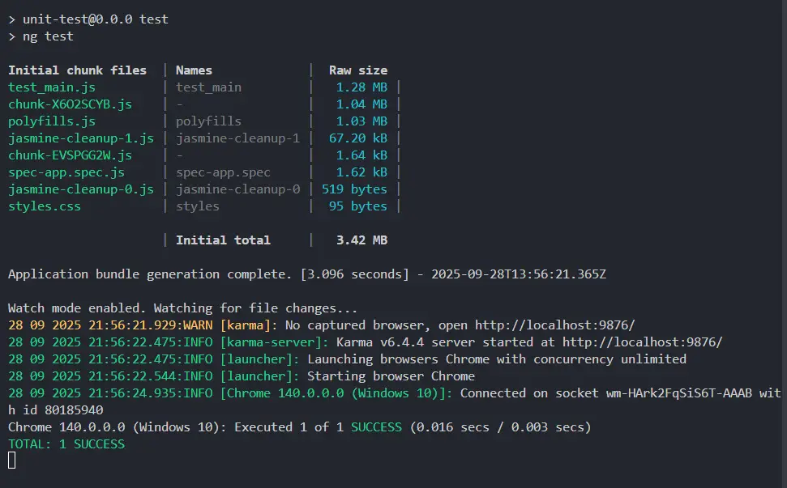
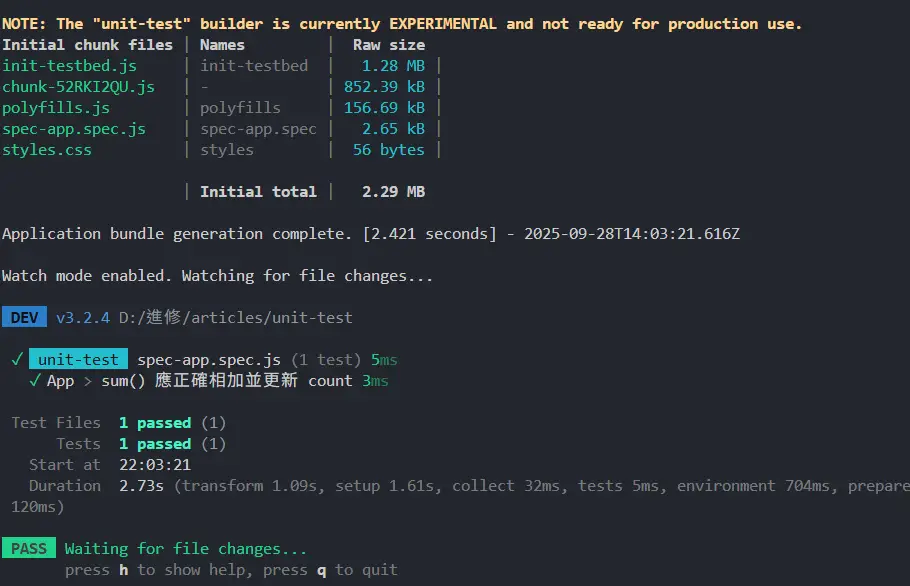

今天要介紹 Angular 的單元測試，單元測試的目的是將程式碼切割成小單元，並針對每個單元進行測試，以確保它們的功能正確且符合預期，不會影響到其他部分。

測試檔案副檔名**必須是 `.spec.ts`** 以便工具可以將其識別為包含測試的檔案，通常會放在與被測試檔案相同的資料夾中，或是專門的資料夾中。

Angular 預設整合了 [Jasmine](https://jasmine.github.io/index.html)（測試框架）與 [Karma](https://karma-runner.github.io/latest/index.html)（測試執行器），建立專案時，Angular CLI 會自動幫你設定好測試環境，通常不需要額外設定，可以直接撰寫與執行測試。

```ts
export class App {
	count = signal(0);
  sum(a: number, b: number): number {
    const result = a + b;
    this.count.set(result);
    return result;
  }
}
```

```html
<input type="number" #num1 />
<input type="number" #num2 />
<button (click)="sum(+num1.value, +num2.value)">相加</button>
<p>總計： {{ count() }}</p>
```

**測試的寫法**
`describe`：用來定義一個測試套件，通常會包含多個相關的測試案例。
`it`：用來定義一個測試案例，描述要測試的功能或行為。
`expect`：用來斷言某個值是否符合預期，通常會搭配各種匹配器來進行比較，例如： `toBe`是用來比較原始值是否相等。

```ts
import { App } from './app';

describe('App', () => {
  it('sum() 應正確相加並更新 count', () => {
    const app = new App();
    app.sum(2, 3);
    expect(app.count()).toBe(5);
    app.sum(10, 20);
    expect(app.count()).toBe(30);
  });
});
```

最後執行測試的指令
```bash
ng test // npm run test
```


## 其他測試工具
雖然 Angular 預設使用 Jasmine 與 Karma 來進行測試，但是由於 Karma 目前已經在 Repo 中說明已經棄用，因此也可以嘗試用 [Jest](https://jestjs.io/) 、[vitest](https://vitest.dev/guide/) 來進行測試。

在 Angular 20 中，專案中也對 vitest 提供了[實驗性](https://angular.dev/guide/testing/unit-tests) 的支援，以下是使用 vitest 的設定方式。

需要安裝以下套件
```bash
npm install vitest jsdom --save-dev
```

若有使用 Karma 相關套件，可以移除
```bash
npm uninstall karma karma-chrome-launcher karma-coverage karma-jasmine karma-jasmine-html-reporter --save-dev
```

在 angular.json 中移除原本 karma `test` 相關設定，並替換成 vitest 的設定
```json
"test": {
  "builder": "@angular/build:unit-test",
  "options": {
    "tsConfig": "tsconfig.spec.json",
    "runner": "vitest",
    "buildTarget": "::development"
  }
}
```

將測試的寫法調整成 vitest 的寫法

> Angular 傳統測試環境自動全域註冊測試 API，所以不用匯入；但 vitest 需要手動匯入

```ts
import { describe, it, expect } from 'vitest';
import { App } from './app';

describe('App', () => {
  it('sum() 應正確相加並更新 count', () => {
    const app = new App();
    app.sum(2, 3);
    expect(app.count()).toBe(5);
    app.sum(10, 20);
    expect(app.count()).toBe(30);
  });
});
```

最後執行測試的指令
```bash
ng test // npm run test
```


## 結論
今天介紹了 Angular 的單元測試基本概念與寫法，目前在 karma 已經宣布棄用的情況下，期待 Angular 官方文件能對於其他測試工具有更多的支援。
