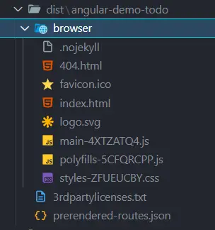
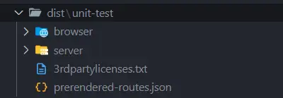

今天會介紹 Angular 專案的建置流程，以及兩種進階的建置模式 SSR 和 SSG。
## Build

在 Angular 專案中，build 是將開發階段的程式碼轉換成適合部署到生產環境的靜態檔案的過程。

使用以下指令，會將 Angular 專案的程式碼編譯並打包成靜態檔案，讓瀏覽器可以載入並執行這些檔案。
```bash
npm run build // ng build 
```

這些靜態檔案通常會放在專案的 `dist/` 的專案名稱資料夾中。
- 預設會包含一個 browser 資料夾



將檔案建置後，就可以考慮部署到伺服器或靜態主機上。
## Rendering modes 
Angular 支援三種渲染模式：
- **Client (CSR)**：Angular 的預設行為，在瀏覽器中渲染應用程式。
- **Server (SSR)**：在伺服器端渲染應用程式，然後將完整的 HTML 傳送到瀏覽器。
- **Static (SSG)**：在建置時為路由預先產生靜態 HTML 檔案。

### SPA
預設情況下，建構的專案屬於單頁式應用程式（SPA），僅在客戶端執行，所有 UI 渲染都發生在瀏覽器端。因此，前端只需部署在靜態主機上，無需額外的後端伺服器。  
這種模式的缺點是 SEO 效果較差，因為初始載入的 HTML 幾乎沒有內容，搜尋引擎較難正確索引。此外，若初始資料量較大，使用者可能會感覺載入速度較慢。

Angular 對於建置專案到不同平台，有提供不同的[工具](https://angular.dev/tools/cli/deployment#automatic-deployment-with-the-cli) 來協助部署專案到不同的平台。
 -  [Firebase hosting  Firebase 託管](https://firebase.google.com/docs/hosting)、[GitHub pages  GitHub 頁面](https://pages.github.com/) 

在建置前需要先安裝相關的套件，再來執行建置指令
```bash
ng add angular-cli-ghpages
ng deploy
```

當部署 Angular 專案到 GitHub Pages 或子目錄時，常需設定 baseHref，否則路徑會錯誤。可在 angular.json 新增 deploy 設定：
```json
 "deploy": {
          "builder": "angular-cli-ghpages:deploy",
          "options": {
            "baseHref": "/angular-demo-todo/",
            "repo": "https://github.com/<your-github-username>/angular-demo-todo.git",
          }
        }
```

## SSR
伺服器端渲染 Server-Side Rendering 
- 由伺服器預先產生完整的 HTML 頁面，將渲染後的內容直接傳送到瀏覽器，使用者一打開網頁即可看到完整畫面。  
- 支援 SPA 的互動功能，頁面載入後仍可即時與使用者互動，享有單頁應用的體驗。
- 缺點是需要能執行 Node.js 的伺服器環境，增加部署的複雜度。

在建立專案時，可以使用 `--ssr` 參數來啟用 SSR 功能
```bash
ng new --ssr
```
或者在現有專案中加入 SSR 功能
```bash
ng add @angular/ssr
```

啟用後 Angular 會自動調整專案結構，並新增一些必要的設定和檔案。例如：會產生 `server.ts` 來設定伺服器端的渲染邏輯

運行 npm run build 後，會在 dist 資料夾中產生兩個子資料夾：
 - browser：包含用於瀏覽器的靜態檔案
 - server：包含用於伺服器的程式碼



需要注意的是，開發 SSR 時，會有一些限制，例如 
 - 無法使用瀏覽器專屬的 API，例如`localStorage`、`sessionStorage`、`document`、`window` 等這些在伺服器端不存在的物件。
 
> 使用 `afterRender` 生命週期來確保程式碼只在瀏覽器端執行

```ts
constructor() {
	afterRender(() => {
		// 這裡的程式碼只會在瀏覽器端執行
		const test = localStorage.getItem('test');
	});
}
```
### SSG
Static Site Generation 靜態網站生成
- 是 SSR 的一種變體，在建置時預先轉譯，為每個路由產生靜態 HTML 檔案。

`angular.json` 的 prerender 中可以指定路由檔案
```json
...
prerender: {
	"routesFile": "routes.txt"
}
```

將需要預先產生靜態頁面的路由列出來，放到檔案中
```text
// routes.txt

/users/u1/details
/users/u2/details
```

在執行 `npm run build` 後，就會在 `dist/` 資料夾中產生對應的靜態 HTML 檔案

SSR 、SSG 部屬都需要 Node.js 的伺服器環境，無法部署在純靜態主機上。因此可考慮像是 Firebase、Vercel 等支援 Node.js 的平台。
Firebase 和 Angular 一樣，是由 Google 開發的。透過 Firebase App Hosting 部署 Angular 應用程式相對簡單。可以按照[官方文件](https://firebase.google.com/docs/app-hosting/get-started?hl=zh-tw)中步驟進行操作
## 結論
最後一天介紹了 Angular 專案的建置流程，以及兩種進階的建置模式 SSR 和 SSG。
