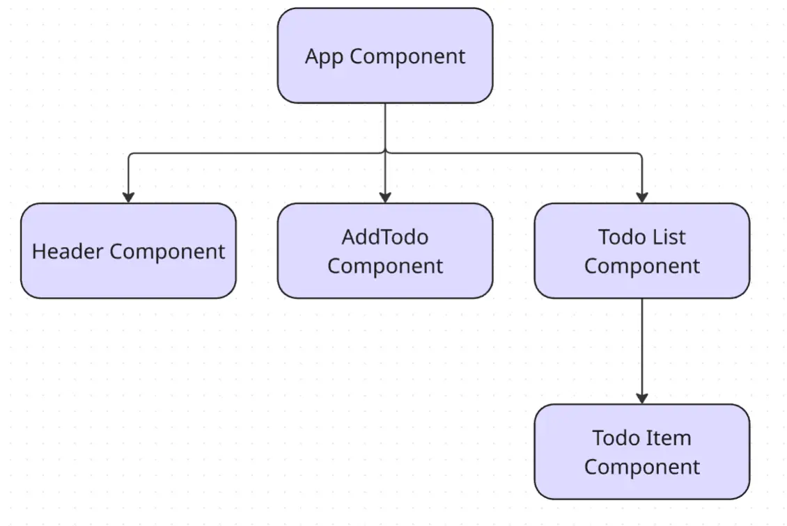

## 元件概念
在進入元件的詳細介紹之前，先來了解一下建立元件的概念。為什麼現代前端框架都強調元件化的開發方式呢？

最主要是關注點分離 `Separation of Concenrs` 的概念，在剛開始建立專案時，可能只有一個頁面或功能，其實不太會感覺到元件化的好處，但隨著應用程式越來越複雜，若將所有的程式碼都寫在一起，會變得難以維護和擴展。

透過元件化，將 UI 切割成多個元件，讓每個元件只關注一個特定的功能或任務，可以提高元件的可重用性和可維護性。此外，Angular 會將所有元件組成一棵「元件樹」，每個元件都是樹上的一個節點，彼此之間可以清楚地分工與協作。


## Angular 元件介紹

- 有別於其他框架是 SFC (Single File Component) 單一檔案元件，像是 vue 會有 .vue 檔案，React 會有 .jsx 或 .tsx 檔案，Angular 採用的是多檔案元件的方式來組成一個元件 (Component)。

每個元件通常包含以下檔案：
- `<元件名稱>.component.ts`：元件的 TypeScript 檔案，包含元件的邏輯和行為。
- `<元件名稱>.component.html`：元件的 HTML 模板檔案，定義元件的視覺結構。
- `<元件名稱>.component.css` 或 `<元件名稱>.component.scss`：元件的樣式檔案，用於定義元件的外觀。
- `<元件名稱>.component.spec.ts`：測試檔案，用於單元測試。

> 檔案命名慣例 
> - Angular 20 版本前的元件檔案命名規則，慣例會用 `<元件名稱>.component.<file-type>` 來命名。 
> - Angular 20 版本後的元件檔案命名規則，則會省略 `.component`，直接使用 `<元件名稱>.<file-type>`。

接下來以 App.ts 為範例，來了解元件的基本結構，會有 `@Component` 裝飾器 (Decorator) 和元件類別 (Class)，這兩個關鍵核心。
```ts
import { Component } from '@angular/core';
import { RouterOutlet } from '@angular/router';

@Component({
  selector: 'app-root',
  imports: [RouterOutlet],
  templateUrl: './app.html',
  styleUrl: './app.css'
})

export class App {
  protected title = 'angular-demo-todo';
}
```

### @Component
`@Component` 是一個 TypeScript 裝飾器 (Decorator)，用來定義一個 Angular 元件。它接受一個物件作為參數，這個物件包含了元件的各種設定和屬性。會在編譯成 JavaScript 時，將這些設定應用到元件類別上。
而這個裝飾器中必備的屬性有 `selector` 和 `template` 。

`selector` 是 Angular 元件的核心屬性之一，用於定義元件在 HTML 中的標籤名稱。
- 它告訴 Angular 如何在模板中識別和使用這個元件。
- 例如，若 `selector` 設定為 `app-header`，則可以在 HTML 中使用 `<app-header></app-header>` 來引入這個元件。
- 除了預設的元素選擇器 `app-<元件名稱>` 命名外，可以使用自訂的選擇器名稱。
	- 例如： class 選擇器、屬性選擇器等  `.app-header`、`header[appHeader]`
	
```html
<app-header></app-header>
<header appHeader></header>
<header class="app-header"></header>
```

 定義元件的 HTML 模板。
- 它可以是內聯模板（inline template）或外部模板檔案。
- 外部模板檔案：透過 `templateUrl` 引用模板檔案路徑，會在檔案內部會放入元件的結構和內容， 
- 內聯模板：直接在組件裝飾器中定義 `template` 屬性，使用反引號包裹多行 HTML。
```ts
template: '<h1>Welcome to {{ title }}!</h1>'
templateUrl: './app.html',
```

定義元件的樣式
- 外部樣式檔案：
	- `styleUrl` 是用來指定元件的 CSS 樣式檔案路徑。
	- `styleUrls` 屬性可以接受一個字串陣列，包含多個樣式檔案。
-  內聯樣式：也支援內聯樣式，可以直接在元件中定義樣式。 

```ts
styles: [`
	 p {
		color: blue;
	 }
`]
styleUrls: ['./btn.component.css','./btn-2.component.css']
styleUrl: './app.css'
```

>多數情況下，都不會將模板、樣式直接寫在組件中，除非是非常簡單的元件。

`imports` 屬性是用來引入其他 Angular 模組或元件，以便在當前元件中使用它們的功能。
- 這個屬性接受一個陣列，包含要引入的模組或元件。
- 只有在 `imports` 中引入的模組或元件，才能在當前元件的模板中使用。

```ts
imports: [HeaderComponent],
```

### Class 
Class 主要用來定義元件的邏輯和行為，是 JavaScript 的類別，使用方式基本上非常相似，像是可以使用 protected 和 private 等修飾詞來用來控制屬性或方法的存取範圍。之後會再詳細介紹在 Angular 中元件類別的各種用法與技巧。

## 獨立元件 Standalone Components

目前 Angular 支援兩種元件開發方式：基於模組的元件和獨立元件，而獨立元件是目前官方推薦的方式。

獨立元件是指不需要依賴模組 (Module) 來註冊和使用的元件。
- 在各元件中使用 `imports` 屬性來引入所需的模組或其他元件。
- 可以非常直觀地看到這個元件所依賴的模組和元件。

而要建立獨立元件需要使用 Angular 14 引入的一個新功能 `standalone` ，可以在裝飾器中，設定 `standalone` 屬性來定義是否是一個獨立元件。
- 取決於版本，在 Angular 19 的發布後，預設就是 `standalone: true`，不需要再特別設定，在之前的版本中需要加入這個設定。
```ts
@Component({
  ...
  standalone: true,  // Angular 19 前的版本需手動定義為獨立元件
})
```
## 快速建立元件

使用 Angular CLI 可以快速建立元件，並自動生成相關的檔案和程式碼。
- 使用 `ng generate component` (`ng g c` ) 建立元件。
- 可以指定元件的名稱和資料夾結構。

```bash
ng generate component <元件名稱>
ng g c <元件名稱> // 簡寫
ng g  c <資料夾結構/元件名稱> // 在指定資料夾下建立元件
```

若是在建立元件時不想自動生成測試檔案，可以在指令中加上 `--skip-tests` 參數。
```bash
ng g c <元件名稱> --skip-tests // 不建立測試檔案
```
或是到 angular.json 中的 schematics 加上這段設定，可以讓你在使用 Angular CLI 快速生成指令時，自動套用
```json
{  
"projects": {  
	"<project-name>": {  
	...  
	"schematics": {  
		"@schematics/angular:component": { "type": "component" , skipTests: true },  
	},  
...  
}
```

## 專案實作
這系列文章預計會實作專案，會在每個章節中，搭配當前學習到的內容，來陸續完成專案。
參考設計稿是 [ToDo List 👅 | Figma](https://www.figma.com/community/file/1175262836322989600)，樣式部分之後會提供個人版本給大家參考，讓大家可以專注在 Angular 的學習上。
專案實作部分會提供個人思路，不會詳細寫出每個步驟，方便大家練習和思考，也會提供完整程式碼參考，讓大家可以對照和學習。

今天的目標是建立專案和第一個元件 Header。
- 使用 Angular CLi 指令建立專案
- 使用 `ng g c` 指令，建立 Header 元件
- 在 App 元件中引入 Header 元件

[day 4 專案分享](https://github.com/johnsonchen3669/angular-demo-todo/commit/a9e44a1a79b8b75ffe18281bf3f5ce4dddcb8c79)

## 結論
透過這篇文章，我們了解了 Angular 元件的基本概念和結構，並學會如何使用 Angular CLI 快速建立元件。
下一章，將介紹模組，探討以前的模組化開發方式，和現在獨立元件的差異。   
