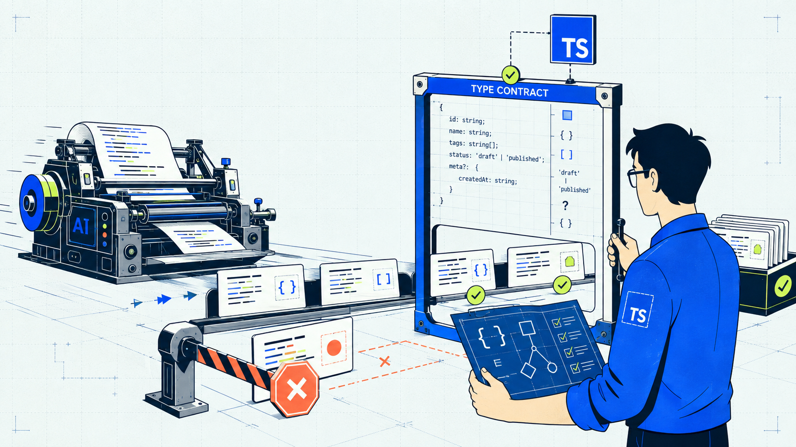
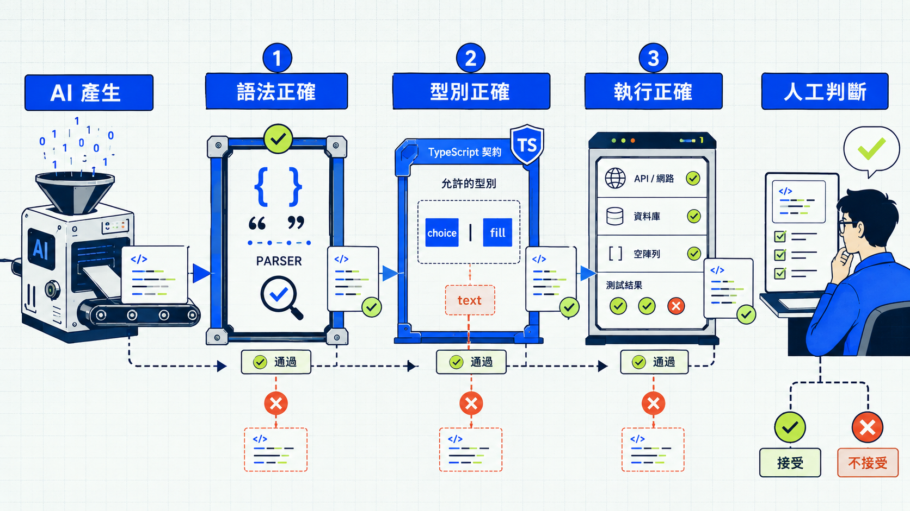

## 這次想分享什麼？

上一屆整理 Angular 時，主要把重點放在框架的使用方式。
這次想回到基本功：這些框架寫法，背後有哪些 JavaScript 與 TypeScript 規則？

當 AI 已經能寫出函式、型別和測試，我們還需要自己學 TypeScript 嗎？

我的答案是：需要。我們仍要看得懂程式，才能判斷它是否符合需求，以及修改會影響哪些地方。

JavaScript 幫助我們理解程式如何執行，TypeScript 則能把部分共同約定寫成可檢查的規則，讓團隊與 AI 協作時有一致的驗收依據。

這也是這次 30 天系列想和你分享的內容。

## 這系列適合誰？

這系列預設你已經具備一些基本程式概念：

- 知道變數、條件判斷與函式的用途。
- 看得懂基本的陣列與物件操作。
- 寫過一點 JavaScript，或曾經請 AI 產生 JavaScript／TypeScript。
- 遇到 TypeScript 錯誤時，常常知道怎麼消除紅字，卻不確定它真正想保護什麼。

這次會在適合的主題中使用 Angular 作為延伸案例。例如談到類別時，會說明框架如何使用 JavaScript 與 TypeScript 的語法。

如果你平常會使用 `any`、`as`，或把 AI 建議的修改直接貼上，讓程式通過編譯，這套系列也適合你。重點不是禁止某個語法，而是知道使用它時放棄了哪些檢查。

## 版本與練習環境

本系列的程式範例會以 TypeScript 7.0 為準。TypeScript 7.0 的編譯器改以 Go 重寫，官方表示完整建置通常可獲得 8～12 倍的速度提升。即使使用不同版本，大部分 JavaScript 行為與型別觀念仍然可以跟著練習；若版本差異會影響範例，我會在文章中另外標示。

你可以直接把範例貼到官方的 [TypeScript Playground](https://www.typescriptlang.org/play/) 練習。它不需要先安裝 Node.js 或 TypeScript；打開頁面後，貼上文章中的範例，就能看到 TypeScript 的檢查結果與編譯後的 JavaScript。

官方也提供了 [使用說明](https://www.typescriptlang.org/_playground-handbook/overview.html)。

版本資訊可參考 [TypeScript 7.0 官方公告](https://devblogs.microsoft.com/typescript/announcing-typescript-7-0/)。

## 30 天會怎麼安排？

整個系列分成五個階段：

1. **Day 1–6｜JavaScript 執行基礎**：動態型別、作用域、閉包、原型、非同步與模組。
2. **Day 7–14｜TypeScript 基礎**：編譯期、型別推論、物件型別、聯集、型別縮小與不確定性。
3. **Day 15–22｜型別設計**：介面、泛型、工具型別、條件型別等。
4. **Day 23–26｜資料邊界與框架**：資料驗證規則、API 型別、錯誤設計，以及 Angular 延伸。
5. **Day 27–30｜AI 實戰**：審查 AI 程式碼、結構化輸出、工具呼叫、MCP 與代理程式。

系列也會搭配獨立的「型旅 TypeTrail 網站」，每篇文章對應一份五題測驗。

接下來，我們就來看今天的主題。

## 程式看起來沒問題，是真的正確嗎？

先看一段程式。這裡掌握大致概念就好，語法細節會在後面的章節說明。

```ts
type QuestionType = "choice" | "fill";

interface Question {
  id: string;
  prompt: string;
  type: QuestionType;
}

function createQuestion(): Question {
  return {
    id: "day-01-01",
    prompt: "TypeScript 會在什麼時候檢查型別？",
    type: "text",
  };
}
```

這段程式建立了一道題目，但網站只定義了 `"choice"`（選擇題）和 `"fill"`（填空題），沒有 `"text"`。TypeScript 會指出 `"text"` 不符合 `QuestionType`。

這段程式可以讓我們分清楚三件事：語法正確、型別正確，以及執行正確。



### 語法正確

這段程式的括號和關鍵字都寫對了，`"text"` 也是合法的 JavaScript 字串。

但語法正確只代表這段程式能被讀懂，還不代表它符合我們定義的資料規則。

### 型別正確

型別正確，表示資料和操作符合我們事先寫好的規則。這個例子只允許 `"choice"` 與 `"fill"`，所以修正後應該是：

```ts
function createQuestion(): Question {
  return {
    id: "day-01-01",
    prompt: "TypeScript 會在什麼時候檢查型別？",
    type: "fill",
  };
}
```

`createQuestion(): Question` 表示函式回傳的資料必須符合 `Question`，包括使用約定好的題型名稱。TypeScript 能在程式執行前指出這類不一致。

### 執行正確

執行期（runtime）是程式真正執行、取得實際值與呼叫函式的階段。TypeScript 的型別檢查發生在執行前，型別資訊通常不會保留在最後執行的 JavaScript 中。

因此，通過型別檢查，仍可能遇到以下問題：

- API 實際回傳的資料與預期不同。
- 網路請求失敗，程式卻沒有處理。
- 陣列是空的，程式卻假設一定有第一筆資料。
- 每個值的型別都合法，但商業規則本身寫錯了。

TypeScript 能檢查的，是我們已經寫下來，而且編譯器能判斷的規則。外部資料驗證、錯誤處理與測試仍然要另外負責。

## 共用型別，讓協作有一致的依據

假設一位開發者與 AI 完成出題功能，用 `"text"` 表示文字作答題；另一位開發者負責畫面，沿用專案的 `"fill"` 判斷該顯示哪種輸入欄位。兩邊都在描述文字作答，程式使用的名稱卻沒有對上。

當大家共用 `Question` 與 `QuestionType`，並讓相關程式接受型別檢查時，這類不一致就能在整合前被指出。

與 AI 協作時，可以把既有型別和需求一起提供，要求它沿用專案已定義的資料格式。收到修改後，先執行型別檢查，再確認規則是否完整。例如：題目找不到時該回傳什麼？新增題型後，畫面是否有對應的處理？這些仍需要開發者理解需求後做出決定。


## 今日練習

[day1 | 型旅 TypeTrail](https://typetrail.johnsonchen.dev/#/day/1)

## 結論

- AI 可以加快寫程式的速度；多人與 AI 協作時，開發者仍需要理解並維護共同規則，讓修改有一致的驗收依據。
- 語法正確、型別正確與執行正確是不同問題，不能互相取代。
- TypeScript 不只用來減少手寫錯誤，也能把部分工程規則變成寫程式時的檢查條件。

接下來五天會先回到 JavaScript 的執行基礎。Day 2 從動態型別與隱含轉型開始，看同一個運算遇到不同型別的值時，為什麼可能得到不同結果。
