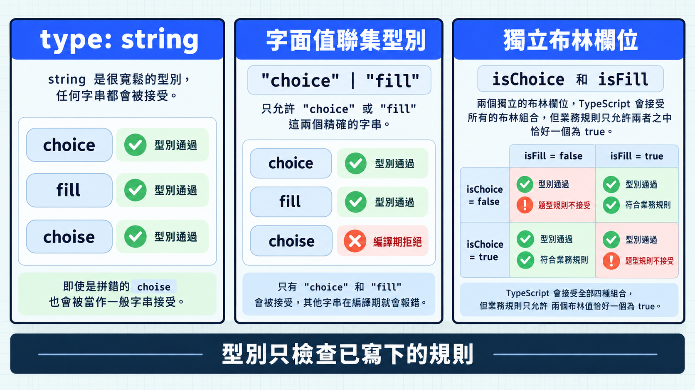

前一篇用物件型別整理資料有哪些欄位，以及各欄位接受的型別。有些文字欄位只接受幾個固定值；如果寫成一般的 `string`，其他字串也會通過檢查。字面值型別與聯集能把允許的範圍寫清楚，讓 TypeScript 擋下規則外的值。

## 從一般字串收窄成固定值

字面值型別（literal type）表示一個特定的值。`"choice"` 可以是型別，不只是資料：

```ts
type ChoiceQuestion = { type: "choice" };

const valid: ChoiceQuestion = { type: "choice" };
const invalid: ChoiceQuestion = { type: "fill" }; // 編譯期錯誤
```

當允許值不只一個，可以用聯集型別（union type）列出可能性：

```ts
type QuestionType = "choice" | "fill";

let kind: QuestionType = "choice";
kind = "fill";
kind = "essay"; // 編譯期錯誤
```

`|` 的意思是「這個值符合列出的其中一個型別」。

把規則放回題目模型：

```ts
type Question = {
  readonly id: string;
  prompt: string;
  type: QuestionType;
};

const question: Question = {
  id: "day-10-01",
  prompt: "哪個關鍵字用來匯出？",
  type: "choice",
};
```

若把 `type` 寫成未列出的字串，錯誤會在資料建立處被指出。

## 兩個布林值會放行不合理的題型組合

假設題目只有選擇題或填空題，直覺寫法可能是：

```ts
type QuestionFlags = {
  isChoice: boolean;
  isFill: boolean;
};

const missingType: QuestionFlags = { isChoice: false, isFill: false };
```

`missingType` 會通過型別檢查，但兩個 `false` 表示這題沒有題型。兩個欄位都填 `true` 也會通過，卻表示同一題同時是選擇題和填空題。題目只能選一種時，這個型別就太寬了。

函式使用多個布林參數時，呼叫處只會顯示 `true`、`false`，很難直接看懂各自代表什麼。這種閱讀困難稱為布林盲點（boolean blindness）：

```ts
function renderQuestion(prompt: string, isChoice: boolean, isFill: boolean) {
  console.log(prompt, isChoice, isFill);
}

renderQuestion("哪個關鍵字用來匯出？", true, false);
```

看到這個呼叫，還得回頭對照參數順序，才知道 `true` 表示選擇題。改用前面定義的 `QuestionType`，呼叫處就能直接寫出題型，型別也只允許 `"choice"` 或 `"fill"`。下面的函式取代上面的版本：

```ts
function renderQuestion(prompt: string, type: QuestionType) {
  console.log(prompt, type);
}

renderQuestion("哪個關鍵字用來匯出？", "choice");
```



## 今日練習

[day10 | 型旅 TypeTrail](https://typetrail.johnsonchen.dev/#/day/10)

## 結論

字面值型別表示特定值，聯集型別用 `|` 列出合法的可能。把題型寫成 `"choice" | "fill"`，TypeScript 就能在編譯時指出拼錯的名稱，也能避免兩個獨立布林值造成的矛盾組合。

拿到聯集型別的值後，程式還需要判斷目前是哪一種，才能決定接下來怎麼處理。這就接到下一篇的型別縮小。
