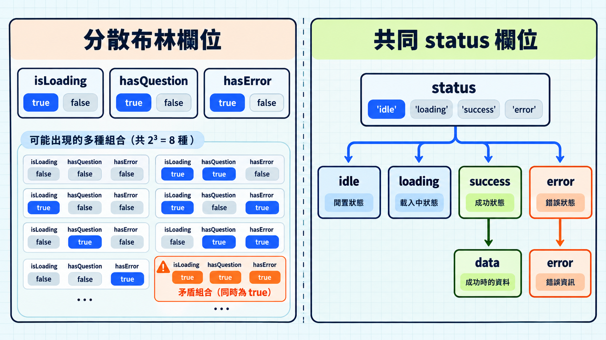

上一篇練習用條件判斷縮小型別，讓程式知道目前是哪一種可能。這次來看怎麼把資料寫清楚，讓每種狀態都對得上該有的欄位。

題目請求可能正在載入、已取得題目，或載入失敗；這幾種情況最多只會有一種成立。若各用一個布林值記錄，TypeScript 卻會接受下面這筆資料：

```ts
type QuestionViewFlags = {
  isLoading: boolean;
  hasQuestion: boolean;
  hasError: boolean;
};

const view: QuestionViewFlags = {
  isLoading: true,
  hasQuestion: true,
  hasError: true,
};
```

三個欄位各自合法，合起來卻表示三種情況同時成立。型別沒有寫出互斥規則，TypeScript 就無法指出這筆資料的問題。

## 讓題型決定有哪些欄位

[可辨識聯集](https://www.typescriptlang.org/docs/handbook/2/narrowing.html#discriminated-unions)（discriminated union）把互斥的資料形式分成數個物件型別，再用聯集組合。每個分支都有同一個判別欄位，值各不相同；TypeScript 便能用這個值辨認資料屬於哪個分支。

```ts
type Question =
  | { type: "choice"; prompt: string; options: readonly string[] }
  | { type: "fill"; prompt: string; answer: string };
```

`type` 是兩個分支共同的判別欄位。它的值會決定該題型必須有哪些資料：

- `type: "choice"`：選擇題必須有 `options`；漏掉時，TypeScript 會指出錯誤。
- `type: "fill"`：填空題必須有 `answer`。

比較下面把兩種題目寫在同一個物件型別的做法：

```ts
type LooseQuestion = {
  type: "choice" | "fill";
  prompt: string;
  options?: readonly string[];
  answer?: string;
};

const missingOptions: LooseQuestion = {
  type: "choice",
  prompt: "哪個關鍵字用來匯出？",
};
```

`options?` 表示選項可以省略，所以這筆選擇題會通過檢查。前面的 `Question` 聯集則把 `type: "choice"` 和必填的 `options` 放在同一個分支。

讀取題目時先判斷 `type`，各分支才能使用自己的欄位：

```ts
function describeQuestion(question: Question): string {
  if (question.type === "choice") {
    return `選擇題，共 ${question.options.length} 個選項`;
  }

  return `填空題，答案長度是 ${question.answer.length}`;
}
```

## 把請求狀態和資料放在一起

題目請求可能尚未開始、正在載入、成功或失敗。成功才有題目資料，失敗才有錯誤資訊：

```ts
type RequestState =
  | { status: "idle" }
  | { status: "loading" }
  | { status: "success"; data: readonly Question[] }
  | { status: "error"; error: Error };
```

`status` 是判別欄位；成功時必須提供題目陣列 `data`，失敗時則必須提供 `error`。

如果把四種狀態寫在同一個物件型別，並讓 `data` 和 `error` 都可以省略，就會變成這樣：

```ts
type LooseState = {
  status: "idle" | "loading" | "success" | "error";
  data?: readonly Question[];
  error?: Error;
};
```

`LooseState` 會接受成功卻沒有 `data`，也會接受失敗卻沒有 `error`。檢查 `status` 後，TypeScript 仍無法確定對應欄位存在。改用前面的聯集，畫面就能根據 `status` 讀取資料：

```ts
function questionMessage(state: RequestState): string {
  switch (state.status) {
    case "idle":
      return "尚未載入題目";
    case "loading":
      return "題目載入中";
    case "success":
      return `已載入 ${state.data.length} 題`;
    case "error":
      return `載入失敗：${state.error.message}`;
  }
}
```

空陣列也可能是成功結果。畫面看 `status`，就能區分「已載入 0 題」和「尚未載入」。這個型別列出可存在的狀態；請求何時從載入轉為成功或失敗，由執行時的流程決定。



## 延伸到 Angular：這個概念在框架中如何出現？

若元件的 `state` 使用 `RequestState`，模板可以這樣寫：

```html
@switch (state.status) {
  @case ("idle") { <p>尚未載入題目</p> }
  @case ("loading") { <p>題目載入中</p> }
  @case ("success") { <p>已載入 {{ state.data.length }} 題</p> }
  @case ("error") { <p>載入失敗：{{ state.error.message }}</p> }
}
```

> [!TIP] 模板控制流程 / Template control flow
> Angular 模板可以用 `@switch` 依 `state.status` 選出要顯示的 `@case`；語法見 [Angular 控制流程](https://angular.dev/guide/templates/control-flow)。

## 今日練習

[day12 | 型旅 TypeTrail](https://typetrail.johnsonchen.dev/#/day/12)

## 結論

遇到互斥狀態，先把每種狀態和它必備的資料寫成同一個分支。TypeScript 才能在建立資料時檢查必填欄位，也能在判斷狀態後縮小型別。

當值的型別尚未確定，或要確認所有分支都處理完，就要再分清 `any`、`unknown` 與 `never`。
