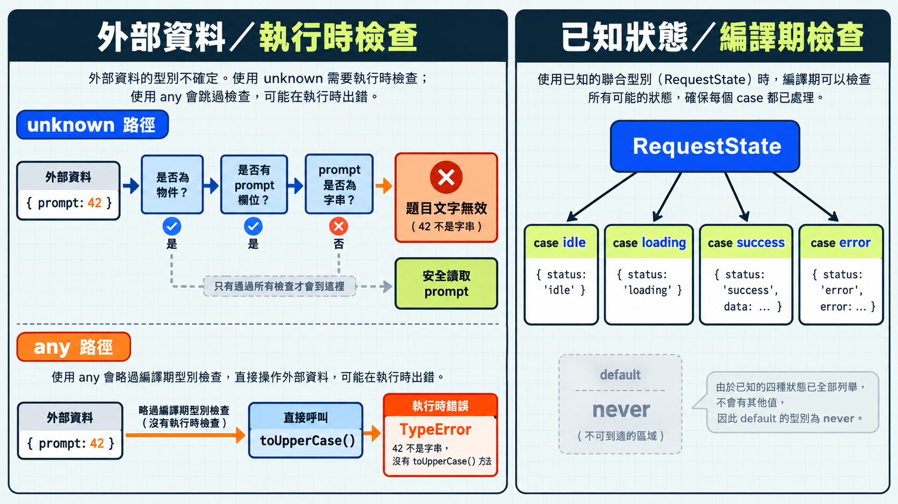

前一篇把題目請求分成幾種狀態，讓 TypeScript 知道每個狀態有哪些資料。資料剛從外部進來時，我們可能連它是不是題目都還不知道。

## any：忽略這個值的型別檢查

`any` 是 TypeScript 的一種型別，可以接收任何值。把值標成 `any` 後，TypeScript 會忽略對它的欄位和方法檢查，程式可以直接讀取或呼叫。

假設程式收到一筆題目資料，要把題目文字轉成大寫：

```ts
function promptText(question: any): string {
  return question.prompt.toUpperCase();
}

promptText({ prompt: 42 }); // 執行時拋出 TypeError
```

這段程式能通過型別檢查，但 `prompt` 實際上是數字 `42`，呼叫 `toUpperCase()` 時就會出錯。從 `any` 讀出的欄位也會繼續帶著 `any`，錯誤可能一路傳到其他函式。

舊程式一時補不齊型別時，可以先在小範圍使用 `any`。等資料格式確認後，再把這一處改成具體型別；若 `any` 已傳到其他函式，回頭整理時會更難排查問題。

## unknown：讀取欄位前要先檢查

`unknown` 也是 TypeScript 的一種型別，可以接收任何值。程式要先檢查資料，才能讀取欄位或呼叫方法。

```ts
function promptText(value: unknown): string {
  if (typeof value !== "object" || value === null) {
    return "題目格式錯誤";
  }

  if (!("prompt" in value) || typeof value.prompt !== "string") {
    return "題目文字無效";
  }

  return value.prompt.toUpperCase();
}

console.log(promptText({ prompt: 42 })); // 題目文字無效
```

如果跳過條件判斷，直接讀取 `value.prompt`，TypeScript 會在 `value` 標出錯誤，因為還不知道它是否為帶有 `prompt` 的物件。通過檢查後，程式確認 `prompt` 是字串，才能呼叫 `toUpperCase()`。

> [!NOTE]
> 這裡用到 Day 11 介紹的型別縮小（narrowing）：TypeScript 會根據條件判斷，縮小程式走到某個位置時可能出現的型別。
> 更多範例可參考 [TypeScript Handbook 的 unknown 小節](https://www.typescriptlang.org/docs/handbook/2/functions.html#unknown)。

### catch 可能接到不同的值

如果專案裡沒有統一錯誤的寫法，有人可能寫 `throw new Error("讀取失敗")`，有人直接寫 `throw "讀取失敗"`。呼叫的套件也可能丟出不同種類的值。JavaScript 允許這些寫法，所以 `catch` 接到的值不一定有 `message` 欄位。下面刻意模擬兩種情況：

```ts
function errorMessage(asText: boolean): string {
  try {
    if (asText) {
      throw "讀取失敗";
    }
    throw new Error("讀取失敗");
  } catch (error) {
    if (error instanceof Error) {
      return error.message;
    }
    return "收到其他形式的錯誤";
  }
}

console.log(errorMessage(false)); // 讀取失敗
console.log(errorMessage(true));  // 收到其他形式的錯誤
```

傳入 `false` 時，`catch` 收到 `Error` 物件，可以讀取它的 `message`。傳入 `true` 時，收到的是字串，沒有 `message` 欄位。所以讀取欄位前，先用 `instanceof Error` 確認值的種類。

> [!TIP] catch 變數的型別 / Catch variable type
> 本系列的 `strict` 設定會讓 `catch` 變數預設為 `unknown`；這由 `useUnknownInCatchVariables` 選項控制。詳見 [TypeScript 官方說明](https://www.typescriptlang.org/docs/handbook/release-notes/typescript-4-4.html#defaulting-to-the-unknown-type-in-catch-variables)。

## never：檢查是否漏掉狀態

`never` 是 TypeScript 的一種型別，表示沒有任何值能出現在這裡。`undefined` 本身還是一個值，因此不等於 `never`。

透過以下範例，看看 `never` 怎麼找出漏掉的分支。

```ts
type Question = { prompt: string };

type RequestState =
  | { status: "idle" }
  | { status: "loading" }
  | { status: "success"; data: readonly Question[] }
  | { status: "error"; error: Error };

function assertNever(value: never): never {
  throw new Error("出現未處理的狀態");
}

function stateMessage(state: RequestState): string {
  switch (state.status) {
    case "idle":
      return "尚未載入";
    case "loading":
      return "載入中";
    case "success":
      return "已載入 " + state.data.length + " 題";
    case "error":
      return "載入失敗：" + state.error.message;
    default:
      return assertNever(state);
  }
}
```

四種狀態都由 `case` 處理後，`default` 裡的 `state` 沒有剩餘的可能值，可以傳給 `assertNever`。若在 `RequestState` 加入 `"cancelled"`，卻漏了對應的 `case`，TypeScript 會在 `assertNever(state)` 標出錯誤：`state` 此時仍可能是取消狀態，不能傳給只接受 `never` 的函式。

> [!TIP] 窮盡檢查 / Exhaustiveness checking
> 用 `never` 確認聯集中的每一種狀態都有處理，稱為窮盡檢查。更多範例見 [TypeScript Handbook 的窮盡檢查章節](https://www.typescriptlang.org/docs/handbook/2/narrowing.html#exhaustiveness-checking)。

`assertNever` 的回傳型別也寫成 `never`，因為它只會丟出錯誤，不會正常回傳。窮盡檢查只針對 `RequestState` 已宣告的狀態；外部資料若要當成 `RequestState` 使用，仍須先確認 `status` 和各狀態需要的欄位。



## 今日練習

[day13 | 型旅 TypeTrail](https://typetrail.johnsonchen.dev/#/day/13)

## 結論

收到尚未確認的資料時，`unknown` 會要求程式先取得可檢查的證據；`any` 則略過這一步。資料已經是明確的聯集時，`never` 可以讓遺漏的分支在編譯期被發現。下一篇接著看型別斷言：程式沒有提供證據，卻要求 TypeScript 採用某個型別時，會留下什麼缺口。
