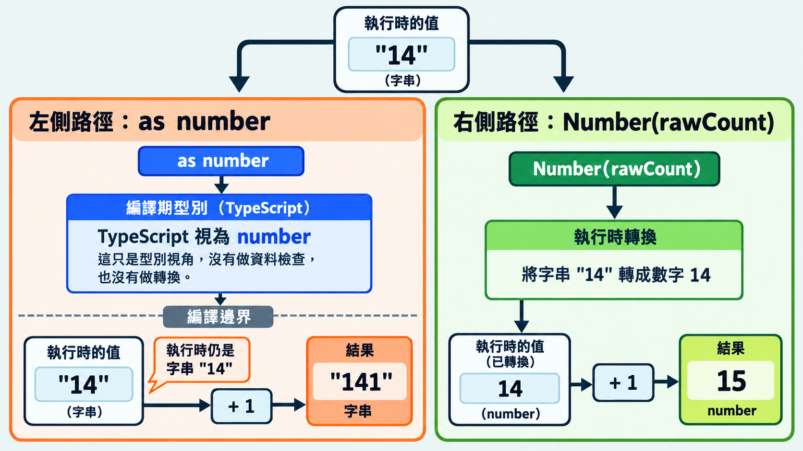

前一篇用 `unknown` 保留尚未確認的資料。`as` 是 TypeScript 的型別斷言（type assertion）語法，可以請編譯器把值當成指定型別。

```ts
type Question = { id: string; prompt: string };

const rawQuestion: unknown = { id: "q14", prompt: 42 };
const question = rawQuestion as Question;

console.log(typeof question.prompt); // number
question.prompt.toUpperCase();       // 執行時拋出 TypeError
```

TypeScript 接受了 `prompt` 是字串，但這時 JavaScript 執行時讀到的仍是數字 `42`。今天要分享 `as`、後綴 `!` 與雙重斷言分別跳過了什麼檢查，以及什麼情況才有理由使用斷言。

## as 只改變 TypeScript 看待值的方式

如果寫成 `const question: Question = rawQuestion`，TypeScript 會因為 `rawQuestion` 是 `unknown` 而標錯。改用 `as Question`，只是略過這道型別檢查。

### 要得到數字，得真的轉換

題目數量如果是字串，`as` 與 `Number` 的結果不同：

```ts
const rawCount: unknown = "14";
const assumed = rawCount as number;
const converted = Number(rawCount);

console.log(assumed + 1);   // 141
console.log(converted + 1); // 15
```

`as number` 讓 TypeScript 跳過原本對 `unknown` 的使用限制，先把 `rawCount` 當成數字；JavaScript 執行時仍依值的實際型別運作。`assumed` 還是字串，所以 `assumed + 1` 會串接成 `"141"`；`Number(rawCount)` 才真的轉成數字。轉換也不保證資料符合需求：`Number("abc")` 會得到 `NaN`。

透過上述範例，可以了解到，誤用 `as` 只會藏起資料與型別不符的問題。等到後面的程式出錯，還得回頭找是哪個斷言讓它通過檢查，排查更費力。



## 雙重斷言：兩次 as 也不會改變資料

假設 API 回傳的題目數量是字串，程式卻需要數字。直接寫 `apiResponse.count as number` 會報錯；有人可能插入 `unknown` 來繞過提醒：

```ts
const apiResponse = { count: "14" }; // 示意的 API 回應
const count = apiResponse.count as unknown as number;
console.log(typeof count); // string
```

這種連續寫兩次 `as` 的方式叫雙重斷言（double assertion）。第一個 `as` 讓 TypeScript 暫時不再把值當成字串，第二個才把它當成數字。型別錯誤雖然消失，執行時的 `count` 仍是字串。真的需要數字，就用 `Number(apiResponse.count)` 轉換。

> [!TIP] 雙重斷言的使用時機 / Double assertion
> 例如套件實際回傳的是數字，附帶的型別卻還寫成 `string`。確認它確實會回傳數字、又暫時改不了套件的型別時，才考慮在取資料的地方用 `as unknown as number`，並寫下原因。
> [TypeScript Handbook 的型別斷言說明](https://www.typescriptlang.org/docs/handbook/2/everyday-types.html#type-assertions)也提到，直接斷言的限制有時過於保守。

## 什麼情況可以使用 as？

假設頁面固定有 `<input id="answer-input">`，程式也會等它出現後才執行。TypeScript 不知道 `getElementById` 找到的是輸入框，直接讀取 `value` 會報錯。這時可以用 `as HTMLInputElement` 告訴 TypeScript：

```ts
const input = document.getElementById("answer-input") as HTMLInputElement;
console.log(input.value);
```

如果輸入框可能被移除或換成別的元素，就讓程式實際檢查：

```ts
const input = document.getElementById("answer-input");
if (!(input instanceof HTMLInputElement)) {
  throw new Error("找不到作答輸入框");
}
console.log(input.value);
```

## 後綴 ! 不會替你找到資料

查找題目時，還可能遇到另一種情況：根本找不到資料。

```ts
function findPrompt(questions: Question[], id: string): string {
  const question = questions.find((item) => item.id === id);
  return question!.prompt;
}

findPrompt([], "q14"); // 執行時拋出 TypeError
```

`find` 找不到時會回傳 `undefined`，所以這裡的 `question` 可能沒有值。

> [!NOTE] 非 null 斷言 / Non-null assertion
> 寫在值後面的 `!` 等於告訴 TypeScript：「這裡一定有值」，讓它在這個位置把 `null` 和 `undefined` 從型別中排除。
> [TypeScript Handbook 的非 null 斷言說明](https://www.typescriptlang.org/docs/handbook/2/everyday-types.html#non-null-assertion-operator-postfix-)。

傳入空陣列時，`question!.prompt` 仍會在執行時讀取 `undefined.prompt`，因此拋出 `TypeError`。

若找不到題目就應中止，可以把函式中的 `return question!.prompt` 換成實際判斷：

```ts
if (question === undefined) {
  throw new Error("找不到題目：" + id);
}
return question.prompt;
```

先處理找不到題目的情況，後面就能直接讀取 `question.prompt`，不必用 `!`。

## 今日練習

[day14 | 型旅 TypeTrail](https://typetrail.johnsonchen.dev/#/day/14)

## 結論

`as` 指定 TypeScript 看待值的型別，雙重斷言能繞過直接斷言的限制，後綴 `!` 則排除空值；它們都不會檢查執行時資料。尚未確認的資料要先檢查；有依據使用斷言時，也要知道誰負責維持那個前提。下一篇接著比較 `interface` 與 `type` 如何描述資料。
