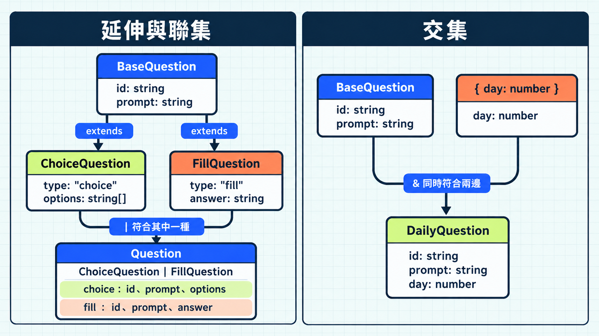

前面幾篇用 `type` 描述題目與狀態。今天這篇加入 `interface`，先比較它和 `type` 如何描述同一份題目資料：

```ts
interface QuestionInterface {
  id: string;
  prompt: string;
}

type QuestionAlias = {
  id: string;
  prompt: string;
};
```

## 描述一個物件，兩者都能做到

介面（interface）可以寫出物件應有的欄位與型別。

`type` 宣告的是型別別名（type alias）：`=` 右邊寫要命名的型別，可以是物件，也可以是字串或聯集，例如 `type QuestionId = string`。

> [!TIP] 型別別名與介面 / Type Aliases and Interfaces
> 想對照兩種宣告的語法和用途，可參考 [TypeScript 官方手冊的型別別名與介面說明](https://www.typescriptlang.org/docs/handbook/2/everyday-types.html#type-aliases)。

把資料標成其中一種型別時，TypeScript 都會檢查必要欄位及其型別；兩者也都能寫可選欄位與 `readonly`。這些檢查只發生在編譯期，執行時不會自動驗證資料或補上欄位。單純描述物件時，可以沿用團隊慣例。

## 用 `extends` 表達共同欄位與延伸關係

`extends` 讓新介面沿用基礎介面的欄位，再加入自己的欄位。下面把選擇題與填空題都有的 ID、題目文字放進 `BaseQuestion`，讓兩種題型各自加入需要的欄位：

```ts
interface BaseQuestion {
  id: string;
  prompt: string;
}

interface ChoiceQuestion extends BaseQuestion {
  type: "choice";
  options: string[];
}

interface FillQuestion extends BaseQuestion {
  type: "fill";
  answer: string;
}
```

把題目資料宣告為 `ChoiceQuestion` 時，若省略從 `BaseQuestion` 繼承的 `id`，TypeScript 會在編譯時報錯。

`BaseQuestion` 是共用欄位的維護位置。新增必要欄位時，所有延伸它的介面都要符合新要求；只適用於部分介面的欄位，則不該放進基礎介面。

## 用 `type` 幫聯集取名

一筆題目可能是選擇題，也可能是填空題。前面兩個介面各自描述一種資料；要用一個名稱表示「其中一種」，可以用聯集：

```ts
type Question = ChoiceQuestion | FillQuestion;
```

介面可以寫出兩種題目各自需要的欄位，但不能直接替整個聯集命名。

## 用 `&` 組合兩份型別的要求

聯集的 `|` 表示符合其中一邊；`&` 則要求同時符合兩邊，稱為交集型別（intersection type）。前面用 `extends` 延伸介面；如果要把題目欄位和日次欄位組合，也可以用 `&`：

```ts
type DailyQuestion = BaseQuestion & { day: number };

const question: DailyQuestion = {
  id: "q15",
  prompt: "哪一種寫法符合需求？",
  day: 15,
};
```



`&` 遇到同名欄位時，可能組出無法填值的型別。下面故意讓兩份型別都宣告 `id`，但要求不同的型別：

```ts
type StringId = { id: string };
type NumberId = { id: number };
type BrokenQuestion = StringId & NumberId;

// 刻意示範編譯期錯誤。
const broken: BrokenQuestion = { id: "q15" };
```

`StringId` 要求 `id` 是字串，`NumberId` 要求同一個 `id` 是數字。`BrokenQuestion` 把兩份要求放在一起，卻只有一個 `id`；一個值無法同時是字串和數字，所以 TypeScript 把 `id` 判定為 `never`。

`type BrokenQuestion` 的宣告可以通過檢查；到了 `const broken` 建立資料，無論填字串或數字都會報錯。若原本是兩個不同的編號，應分別命名為 `questionId`、`dayId`；若是同一個編號，就先統一型別。

換成介面延伸，衝突會在宣告關係時就被指出：

```ts
interface TextId {
  id: string;
}

// 刻意示範編譯期錯誤：id 與基礎介面的要求不相容。
interface NumberQuestion extends TextId {
  id: number;
}
```

需要讓新型別沿用既有欄位時，這種較早出現的衝突提醒，是選擇 `extends` 的實際理由；需要組合既有要求時，`&` 則讓組合關係直接寫在型別中。

> [!TIP] 介面延伸與交集 / Interface Extension vs. Intersection
> 在[TypeScript 官方手冊的延伸與交集比較](https://www.typescriptlang.org/docs/handbook/2/objects.html#interface-extension-vs-intersection) 有整理兩種寫法遇到衝突欄位時的差異，選擇組合方式時可以參考這份文件。

## 宣告合併：同一個介面可以被補充

介面可以在同一作用域用相同名稱宣告多次，TypeScript 會把欄位合在一起。這叫宣告合併（declaration merging）。下面刻意把題庫設定拆成兩份同名宣告：

```ts
interface QuizSettings {
  title: string;
}

interface QuizSettings {
  showHint: boolean;
}

const settings: QuizSettings = {
  title: "每日五問",
  showHint: true,
};
```

如果建立 `settings` 時只填了 `title`，漏掉第二份宣告中的 `showHint`，型別檢查就會報錯。

若兩份介面都宣告 `title`，型別必須相同；不能一份寫 `string`，另一份寫 `number`。

> [!TIP] 介面宣告合併 / Merging Interfaces
> [TypeScript 官方手冊的介面合併說明](https://www.typescriptlang.org/docs/handbook/declaration-merging.html#merging-interfaces)列出同名介面合併的規則，擴充函式庫型別時可用來核對限制。

換成 `type` 就不能重複宣告同一名稱。下面兩行都叫 `QuizSettingsType`，因此會報錯：

```ts
// 刻意示範編譯期錯誤：同一作用域重複宣告型別別名。
type QuizSettingsType = { title: string };
type QuizSettingsType = { showHint: boolean };
```

## 怎麼選擇寫法

選擇寫法時，可以對照當下需求：

| 當下需求 | 可採用的寫法與理由 |
| --- | --- |
| 單純描述物件欄位 | 兩者都可以，沿用專案慣例 |
| 讓新型別沿用既有欄位 | `interface` 搭配 `extends`，直接表達延伸關係 |
| 替字串、聯集等型別命名 | 使用 `type` |
| 同時滿足多份型別要求 | 使用 `&`，需檢查同名欄位是否衝突 |
| 同一作用域的同名宣告要合併欄位 | 使用 `interface`；重複宣告 `type` 會報錯 |

## 今日練習

[day15 | 型旅 TypeTrail](https://typetrail.johnsonchen.dev/#/day/15)

## 結論

設計時先看資料需要共同欄位、不同可能性，還是同時滿足多份要求，再選擇 `interface`、`type` 或交集。下一篇會看另一個問題：名稱不同的型別，為什麼有時仍能互相使用？
