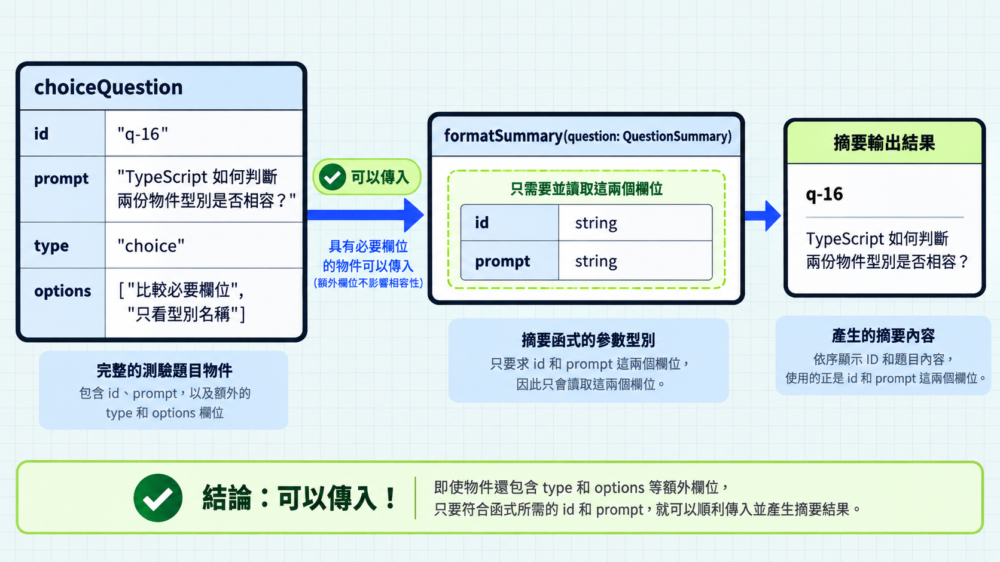
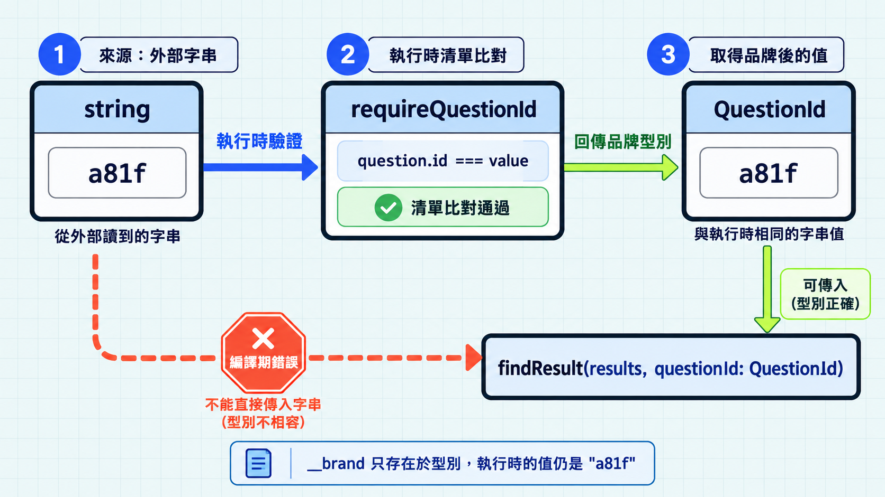

前一篇比較了 `interface` 和 `type`。這篇接著看 TypeScript 怎麼判斷資料能不能交給某段程式使用，這種判斷叫型別相容性。型別名稱不同，資料仍可能相容。

## TypeScript 比較的是結構

```ts
interface QuestionSummary {
  id: string;
  prompt: string;
}

interface ChoiceQuestion extends QuestionSummary {
  type: "choice";
  options: string[];
}

function formatSummary(question: QuestionSummary): string {
  return `${question.id}：${question.prompt}`;
}

const choiceQuestion: ChoiceQuestion = {
  id: "q-16",
  prompt: "TypeScript 如何判斷兩份物件型別是否相容？",
  type: "choice",
  options: ["比較必要欄位", "只看型別名稱"],
};

formatSummary(choiceQuestion); // 通過
```

結構型別（structural typing）會依物件具備的欄位與型別，判斷它能否交給函式使用。`choiceQuestion` 多了題型和選項，仍然能交給只讀 `id` 和 `prompt` 的函式；欄位符合要求就可能相容，用途則要由程式另外表達。

> [!TIP] 型別相容性 / Type compatibility
> 想查其他型別能否互相使用的判斷規則，可參考 [TypeScript 官方手冊的型別相容性說明](https://www.typescriptlang.org/docs/handbook/type-compatibility)。



## 直接寫物件時的多餘屬性檢查

同樣是交給 `formatSummary`，直接寫物件時，TypeScript 會多檢查一件事：物件有沒有寫出參數型別未宣告的欄位。這叫多餘屬性檢查（excess property checking）。

```ts
formatSummary({
  id: "q-17",
  prompt: "TypeScript 的型別在執行時還存在嗎？",
  type: "choice",
  options: ["存在", "不存在"],
}); // 編譯期錯誤：QuestionSummary 沒有 type、options。
```

`QuestionSummary` 只要求 `id` 和 `prompt`，因此直接寫入的 `type`、`options` 會被指出來。前面的 `choiceQuestion` 卻能傳入，因為它已經是一個變數；TypeScript 只檢查它是否具備函式需要的欄位。

若要先確認這筆資料是完整的選擇題，可以使用前面宣告的 `ChoiceQuestion`：

```ts
const nextQuestion: ChoiceQuestion = {
  id: "q-17",
  prompt: "TypeScript 的型別在執行時還存在嗎？",
  type: "choice",
  options: ["存在", "不存在"],
};

formatSummary(nextQuestion); // 通過
```

宣告 `nextQuestion` 時會檢查 `ChoiceQuestion` 要求的欄位；傳給 `formatSummary` 時則只需要符合 `QuestionSummary`。直接把物件指派給標明型別的變數，也會觸發多餘屬性檢查。

> [!TIP] 多餘屬性檢查 / Excess property checking
> 遇到其他類似的欄位錯誤時，可參考 [TypeScript 官方手冊的多餘屬性檢查說明](https://www.typescriptlang.org/docs/handbook/2/objects.html#excess-property-checks)，核對檢查何時會觸發。

## 一樣是字串，看不出用途

結構型別比對的是型別本身，不看名字，也不管這個值在程式裡代表什麼。物件要比對欄位才能相容；`string` 這種型別只要對得上就會通過，所以題目 ID、選項代號和使用者的暱稱，只要是字串都會收下。

```ts
interface QuestionResult {
  questionId: string;
  isCorrect: boolean;
}

function findResult(results: QuestionResult[], questionId: string) {
  return results.find((result) => result.questionId === questionId);
}

type QuestionId = string;

findResult(results, selectedId); // 通過
```

`selectedId` 是從外部讀到的字串，例如 `"a81f"`。`type QuestionId = string` 只是換個名字，檢查結果自然一樣。名稱方便人閱讀，對編譯器卻沒有約束力：它不會因為你叫它 `QuestionId`，就確定這個值真的對應到一筆題目。兩個都是字串的欄位互相比較時，編譯器也一律放行，即使其中一邊是題目文字而不是 ID。

## 用品牌型別加上記號

既然相容與否看的是欄位，那就多給它一個欄位：

```ts
type QuestionId = string & { readonly __brand: "QuestionId" };

function findResult(results: QuestionResult[], questionId: QuestionId) {
  return results.find((result) => result.questionId === questionId);
}

findResult(results, selectedId); // 編譯期錯誤：string 不能指定給 QuestionId
```

`__brand` 這個欄位在執行時不存在，值還是原本的字串。品牌型別（branded type）是把結構型別反過來用：原本「長得一樣就能互換」，現在「長得不一樣就不能互換」。上面只有參數換成 `QuestionId`；`QuestionResult.questionId` 仍是 `string`，因為判分結果是外部資料，型別不會替它驗證。

它記下的是一項事實：這個值已經通過確認。這件事在執行時沒有對應的資料，只是在型別上多一個欄位，編譯器就能靠它一路追蹤下去。

## 確認過才算是題目 ID

確認的方式是查一次題目清單：

```ts
function requireQuestionId(
  value: string,
  questions: QuestionSummary[],
): QuestionId {
  if (!questions.some((question) => question.id === value)) {
    throw new Error("找不到對應的題目");
  }

  return value as QuestionId;
}
```

`some` 逐筆比對，只要有一筆相同就通過；全部比完都沒有，就走到 `throw`。

`as QuestionId` 是整段唯一的斷言，也是責任所在明這個字串對應到題目，TypeScript 才接受後續把它當成 `QuestionId`。之後的函式不必再確認一次，型別已經替它們記住這件事。

```ts
const questionId = requireQuestionId(selectedId, questions); // 型別是 QuestionId
findResult(results, questionId); // 通過

findResult(results, selectedId); // 編譯期錯誤：string 不能指定給 QuestionId
```

品牌型別只存在編譯期，執行時的值還是一般字串，真正檢查資料的仍然是程式本身，型別負責把檢查過的結果傳下去。同一個字串如果在多處流動、需要區分用途，這種記號才有價值；只有一兩處用到時，維持 `string` 就好。



## 今日練習

[day16 | 型旅 TypeTrail](https://typetrail.johnsonchen.dev/#/day/16)

## 結論

結構型別讓完整題目可以交給只需要部分欄位的函式。直接寫物件時，多餘屬性檢查會另外指出未宣告的欄位。品牌型別則是反過來利用同一套規則：把「已確認」做成一項欄位，沒確認過的字串就不相容。下一篇會把相容性帶到函式的參數與回傳值。
