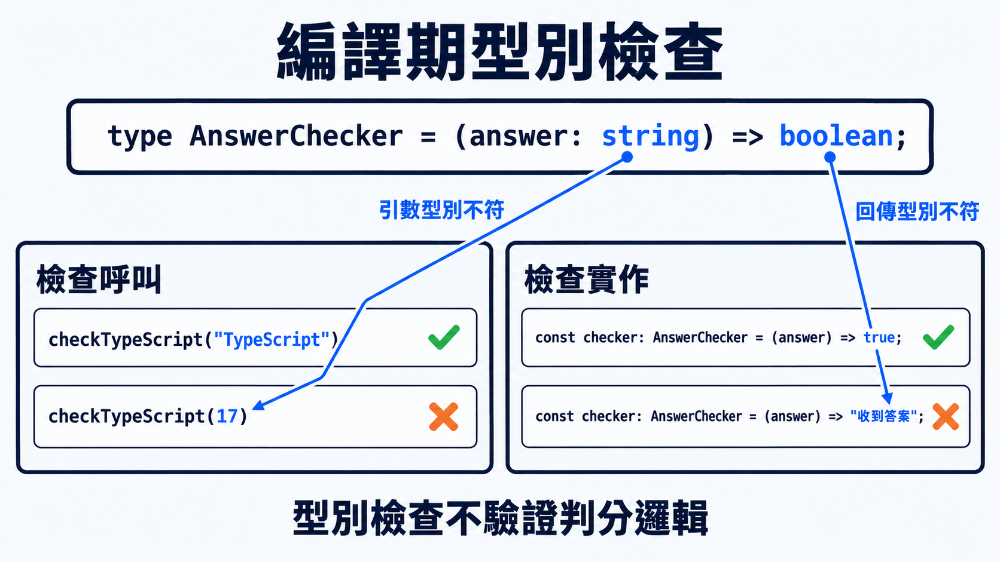

前一篇用物件的欄位判斷兩份資料能不能互相使用。函式也能被存進變數、當成參數傳遞，因此同樣需要一份契約：呼叫端會提供哪些資料，函式完成後又會交回什麼結果。

這篇會從參數與回傳值開始，接著處理回呼函式、選填參數、剩餘參數與多載。

## 函式型別描述輸入與輸出

先替函式寫出型別：

```ts
type AnswerChecker = (answer: string) => boolean;

const checkTypeScript: AnswerChecker = (answer) => {
  return answer.trim().toLowerCase() === "typescript";
};

console.log(checkTypeScript("TypeScript")); // true
```

函式型別的寫法是 `(參數名稱: 參數型別) => 回傳型別`。括號內每個參數以冒號標註型別，多個參數用逗號分隔；`=>` 右側標註回傳值的型別。

型別檢查只確認參數與回傳值的型別，不保證判分邏輯正確；永遠回傳 `true` 的函式也能符合 `AnswerChecker`。

上面的實作用箭頭函式，也可以改成一般函式宣告。一般函式的參數同樣用 `名稱: 型別`，回傳型別則寫在右括號後方的冒號：

```ts
function checkTypeScript(answer: string): boolean {
  return answer.trim().toLowerCase() === "typescript";
}

const checker: AnswerChecker = checkTypeScript;
```



## 回呼函式契約決定外層程式怎麼呼叫它

回呼函式（callback）是傳給另一段程式、由那段程式呼叫的函式。作為參數時，用函式型別指定它要接收哪些參數、回傳什麼型別：

```ts
function submitAnswer(answer: string, checker: AnswerChecker): string {
  return checker(answer) ? "答對了" : "再試一次";
}
```

TypeScript 會檢查參數型別，但允許函式實作少宣告用不到的參數。因此，`AnswerVisitor` 雖然定義了 `answer` 和 `index`，只宣告 `answer` 的函式仍然符合這份型別；呼叫時傳入的索引會被忽略。

```ts
type AnswerVisitor = (answer: string, index: number) => void;

function visitAnswers(answers: string[], visit: AnswerVisitor): void {
  answers.forEach((answer, index) => visit(answer, index));
}

// 顯示作答位置，需要答案與索引
visitAnswers(["A", "B"], (answer, index) => {
  console.log(`第 ${index + 1} 筆：${answer}`);
});

// 只印出答案，不需要索引
visitAnswers(["A", "B"], (answer) => {
  console.log(answer);
});
```

> [!TIP] 不使用回傳值 / void
> 函式型別中的 `void` 表示呼叫端不使用回傳值，實作仍可回傳其他值。

## 選填參數表示呼叫端可以省略

問號放在參數名稱後方，代表呼叫時可以不提供該參數：

```ts
function formatFeedback(message: string, label?: string): string {
  if (label === undefined) {
    return message;
  }

  return `${label}：${message}`;
}

formatFeedback("答對了");
formatFeedback("答對了", "第 3 題");
```

參數設為選填後，呼叫端可能不提供值，因此函式內的參數型別會包含 `undefined`。使用前必須先判斷是否有值，或設定預設值來處理缺值情況。

回呼函式的參數是否加 `?`，決定的是呼叫時能不能省略值：

| 參數宣告 | 呼叫時的要求 | 實作中參數的型別 |
|---|---|---|
| `index: number` | 必須傳入數字 | `number` |
| `index?: number` | 可以不傳 | `number | undefined` |

```ts
type OptionalIndexVisitor = (answer: string, index?: number) => void;
```

前面提過，函式實作本來就可以少宣告用不到的參數，不需要加 `?`。只有呼叫時真的允許不傳值，才把參數設為選填；需要使用這個參數的實作，也就必須處理 `undefined`。

> [!TIP] 回呼函式的選填參數 / Optional parameters in callbacks
> [官方選填參數文件](https://www.typescriptlang.org/docs/handbook/2/functions.html#optional-parameters-in-callbacks)展示了把索引標成選填後，使用端會遇到的缺值錯誤，可用來對照自己的回呼函式宣告。

## 剩餘參數收集數量不固定的值

剩餘參數（rest parameter）寫成 `...變數名稱`，會把傳入的引數收集成陣列。TypeScript 再用冒號標註陣列型別，例如 `...messages: string[]`。需要把數量不固定的回饋組成一句話時，就可以這樣寫：

```ts
function joinFeedback(...messages: string[]): string {
  return messages.join("；");
}

joinFeedback("答對了");
joinFeedback("答對了", "連續答對 3 題", "繼續保持");
```

剩餘參數可以收集零到多個引數，且必須放在參數列表最後；若前面有固定參數，則只收集它們之後的引數。

## 多載表達有限的呼叫方式

多載（function overload）讓同一個函式依不同的參數型別，對應不同的回傳型別。

前面用 `type` 定義函式型別。TypeScript 也允許用 `function` 開頭、分號結尾的宣告，直接描述某個函式的參數與回傳型別。這種宣告沒有 `{ ... }` 函式本體，只用於型別檢查。

多載使用這種語法，先列出允許的呼叫方式，再接一份同名的函式實作：

- 多載簽章（overload signature）：沒有函式本體的宣告，每行列出一種參數與回傳型別組合。
- 實作簽章（implementation signature）：函式本體前的參數與回傳型別標註，必須與所有多載簽章相容。

執行時只有一個函式，各種輸入都由同一份本體處理。

```ts
// 正規化單一答案回傳字串
function normalizeAnswer(value: string): string;
// 正規化一組答案回傳陣列
function normalizeAnswer(value: string[]): string[];
function normalizeAnswer(value: string | string[]): string | string[] {
  if (typeof value === "string") {
    return value.trim();
  }

  return value.map((item) => item.trim());
}

const oneAnswer = normalizeAnswer(" A ");
// string

const manyAnswers = normalizeAnswer([" A ", " B "]);
// string[]
```

呼叫端只依對外的多載簽章檢查。此例若傳入尚未縮小的 `string | string[]` 引數，就無法符合任一多載。

多載的價值在於保留這裡的對應關係：傳入字串得到字串，傳入陣列得到陣列。若幾種輸入都回傳相同型別，直接以聯集型別標註參數通常更簡單，不需要為每種輸入重複列一份簽章。

> [!TIP] 函式多載 / Function overload
> 想確認哪些呼叫能符合多載，可以查閱[官方多載文件](https://www.typescriptlang.org/docs/handbook/2/functions.html#function-overloads)，其中也比較了多載與聯集參數的適用情況。

## 今日練習

[day17 | 型旅 TypeTrail](https://typetrail.johnsonchen.dev/#/day/17)

## 結論

- 函式型別由參數與回傳值共同組成，參數名稱不影響相容性。
- 回呼函式的型別描述外層程式會如何呼叫它；可以忽略多出的參數，但不能要求呼叫端沒有承諾提供的資料。

函式契約已經能描述固定的輸入與輸出；當兩者之間還要保留同一個型別關係時，就需要在這份契約上再加入型別參數。
