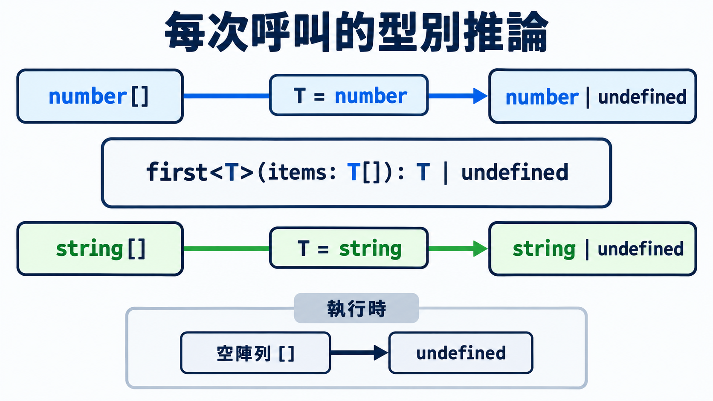

前一篇用多載描述幾種固定的呼叫方式。泛型讓同一份函式或型別定義適用於各種型別，使用時再決定具體型別。

## 聯集沒有保留輸入與輸出的對應

假設取出陣列第一筆資料的函式要支援字串、數字，以及其他資料型別。用聯集宣告時，每增加一種型別，都要在參數與回傳型別各補一次，支援的種類越多，宣告就越長：

```ts
function first(items: string[] | number[]): string | number | undefined {
  return items[0];
}

const firstScore = first([80, 90]);
// string | number | undefined
```

回傳型別包含聯集中所有可能的型別。傳入數字陣列後，使用結果時仍須判斷它是字串、數字，還是 `undefined`。支援的型別越多，需要處理的情況也越多。

## 泛型用型別參數連接不同位置

泛型（generic）讓函式或型別宣告接受型別參數，再把它用在需要連動的位置。型別參數（type parameter）是宣告中的型別名稱，由使用端提供具體型別，或由 TypeScript 推論。

先在名稱後加上 `<T>` 宣告型別參數，接著才能在宣告中引用 `T`。函式可以在參數與回傳型別使用它，介面與型別別名則可以用在欄位型別：

| 宣告種類 | 寫法 |
|---|---|
| 函式 | `function 函式名稱<T>(參數: T): T { ... }` |
| 介面 | `interface 介面名稱<T> { 欄位: T; }` |
| 型別別名 | `type 型別名稱<T> = { 欄位: T };` |

使用時以 `<具體型別>` 指定，例如 `函式名稱<string>(值)` 或 `介面名稱<string>`。`T` 是常見命名，也可以取成 `Item` 等有意義的名稱。

```ts
// T[] 的元素與回傳值使用同一個型別 T
function first<T>(items: T[]): T | undefined {
  return items[0]; // 空陣列會得到 undefined
}

const firstScore = first([80, 90]);
// number | undefined

const firstTag = first(["typescript", "generic"]);
// string | undefined
```

> [!TIP] 泛型 / Generics
> [TypeScript 官方泛型文件](https://www.typescriptlang.org/docs/handbook/2/generics.html)也展示泛型函式型別與類別，需要閱讀其他寫法時可參考。



## 推論與明確指定型別

TypeScript 通常會根據引數推論型別參數，這稱為泛型推論（generic inference）。呼叫函式時也可以在名稱後用 `<具體型別>` 明確指定：

```ts
interface Question {
  id: string;
  prompt: string;
}

const questions: Question[] = [
  { id: "q18", prompt: "泛型保留了什麼？" },
];

const question = first(questions); // Question | undefined
const emptyQuestion = first<Question>([]); // Question | undefined
```

引數已有足夠型別資訊時，可以省略角括號。空陣列沒有元素可供推論預計使用的型別，明確指定就能表達這個要求。

## 約束限定型別參數的要求

未受限制的型別參數可以代表各種型別，函式本體只能使用這些型別都支援的操作。泛型約束（generic constraint）用來限定型別參數必須符合的要求，讓實作可以使用要求中已知的欄位或方法。

寫法是 `<T extends 型別>`，表示 `T` 必須與指定型別相容，仍可保留符合要求的其他型別資訊。

```ts
// 依 ID 查資料，因此要求每個元素至少有 id: string
function findById<T extends { id: string }>(
  items: T[],
  id: string,
): T | undefined {
  return items.find((item) => item.id === id);
}

const choiceQuestions = [
  { id: "q18", prompt: "選出正確答案", options: ["A", "B"] },
];

const found = findById(choiceQuestions, "q18");
if (found !== undefined) {
  console.log(found.options);
}

const users = [
  { id: "u18", name: "小明", email: "ming@example.com" },
];

const user = findById(users, "u18");
if (user !== undefined) {
  console.log(user.email); // 保留使用者資料的欄位型別
}
```

約束提供函式本體可以使用的欄位，`T` 則保留來源的完整型別。若直接把參數寫成 `{ id: string }[]`、回傳寫成 `{ id: string } | undefined`，使用端就只能透過這份回傳型別讀取 `id`。

## 泛型介面描述可替換的欄位型別

泛型介面適合外層結構相同、部分欄位型別不同的資料，例如 API 回應都帶有請求 ID，但內容可能是題目清單或題數：

```ts
interface ApiResponse<T> {
  data: T;
  requestId: string;
}

const questionResponse: ApiResponse<Question[]> = {
  data: questions,
  requestId: "req-18",
};

const countResponse: ApiResponse<number> = {
  data: 20,
  requestId: "req-count",
};
```

指定型別後，介面中所有使用 `T` 的位置都會套用該型別。若資料結構固定，直接宣告欄位即可；只有同一份結構需要搭配不同型別時，才加入型別參數。

## 延伸到 Angular：這個概念在框架中如何出現？

Angular 的 `HttpClient` 和 `fetch` 一樣，可以用來呼叫 API。它的 `get<T>()` 讓使用端指定預期取得的資料型別：

```ts
import { HttpClient } from "@angular/common/http";

function loadQuestions(http: HttpClient) {
  return http.get<ApiResponse<Question[]>>("/api/questions");
}
```

指定回應型別後，後續操作資料時，編輯器就能提供欄位補全：

```ts
function showQuestions(http: HttpClient) {
  // 類似 addEventListener 登記回呼；這裡在收到 API 回應時呼叫
  loadQuestions(http).subscribe((response) => {
    // 輸入 response.，下拉清單會提供 data、requestId
    const question = first(response.data);

    if (question !== undefined) {
      // 輸入 question.，下拉清單會提供 id、prompt
      console.log(question.prompt);
    }
  });
}
```

> [!TIP] HTTP 回應型別 / HTTP response type
> [Angular 官方 HTTP 文件](https://angular.dev/guide/http/making-requests#fetching-json-data)說明 `get` 的泛型用法與限制，接 API 時可核對。

## 今日練習

[day18 | 型旅 TypeTrail](https://typetrail.johnsonchen.dev/#/day/18)

## 結論

泛型讓同一份定義適用於各種型別，也能保留參數與回傳值之間的型別關係。實作需要使用特定欄位或方法時，可以透過約束限定型別參數的要求。

除了使用端提供型別，型別也能從既有資料取得，例如下一篇介紹的物件的鍵與欄位型別。
