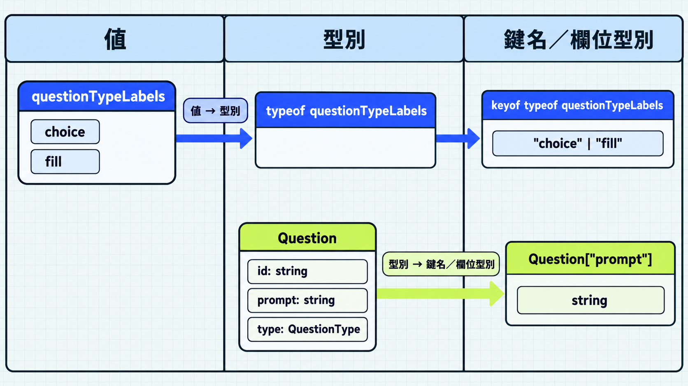

前一篇用泛型保留不同位置的型別關係。這次介紹如何從既有的值或型別取得資訊，讓鍵名與欄位型別跟著來源更新。

例如題型標籤已經寫在物件裡，卻又另外宣告一份題型聯集：

```ts
const questionTypeLabels = {
  choice: "選擇題",
  fill: "填空題",
};

type QuestionType = "choice" | "fill";
```

新增題型時，物件與聯集都要修改。如果能從物件取得鍵名，就可以只維護一份資料。

## `typeof` 取得既有值的型別

JavaScript 的 `typeof` 用來判斷值的類型，執行時會回傳 `"string"`、`"object"` 等字串。TypeScript 在型別宣告中使用 `typeof`，則會取得變數或屬性的型別。

兩種寫法可以並排比較：

```ts
const questionTypeLabels = {
  choice: "選擇題",
  fill: "填空題",
};

console.log(typeof questionTypeLabels); // "object"

type QuestionTypeLabels = typeof questionTypeLabels;
// { choice: string; fill: string; }
```

`type 名稱 = typeof 變數` 讓型別別名參照既有變數的型別，省去另外宣告相同結構的工作。物件欄位仍可改成其他字串，因此 TypeScript 將欄位型別推論為 `string`。

> [!TIP] 型別位置的 typeof / Typeof type operator
> 型別位置的 `typeof` 可參照變數與屬性，像是 `typeof obj.field`。其他語法限制可查閱 [TypeScript 官方 typeof 文件](https://www.typescriptlang.org/docs/handbook/2/typeof-types.html)。

## `keyof` 取得物件型別的鍵名

`keyof 型別` 會取得該型別允許的鍵名。對於明確列出欄位的物件型別，結果是這些鍵名組成的聯集：

```ts
type Question = {
  id: string;
  prompt: string;
  type: "choice" | "fill";
};

type QuestionKey = keyof Question;
// "id" | "prompt" | "type"

let key: QuestionKey = "prompt";
key = "type";
// key = "answer"; // 型別錯誤：不在鍵名聯集中
```

鍵名聯集可以限制變數只接受已宣告的欄位名稱。修改來源型別的欄位時，允許的鍵名也會跟著更新。

若來源是物件變數，就先用 `typeof` 取得型別，再用 `keyof` 取得鍵名：

```ts
// 使用前面宣告的 questionTypeLabels
type QuestionType = keyof typeof questionTypeLabels;
// "choice" | "fill"
```

`keyof typeof 變數` 可以由右往左讀：先取得變數的型別，再取得該型別的鍵名。這就能取代開頭手寫的題型聯集。

> [!TIP] 鍵名型別 / Keyof type operator
> 鍵名也可以是數字或 symbol。若型別允許任意字串或數字作為鍵，`keyof` 的結果也會包含較廣的型別；相關寫法可查閱 [TypeScript 官方 keyof 文件](https://www.typescriptlang.org/docs/handbook/2/keyof-types.html)。



## 索引存取型別取得欄位的型別

索引存取型別（indexed access type）的寫法是 `型別[鍵名型別]`，用來取得指定欄位的型別。鍵名可以是單一字面值型別，也可以是聯集；使用聯集時，結果會包含各個欄位的型別：

```ts
type QuestionPrompt = Question["prompt"];
// string

type QuestionKind = Question["type"];
// "choice" | "fill"

type QuestionContent = Question["prompt" | "type"];
// string："choice"、"fill" 已包含在 string 中
```

`Question[keyof Question]` 則取得所有欄位型別的聯集。來源欄位的型別改變時，依照這些寫法取得的型別也會更新。

方括號內需要的是型別。若鍵名存在變數中，要先用 `typeof` 取得它的型別：

```ts
const field = "prompt";

// type Prompt = Question[field]; // 型別錯誤：field 是變數名稱
type Prompt = Question[typeof field]; // string
```

這裡的 `const` 字串變數推論為 `"prompt"`，所以能作為索引型別。若變數型別是一般的 `string`，它也可能是不存在的欄位名稱，便無法用來索引這份物件型別。

> [!TIP] 索引存取型別 / Indexed access type
> 除了物件欄位，也能用這種寫法取得陣列元素的型別。需要其他用法時，可參考 [TypeScript 官方索引存取型別文件](https://www.typescriptlang.org/docs/handbook/2/indexed-access-types.html)。

## 用 `extends` 限制可使用的鍵名

前一篇介紹過，型別參數可以用 `extends` 限定必須符合的型別。搭配 `keyof` 時，就能要求型別參數只能使用物件型別已有的鍵名：

```ts
// keyof Question 是 "id" | "prompt" | "type"
// K 必須符合這個鍵名聯集，才能用來索引 Question
type QuestionField<K extends keyof Question> = Question[K];

// K 指定為 "prompt"，取得 Question["prompt"]
type PromptField = QuestionField<"prompt">; // string

// K 指定為 "type"，取得 Question["type"]
type Kind = QuestionField<"type">; // "choice" | "fill"

// type Answer = QuestionField<"answer">;
// 型別錯誤："answer" 不符合 keyof Question 的要求
```

`extends keyof Question` 限制 `K` 可使用的鍵名，`Question[K]` 則取得對應欄位的型別。這裡用型別別名展示兩者的組合；只需要取得單一欄位型別時，直接寫 `Question["prompt"]` 即可。

## 今日練習

[day19 | 型旅 TypeTrail](https://typetrail.johnsonchen.dev/#/day/19)

## 結論

已有物件資料時，可以用 `typeof` 取得型別，再用 `keyof` 取得鍵名；已有物件型別時，則能用索引存取型別取得欄位型別。這些寫法讓相關宣告共用同一份來源，減少資料改動時需要同步修改的地方。

除了取得鍵名與欄位型別，也可以從既有型別挑選欄位或調整欄位要求，這是下一篇工具型別的主題。
