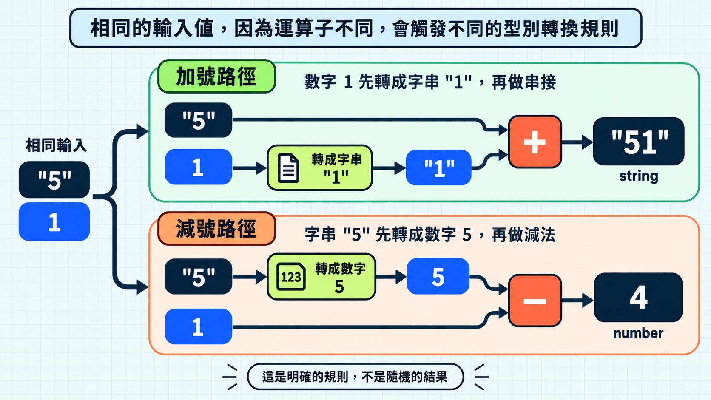

在進入今日主題前，先看一段計算總分的程式：

```js
function calculateTotal(score, bonus) {
  return score + bonus;
}

console.log(calculateTotal("5", 1)); // "51"
```

呼叫時傳入的分數是字串 `"5"`，獎勵是數字 `1`；需求上希望結果是 `6`，實際卻得到字串 `"51"`。

這段程式語法正確，執行期間也沒有報錯。問題是 `score` 實際收到字串，`+` 因此執行字串串接。

沒有參數型別標註的函式看起來簡單合理，但只看函式名稱與參數名稱，無法知道實際傳入的值。

麻煩的地方是：JavaScript 按照既定規則完成運算，結果卻不符合需求。

## 動態型別不是「沒有型別」

JavaScript 的值有型別。字串、數字、布林值、`undefined`、物件與函式在程式執行期間都有自己的行為。

動態型別（dynamic typing）指的是型別由程式當下處理的值決定，而不是在宣告變數時固定下來；程式執行期間，同一個變數可以先指向數字，之後再指向字串。

```js
let answer = 1;

console.log(typeof answer); // number

answer = "A";

console.log(typeof answer); // string
```

這裡不是 `answer` 自己變了型別，而是它後來指向了另一個型別的值。JavaScript 會在程式真正執行到某個操作時，根據當下的值決定怎麼處理。

這帶來彈性，也讓一部分檢查延後到相關程式碼真正執行才發生。

例如下面的函式：

```js
function normalizeAnswer(answer) {
  return answer.trim().toUpperCase();
}

console.log(normalizeAnswer(" a ")); // A

normalizeAnswer(1);
// 執行期錯誤：這個值沒有 trim 方法
```

傳入字串時沒有問題，但 JavaScript 不會在函式宣告時確認 `answer` 一定是字串。

錯誤直到這次函式呼叫真的執行，並嘗試尋找數字上的 `trim` 方法時才出現。

## JavaScript 有時報錯，有時幫忙轉型

如果型別不相容的操作都立刻報錯，問題反而比較容易發現。但即使型別不相容，JavaScript 也可能透過隱式型別轉換讓操作繼續執行。

> [!TIP] 隱式型別轉換 / Implicit coercion
> JavaScript 會在操作需要時，按照規則嘗試把值轉成另一種型別。想深入了解可以閱讀 MDN 的 [Type coercion](https://developer.mozilla.org/en-US/docs/Web/JavaScript/Guide/Data_structures#type_coercion)。

開頭的 `+` 已經展示字串串接；再看減號如何處理同樣類型的輸入：

```js
const numberResult = "5" - 1; // 4

console.log(typeof numberResult); // number
```

`-` 沒有字串相減這種用途，所以 JavaScript 會嘗試把 `"5"` 轉成數字，再計算 `5 - 1`，得到 `4`。

開頭的 `+` 與這裡的 `-` 都沒有拋出錯誤，卻依照運算子的規則得到不同結果：前者是字串串接，後者是數字運算。




隱式轉換不一定是錯誤，但當轉換藏在運算裡時，我們必須同時記住資料來源與運算子的規則。

如果希望輸入以數字參與運算，可以明確寫出轉換。

> [!TIP] 顯式轉換 / Explicit conversion
> 使用 `Number()`、`String()` 或 `Boolean()`，可以明確表達希望的型別；但轉換結果仍要依輸入內容驗證。

```js
const rawScore = "5";
const score = Number(rawScore);

console.log(score + 1); // 6
console.log(Number("five")); // NaN
```

`Number(rawScore)` 不能保證輸入一定有效；無法轉成數字的字串會得到 `NaN`。但至少這段程式清楚表達了「我們要把輸入當成數字處理」，而不是讓 `+` 順便決定。

## 真值與假值不是「大概算 true 或 false」

在條件判斷中，`if` 會按照 JavaScript 的規則，先將括號內的值判斷為真值（Truthy）或假值（Falsy）。因此，條件不一定要原本就是布林值（Boolean）；Truthy 會執行區塊，Falsy 則不會。

常見的假值包括：

- `false`
- `0` 與 `-0`
- `0n`
- 空字串 `""`
- `null`
- `undefined`
- `NaN`

除了少數特殊情況，其餘值都是真值。幾個容易猜錯的例子是：

```js
Boolean("0");     // true
Boolean("false"); // true
Boolean([]);      // true
Boolean({});      // true
```

字串的內容看起來像 `0` 或 `false` 並不重要。只要不是空字串，它就是真值。陣列與物件即使沒有內容，也仍然是物件，因此也是真值。

直接用真值判斷是否作答，不一定符合需求。假設型旅 TypeTrail 網站有一道數字題，答案 `0` 是合法輸入：

```js
function hasAnswer(answer) {
  return Boolean(answer);
}

console.log(hasAnswer(0)); // false
```

這段程式把「假值」直接當成「沒有答案」，因此錯誤地排除了數字 `0`。如果真正的規則只是排除 `null` 與 `undefined`，就應該把條件寫清楚：

```js
function hasAnswer(answer) {
  return answer !== null && answer !== undefined;
}

console.log(hasAnswer(0)); // true
```

真值與假值是 JavaScript 的轉換規則。看到 `if (value)` 時，要先問清楚這裡想排除的是空字串、數字 `0`、`null`，還是所有假值。

## 型別錯誤為什麼常常來得很晚？

前面的 `normalizeAnswer(1)` 就是例子：傳入數字時，錯誤要等到呼叫 `trim()` 才出現。把值傳給函式，並不代表已經確認它能支援後面的操作。

這種錯誤也可能躲在很遠的資料流後面：

1. 表單或 API 提供一個值。
2. 程式把值傳過幾個函式。
3. 中途沒有任何操作需要確認它的型別。
4. 最後某段程式呼叫特定方法，才發現值不符合預期。

錯誤出現的位置因此不一定是錯誤資料進入系統的位置。當程式規模變大，排查成本也跟著增加。

不過，JavaScript 也可能在不報錯的情況下繼續執行，讓程式順利跑完，結果卻不是我們要的。這類問題不一定會立即被發現，反而可能比程式直接崩潰更難排查。

## TypeScript 想把哪些問題提早？

TypeScript 會在程式執行前，根據它目前知道的型別檢查操作是否合理。

例如，將函式參數標註為 `number`：

```ts
function formatScore(score: number): string {
  return score.toFixed(2);
}

formatScore("100");
```

參數已經宣告為 `number`，TypeScript 因此可以在執行前指出：字串 `"100"` 不能傳給需要數字的函式。我們不必等到程式真的走到這條路徑，才發現這個值沒有 `toFixed` 方法。

## TypeScript 不會替我們決定需求

TypeScript 能確認兩個值都是 `number`，卻不知道分數公式是否寫對：

```ts
function addBonus(score: number, bonus: number): number {
  return score - bonus;
}
```

這段程式在型別上沒有問題，但函式名稱與實際行為不一致。如果需求是加分，正確運算應該是 `score + bonus`。這類業務邏輯需要測試與人工審查。

TypeScript 不會讓外部資料自動可信。下面的宣告只表達我們希望回傳 `string`：

```ts
function readAnswer(): string {
  return JSON.parse('{"answer": 1}').answer;
}
```

`JSON.parse` 會在程式執行期間解析資料；光靠函式回傳型別，並不會把裡面的數字驗證或轉換成字串。

最後，TypeScript 也不會消除 JavaScript 的執行規則。學 TypeScript 之前先理解這些規則，才能分辨錯誤究竟來自型別設計、資料邊界，還是 JavaScript 本身的執行期行為。

## 今日練習

[day2 | 型旅 TypeTrail](https://typetrail.johnsonchen.dev/#/day/2)

## 結論

- JavaScript 的變數可以先後指向不同型別的值；隱式轉換可能產生符合語言運算規則、卻不符合需求的結果。
- 真值與假值是語言規則，不等於「有資料」與「沒資料」的業務定義；動態型別的錯誤也通常要等不相容的操作真正執行後才出現。
- TypeScript 可以把已知的型別衝突提早到執行前，但不會驗證外部資料，也不會替我們判斷商業邏輯。

下一篇會從值的型別，進一步看到值放在哪裡：作用域與閉包。屆時會說明函式如何保留外部資料，以及不同執行範圍為什麼會影響程式行為。
