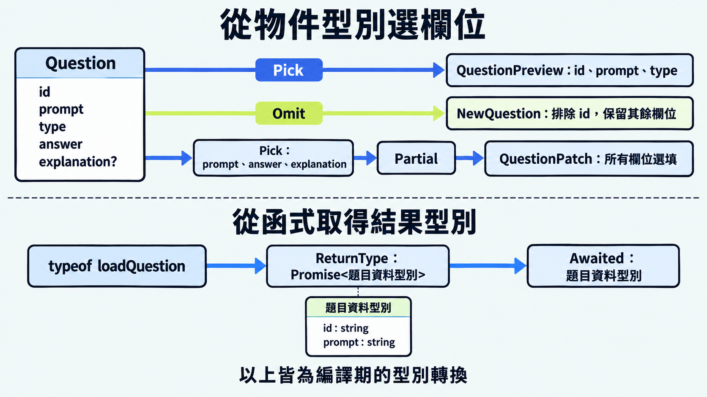

前一篇介紹如何取得既有型別的鍵名與欄位型別。有時候我們還需要保留部分欄位，或把必填欄位改成選填。TypeScript 內建的工具型別（utility types）提供這些常用的轉換，讓相關宣告共用同一份來源。

工具型別可以直接使用，不需要匯入套件。角括號中放入來源型別，以及工具需要的其他型別參數。

## `Pick` 與 `Omit` 選擇要保留的欄位

`Pick<T, K>` 從來源型別 `T` 取出鍵名 `K` 指定的欄位；`Omit<T, K>` 則排除指定欄位，保留其餘欄位。多個鍵名可以用字串字面值聯集表示，原本的欄位型別與選填設定會保留。

```ts
interface Question {
  id: string;
  prompt: string;
  type: "choice" | "fill";
  answer: string;
  explanation?: string;
}

// 列表預覽只需要編號、題幹與題型
type QuestionPreview = Pick<Question, "id" | "prompt" | "type">;

// 新增資料的 id 由伺服器產生，輸入型別排除它
type NewQuestion = Omit<Question, "id">;
// 保留 prompt、type、answer，以及選填的 explanation
```

來源欄位的型別改變時，這些衍生型別也會更新。工具型別只描述資料需要哪些欄位；實際要從物件取出欄位，仍須寫出對應的程式：

```ts
function toPreview(question: Question): QuestionPreview {
  return {
    id: question.id,
    prompt: question.prompt,
    type: question.type,
  };
}
```

> [!TIP] 工具型別 / Utility types
> [TypeScript 官方工具型別文件](https://www.typescriptlang.org/docs/handbook/utility-types.html)提供完整的寫法與範例。本文先介紹選欄位、修改欄位要求與取得結果型別的常用工具。

## `Partial` 與 `Required` 調整欄位是否必填

`Partial<T>` 將 `T` 的所有欄位改為選填，適合描述只提供部分欄位的資料。`Required<T>` 則將所有欄位改為必填，使用端需要提供完整的欄位。

```ts
// 第一步：Pick 只保留這三個欄位
type EditableQuestion = Pick<Question, "prompt" | "answer" | "explanation">;

// 第二步：Partial 把保留的欄位都改為選填
type QuestionPatch = Partial<EditableQuestion>;

const patch: QuestionPatch = { prompt: "如何只保留指定的欄位？" };
const emptyPatch: QuestionPatch = {}; // 所有欄位皆可省略
```

把上面的兩步合併，也能得到相同的型別：

```ts
// 內層 Pick 選欄位，外層 Partial 把它們改為選填
type CombinedQuestionPatch = Partial<
  Pick<Question, "prompt" | "answer" | "explanation">
>;

// QuestionPatch 與 CombinedQuestionPatch 都相當於：
// {
//   prompt?: string;
//   answer?: string;
//   explanation?: string;
// }
```

組合較長時，可以像前面的寫法拆開命名，方便看出每一步的作用。

`Required` 則讓原本選填的欄位也必須提供：

```ts
// 審核時要求答案解析也必須存在
type ReviewQuestion = Required<Question>;

const review: ReviewQuestion = {
  id: "q20",
  prompt: "哪個工具會把欄位改成選填？",
  type: "fill",
  answer: "Partial",
  explanation: "Partial 會讓來源型別的所有欄位變成選填。",
};
```

## `Readonly` 限制欄位重新指定

`Readonly<T>` 將 `T` 的所有欄位改成唯讀。透過這個型別使用物件時，TypeScript 會阻止重新指定欄位：

```ts
const preview: Readonly<QuestionPreview> = {
  id: "q20",
  prompt: "工具型別會修改實際資料嗎？",
  type: "choice",
};

// preview.prompt = "哪個工具會把欄位改成選填？"; // 型別錯誤：prompt 是唯讀欄位
```

`Readonly` 是 TypeScript 的編譯期限制。若要在 JavaScript 執行時阻止欄位修改，可以使用 `Object.freeze()`：

```js
const frozenPreview = Object.freeze(preview);

// frozenPreview.prompt = "哪個工具會把欄位改成選填？";
// 凍結後無法改變 prompt 的值
```

`Readonly` 和 `Object.freeze()` 都只作用於目前這層，巢狀物件或陣列的內容仍可能修改。

## `Record` 描述鍵名與值型別

`Record<K, V>` 建立物件型別，以 `K` 指定鍵名，以 `V` 指定各欄位的值型別。`K` 是固定鍵名聯集時，每個鍵都必須有對應欄位：

```ts
type QuestionType = Question["type"];

const questionTypeLabels: Record<QuestionType, string> = {
  choice: "選擇題",
  fill: "填空題",
};

// 少了 fill，會有型別錯誤
// const labels: Record<QuestionType, string> = { choice: "選擇題" };
```

固定的鍵名聯集能讓編譯器檢查是否漏了項目。來源聯集新增鍵名時，對應表也要補上欄位。若再套上 `Readonly<Record<QuestionType, string>>`，就會同時限制鍵名、值型別與欄位修改。

## `ReturnType` 取得函式回傳型別

`ReturnType<F>` 從函式型別 `F` 取得回傳型別，讓其他型別宣告沿用函式的結果，不必再寫一份相同的資料結構。回傳型別可以明確標註，也可以由 TypeScript 推論。

角括號內需要放函式型別。若來源是已宣告的函式，就用 `typeof` 取得它的型別。

> [!TIP] Promise 型別 / Promise type
> `Promise<T>` 表示非同步操作成功完成後會取得 `T` 型別的值。可以用 `await` 取得結果，也可以用 `.then()` 接收結果。

```ts
// 用記憶體中的資料示範非同步回傳型別
function loadQuestion(id: string) {
  return Promise.resolve({
    id,
    prompt: "哪個工具可以取得函式回傳型別？",
  });
}

type LoadPromise = ReturnType<typeof loadQuestion>;
// Promise<{ id: string; prompt: string }>
```

來源的回傳型別改變時，別名也會跟著更新。

## `Awaited` 取得 await 後的結果型別

`Awaited<T>` 取得對 `T` 使用 `await` 後的結果型別。它會解開 `Promise`，直到取得最終的值型別；非 `Promise` 型別則維持原樣。

```ts
// 等同於 Awaited<ReturnType<typeof loadQuestion>>
type LoadedQuestion = Awaited<LoadPromise>;
// { id: string; prompt: string }

// showQuestion 接收載入完成後的題目資料
// 參數使用 LoadedQuestion，型別會隨 loadQuestion 的回傳型別更新
function showQuestion(question: LoadedQuestion) {
  console.log(question.prompt);
}

// Promise 完成後，把題目資料交給 showQuestion
loadQuestion("q20").then(showQuestion);
```



## 今日練習

[day20 | 型旅 TypeTrail](https://typetrail.johnsonchen.dev/#/day/20)

## 結論

工具型別讓欄位選擇、必填要求與函式結果都能沿用既有宣告，減少重複維護型別的工作。

如果內建工具沒有提供需要的轉換，也可以自己定義。下一篇會介紹映射型別與條件型別，看看如何逐一調整欄位，或依條件選擇型別。
