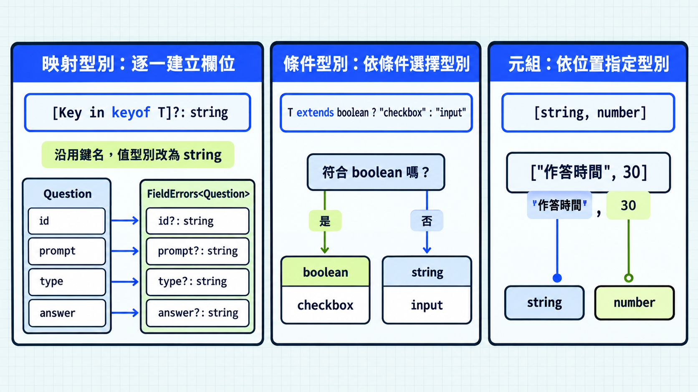

前一篇使用工具型別完成常見轉換。閱讀工具或函式庫宣告時，會遇到逐一調整欄位、依條件選擇型別，以及描述固定位置的寫法。理解這些語法，就能讀懂轉換規則，也能在現成工具不夠用時自行定義。

## 映射型別：依鍵名建立欄位

映射型別（mapped type）依鍵名集合建立物件型別，用同一份規則指定各欄位的值型別、選填或唯讀設定。

前一篇的 `Partial`、`Pick` 已能處理常見需求。需要對每個欄位套用自己的規則時，可以使用映射型別。

`keyof T` 取得鍵名聯集，`[Key in keyof T]` 逐一建立欄位。冒號後指定值型別，方括號後的 `?` 將欄位改成選填：

> [!TIP] 映射語法中的 in / Mapping with in
> `[Key in Keys]` 中的 `in` 表示逐一使用鍵名聯集 `Keys` 的成員，讓 `Key` 代表每個鍵名。這是型別宣告的語法；JavaScript 的 `"name" in object` 則是在執行時檢查物件是否具有屬性。

```ts
interface Question {
  id: string;
  prompt: string;
  type: "choice" | "fill";
  answer: string;
}

type QuestionDraft = {
  // keyof Question 取得 "id" | "prompt" | "type" | "answer"
  // Key 逐一使用這些鍵名，Question[Key] 取得對應的欄位型別
  // 方括號後的 ? 將欄位改成選填
  [Key in keyof Question]?: Question[Key];
};
```

效果等同於 `Partial<Question>`。表單函式庫也可以沿用資料欄位的名稱，建立錯誤訊息型別。下面是簡化的自訂工具範例：

```ts
// 函式庫提供：每個欄位都能有一則錯誤訊息
type FieldErrors<T> = {
  [Key in keyof T]?: string;
};

// 使用端傳入自己的資料型別
// 在物件中填入各欄位的錯誤訊息
const errors: FieldErrors<Question> = {
  prompt: "請填寫題目內容",
  answer: "請填寫正確答案",
};
// 自動沿用 Question 的鍵名，錯誤訊息依 FieldErrors 設定為 string
```

`FieldErrors<Question>` 描述錯誤訊息物件的欄位要求，TypeScript 會依這份型別檢查鍵名與訊息型別。

## 在轉換過程中保留或移除修飾子

映射型別中，`readonly` 放在方括號前，`?` 放在方括號後；加上 `-` 則移除對應設定，例如 `-readonly`、`-?`。沒有指定修飾子時，會保留來源欄位的設定：

```ts
// 題目範本的欄位是唯讀，且可省略
interface QuestionInput {
  readonly prompt?: string;
  readonly type?: "choice" | "fill";
  readonly answer?: string;
}

type CompleteQuestion = {
  // 用範本建立新題目：欄位必須填齊，題幹與答案可以修改
  // -readonly 移除唯讀，-? 移除選填
  -readonly [Key in keyof QuestionInput]-?: QuestionInput[Key];
};

const question: CompleteQuestion = {
  prompt: "哪個符號會移除選填設定？",
  type: "fill",
  answer: "-?",
};

question.prompt = "哪個修飾子會移除唯讀？"; // 可以重新指定
```

如果只要讓所有欄位變成必填，可以使用 `Required`。

## 條件型別像型別層的 if

條件型別（conditional type）是一種依照型別是否符合條件，選擇結果型別的寫法。成立與不成立時，分別得到不同的型別。

寫法是 `T extends U ? A : B`：`extends` 檢查 `T` 是否可以指定給 `U`；成立時採用 `?` 後的型別 `A`，否則採用 `:` 後的型別 `B`。

> [!TIP] 條件型別中的 extends / Conditional type check
> 前面 `<T extends U>` 的 `extends` 用來限制型別參數；這裡 `T extends U ? A : B` 的 `extends` 則用來判斷型別，再選擇結果。
> 在 `T extends boolean ? "checkbox" : "input"` 中，`extends` 判斷的是 `T` 是否符合 `boolean`，再決定採用哪個字串字面值型別。

表單函式庫可以根據資料型別，限制可使用的控制項名稱。例如布林值使用勾選框，其他型別使用輸入框。先把這個規則寫成型別：

```ts
// FieldKind 是自訂型別別名，T 是傳入的資料型別
type FieldKind<T> = T extends boolean ? "checkbox" : "input";

type HintControl = FieldKind<boolean>; // "checkbox"
type TitleControl = FieldKind<string>; // "input"
```

讀取這個規則時，先看傳入的型別，再選擇條件成立或不成立的結果：

```ts
// T 是 boolean：符合 boolean，採用 ? 後的 "checkbox"
const hintControl: HintControl = "checkbox";

// T 是 string：不符合 boolean，採用 : 後的 "input"
const titleControl: TitleControl = "input";
// const wrong: TitleControl = "checkbox"; // 錯誤：只接受 "input"
```

這類規則常見於支援多種資料型別的共用工具。一般功能若只需要固定幾個型別，直接宣告即可。

> [!TIP] 條件型別與聯集 / Distributive conditional type
> 當 `extends` 左側直接寫型別參數 `T`，傳入聯集時會分別判斷各個成員，再合併結果。例如 `FieldKind<string | boolean>` 會得到 `"input" | "checkbox"`。這稱為分配式條件型別；先知道這個結果，閱讀函式庫宣告時再深入即可。



## 元組：依位置指定型別

元組（tuple）是指定各個位置型別的陣列型別。例如 `[string, number]` 表示第一個元素是字串、第二個是數字：

```ts
const entry: [string, number] = ["作答時間", 30];
// entry[0] 是 string，entry[1] 是 number
const [label, seconds] = entry; // 解構後仍保留各位置的型別
```

像是座標 `[x, y]`、鍵值配對 `[key, value]` 都有固定的位置意義，適合元組。若回傳資料有多個不容易記住的欄位，物件名稱通常比位置更清楚。

## 今日練習

[day21 | 型旅 TypeTrail](https://typetrail.johnsonchen.dev/#/day/21)

## 結論

映射型別用同一份規則建立多個欄位，條件型別則依型別是否符合條件選擇結果。元組則讓陣列的每個位置具有明確型別。先能讀懂這三種基本寫法，就能理解更多共用工具的型別宣告。

有時候我們還需要取得型別中的一部分，例如陣列的元素型別。下一篇會用 `infer` 來完成這件事。
