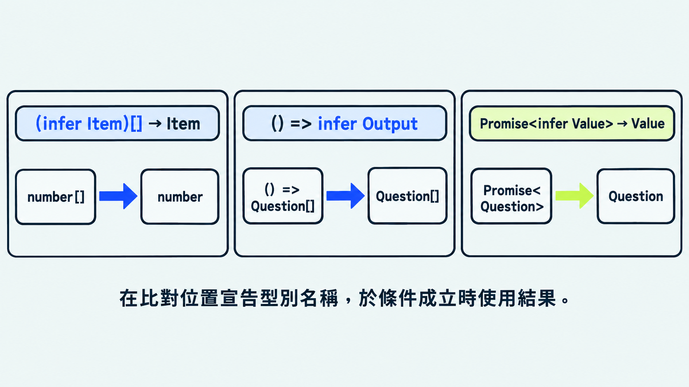

前一篇用條件型別（conditional type）判斷「某個型別是否符合條件」，再決定結果。實際閱讀函式庫宣告時，常見的下一個問題是：「符合條件之後，我想取出裡面的那一段型別，該怎麼寫？」

本篇會從陣列、函式與 Promise 三種結構，介紹 `infer` 如何取得其中的型別。

後面的例子使用以下同一個型別：

```ts
type Question = {
  id: string;
  prompt: string;
  type: "choice" | "fill";
  answer: string;
};
```

## `infer` 取出符合結構的部分

`infer` 是「推斷」的意思。在 TypeScript 中，它用來從既有型別的結構中推導出其中一部分，並替這個型別取一個名稱。寫法是 `infer 名稱`，放在條件型別 `extends` 右側想擷取的位置；推導出的型別可以在 `?` 後的成立分支使用。

`T` 代表傳入的完整型別，`infer Item` 則讓 TypeScript 推導其中的元素型別。`Item` 是自行取的名稱，換成 `Element` 也可以；宣告與成立分支使用的名稱要一致。

```ts
// (infer Item)[] 比對陣列，將元素型別命名為 Item
// 符合時採用 Item；其他型別則保留原本的 T
type ElementOf<T> = T extends (infer Item)[] ? Item : T;

// number[] 符合陣列結構，推導出 Item 是 number
type FromNumbers = ElementOf<number[]>; // number

// string 是字串型別，採用冒號後的 T，保留 string
type FromText = ElementOf<string>; // string
```

> [!TIP] 唯讀陣列的元素型別 / Readonly array element type
> 唯讀陣列可以用 `T extends ReadonlyArray<infer Item> ? Item : never` 取得元素型別。例如傳入 `readonly number[]`，結果是 `number`；這個寫法也適用於一般陣列。

## 取得函式的回傳型別

`infer` 也能取得函式的回傳型別。先從無參數函式開始：`()` 是參數部分，箭頭右側是回傳型別，把 `infer Output` 放在這個位置，就能取得它：

```ts
// () => infer Output 比對無參數函式，將回傳型別命名為 Output
// 符合時採用 Output；不符合時採用 never
type OutputOf<T> = T extends () => infer Output
  ? Output
  : never;

// 傳入回傳 string 的函式型別，推導出 Output 是 string
type QuestionId = OutputOf<() => string>; // string

// 傳入回傳 Question[] 的函式型別，推導出 Output 是 Question[]
type QuestionList = OutputOf<() => Question[]>; // Question[]
```

輸入一般物件型別時，會採用條件不成立的分支：

```ts
type Invalid = OutputOf<Question>; // never
```

這個版本用來示範無參數函式。具有必要參數的函式，可以使用內建 `ReturnType` 取得回傳型別。

### 函式回傳的是 `Promise<Question>`

沿用前面的 `OutputOf`，先看以下這個函式：

```ts
function loadQuestion(): Promise<Question> {
  return Promise.resolve({
    id: "q22",
    prompt: "哪個關鍵字能推導結構中的型別？",
    type: "fill",
    answer: "infer",
  });
}

// typeof loadQuestion 取得函式型別：() => Promise<Question>
// OutputOf 取得箭頭右側的型別：Promise<Question>
type LoadResult = OutputOf<typeof loadQuestion>;
```

此時得到的是 `Promise<Question>`。接下來要取得其中的 `Question`，可以把 `infer` 放在 Promise 的型別參數位置。

### 用 `infer` 取得 Promise 裡的資料型別

```ts
type UnwrapPromise<T> = T extends Promise<infer Value>
  ? Value
  : T;

// 前面的 LoadResult 是 Promise<Question>，這裡直接寫出完整型別
// 傳入 Promise<Question>，與 Promise<infer Value> 比對
// TypeScript 推導出 Value 是 Question，採用 ? 後的 Value
type LoadedQuestion = UnwrapPromise<Promise<Question>>; // Question
```

`infer Value` 的作用，和前面的 `infer Item` 相同：陣列範例取得元素型別，這裡取得 Promise 型別參數所代表的資料型別。

### 內建工具的型別宣告也使用 `infer`

查看 TypeScript 提供的型別宣告，可以看到 `ReturnType` 在函式回傳型別的位置使用 `infer`，而 `Awaited` 也使用 `infer` 推導等待完成後的資料型別。

前面的 `OutputOf` 與 `UnwrapPromise` 的範例，讓我們看懂這些內建工具如何擷取型別。內建版本另外處理了更多情況，例如具有參數的函式與巢狀 Promise。

一般開發可以直接使用這兩個工具：

```ts
// ReturnType 取得函式回傳型別：Promise<Question>
// Awaited 取得等待完成後的資料型別：Question
type QuestionData = Awaited<ReturnType<typeof loadQuestion>>;
```

> [!TIP] 條件型別中的推導 / Inferring within conditional types
> [官方條件型別文件](https://www.typescriptlang.org/docs/handbook/2/conditional-types.html#inferring-within-conditional-types)有更多 `infer` 範例。閱讀函式庫宣告時，可以對照其中的陣列與函式寫法。



## 今日練習

[day22 | 型旅 TypeTrail](https://typetrail.johnsonchen.dev/#/day/22)

## 結論

閱讀 `infer` 時，先找出它在陣列、函式或 Promise 結構中的位置，再看 `?` 後如何使用推導結果。日常開發可以選用現成工具，這些簡化範例則幫助我們理解工具的型別宣告。
