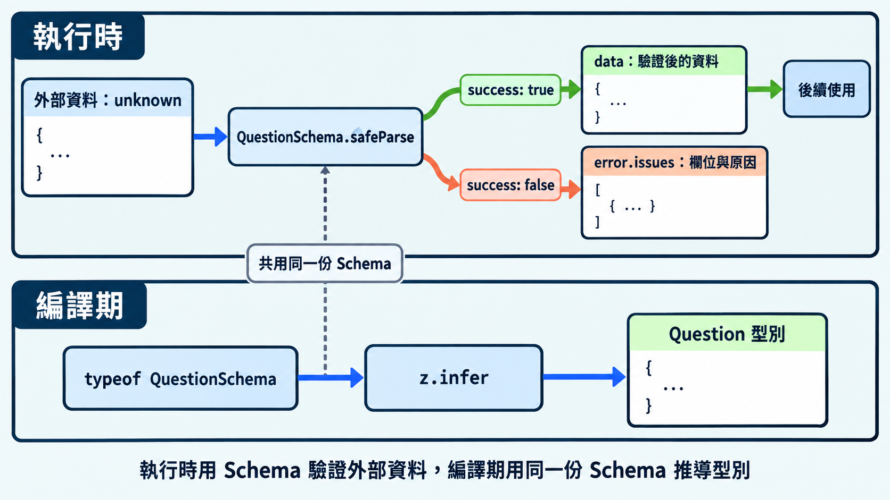

前面介紹的型別都能幫忙檢查程式怎麼使用資料。當資料來自 API、檔案或使用者輸入時，還需要確認實際收到的值符合規則。這篇用 Zod 建立資料入口，把驗證規則與 TypeScript 型別接在一起。

## API 回應的型別從哪裡來？

原生 `fetch` 透過 `response.json()` 取得 API 回應資料。API 文件描述預期的資料格式，程式則可以用型別與驗證規則描述這份格式。

```ts
// 原生 fetch：先取得資料，將內容以 unknown 接收
async function fetchQuestion(): Promise<unknown> {
  const response = await fetch("/api/question");
  if (!response.ok) throw new Error("題目載入失敗");

  const payload: unknown = await response.json();
  return payload;
}
```

`unknown` 明確標示資料尚未確認格式。TypeScript 會要求先確認型別才能存取欄位，降低程式提前使用資料的機會；通過 Zod 驗證後，就能使用具有明確型別的結果。

將資料交給 Zod，可以確認實際值符合規則，並取得驗證後的資料型別。

泛型與 `as 型別` 都是提供資訊給編譯器；Zod 則在程式執行時讀取資料，檢查欄位與值。

## 認識 Zod

Zod 是 JavaScript 與 TypeScript 的資料驗證套件。它會在程式執行時讀取資料，依照指定規則檢查欄位與值，並提供驗證結果和錯誤資訊。

這份規則稱為資料結構描述（Schema），描述欄位、值的型別與限制。Zod 也能從 Schema 推導 TypeScript 型別，讓驗證規則與型別共用同一來源。

API 回應、表單輸入或讀取檔案後的資料，都可以交給 Zod 驗證。多個欄位與巢狀結構的檢查可以組合使用，省去逐項撰寫條件判斷與整理錯誤的工作。

### 安裝套件

使用 Zod 4。在已有的 npm 專案安裝套件與 TypeScript 執行工具：

```sh
node --version
npm --version
npm install zod@4
npm install -D tsx
```

以下 TypeScript 程式碼依序放入 `validate-question.ts`：宣告 Schema、呼叫 `safeParse`，再取得型別。

## 用 Zod 宣告資料規則

Zod 用函式建立 Schema。先從單一值的規則開始，再把它們放進物件或陣列，組成整份資料的規則：

| 寫法 | 驗證要求 |
|---|---|
| `z.string()` | 字串 |
| `z.number()` | 有限數值 |
| `z.boolean()` | 布林值 |
| `z.enum(["choice", "fill"])` | 指定選項中的字串 |
| `z.array(z.string())` | 每個元素都是字串的陣列 |
| `z.object({ prompt: z.string() })` | 物件必須有字串型別的 prompt 欄位 |

這些寫法會建立規則，呼叫驗證方法時才會檢查輸入。`z.string()` 要求輸入已經是字串，傳入數字會驗證失敗。

```ts
// validate-question.ts
// 將 Zod 的匯出集中到 z 名稱下，透過 z.string()、z.object() 等寫法使用
import * as z from "zod";

const QuestionSchema = z.object({
  id: z.string().min(1),
  prompt: z.string().trim().min(1), // 先去除前後空白，再要求至少一個字元
  type: z.enum(["choice", "fill"]),
});
```

規則可以串接使用。例如 `.min(1)` 加上最短長度限制，`.trim()` 去除字串前後空白。後續使用驗證結果中的資料，就能取得處理後的內容。

> [!TIP] Schema 寫法 / Schema API
> Zod 還提供選填欄位與其他組合方式。[官方 Schema 文件](https://zod.dev/api)整理各種規則，需要處理更複雜的資料時再查閱即可。

## `safeParse` 回傳成功或失敗結果

`safeParse` 接受待驗證的值，回傳一個結果物件。下面將它命名為 `result`，依驗證結果分成兩種結構：

- 成功：`{ success: true, data }`。`data` 是驗證後的資料，包含 Schema 處理過的內容，例如去除前後空白的字串。
- 失敗：`{ success: false, error }`。`error` 是錯誤物件，`error.issues` 是列出欄位位置與失敗原因的陣列。

這兩種結構以 `success` 區分，屬於前面介紹的可辨識聯集。先判斷 `result.success`，TypeScript 就能確認該分支可以使用 `data` 或 `error`：

```ts
// validate-question.ts（接續前面的程式碼）
const payload: unknown = {
  id: "q-23",
  prompt: "  哪個型別表示未知資料？  ",
  type: "choice",
};

const result = QuestionSchema.safeParse(payload);

if (result.success) {
  // success 是 true：data 是符合 Schema 的資料
  console.log(result.data.prompt); // 前後空白已去除
} else {
  // success 是 false：從 error.issues 查看欄位位置與失敗原因
  console.error(result.error.issues);
}
```

把 `prompt` 改成 `42` 或只含空白的字串，就會進入失敗分支，可以在這裡顯示錯誤或結束流程。

另一個方法是 `parse`，它在驗證成功時直接回傳資料，失敗時拋出 `ZodError`，由 `try/catch` 或外層錯誤流程處理。

| 方法 | 驗證成功 | 驗證失敗 |
|---|---|---|
| `Schema.safeParse(value)` | `{ success: true, data }` | `{ success: false, error }` |
| `Schema.parse(value)` | 直接回傳資料 | 拋出 `ZodError` |

依照程式如何處理失敗選擇方法。Schema 負責檢查已宣告的資料規則。編號是否存在由資料查詢確認，題目答案是否正確則屬於內容審查。

## 從 Schema 取得 TypeScript 型別

Schema 已經寫出每個欄位的規則，例如 `z.string()` 對應 `string`，`z.enum(["choice", "fill"])` 對應 `"choice" | "fill"`。透過 `z.infer`，可以直接從這些規則取得資料型別，省去手動再列一次欄位與型別。

寫法是 `z.infer<typeof Schema>`，其中 `typeof` 取得 Schema 的型別。`z.infer` 是 Zod 提供的工具名稱，和上一篇直接寫在條件型別中的 `infer` 關鍵字用法不同：

```ts
// validate-question.ts（接續前面的程式碼）
// typeof QuestionSchema 取得規則的型別
// z.infer 取得驗證後的資料型別，type Question 替這個結果命名
type Question = z.infer<typeof QuestionSchema>;
// 等同於手動宣告以下欄位：
// type Question = {
//   id: string;
//   prompt: string;
//   type: "choice" | "fill";
// };

function showQuestion(question: Question): void {
  console.log(question.prompt.toUpperCase());
}

if (result.success) {
  showQuestion(result.data); // 驗證成功的資料具有推導出的型別
}
```

`type Question = ...` 替推導結果命名，方便函式參數等地方使用。修改 Schema 時，`Question` 的欄位型別也會跟著更新。

將以上三段程式碼依序放入同一個檔案後，執行：

```sh
npx tsx validate-question.ts
```

`tsx` 負責執行 `.ts` 檔案，型別檢查由編輯器或 `tsc` 處理。TypeScript 型別宣告在轉成 JavaScript 時會被移除；若 API 傳來的題目文字是數字，程式直接呼叫 `toUpperCase()` 就會拋出錯誤。例外若沒有被捕捉，當次流程就會中斷。

Zod 的用途是提早發現不符合規則的資料，讓程式在使用前處理驗證失敗。範例呼叫 `safeParse()` 後，格式錯誤會回傳失敗結果，程式便能顯示錯誤或結束流程；成功時才把 `result.data` 交給後續函式。這讓格式錯誤能在資料入口集中處理。



## 延伸到 Angular：在 HTTP 資料入口驗證

Angular 的 `HttpClient.get<Question>()` 將回應宣告為 `Question`，讓編譯器據此檢查程式。要確認伺服器傳來的內容，可以先接收 `unknown`，再交給 Schema 驗證。

在 HTTP 回應流程中加入驗證：

```ts
import { HttpClient } from "@angular/common/http";
import { map } from "rxjs";

// 與前面宣告的 QuestionSchema 放在同一個檔案
function loadQuestion(http: HttpClient) {
  return http.get<unknown>("/api/question").pipe(
    map((data) => QuestionSchema.parse(data)),
  );
}
```

驗證成功後，訂閱端取得具有 `Question` 型別的資料；驗證失敗時，`parse` 拋出的錯誤會交給訂閱端的錯誤處理流程。

> [!TIP] HTTP 回應型別 / HTTP response type
> [Angular 官方 HTTP 文件](https://angular.dev/guide/http/making-requests#fetching-json-data)說明泛型回應型別的用途與限制，Schema 則負責確認實際收到的資料。

## 今日練習

[day23 | 型旅 TypeTrail](https://typetrail.johnsonchen.dev/#/day/23)

## 結論

外部資料先以 `unknown` 接收，通過 Schema 驗證後再使用。Zod 把規則、驗證結果與型別推導接在一起，讓資料入口能檢查實際值，後續函式也有明確的型別。

同一份資料在新增、修改與顯示時，可能需要不同欄位。下一篇會從這些用途整理 API 型別。
