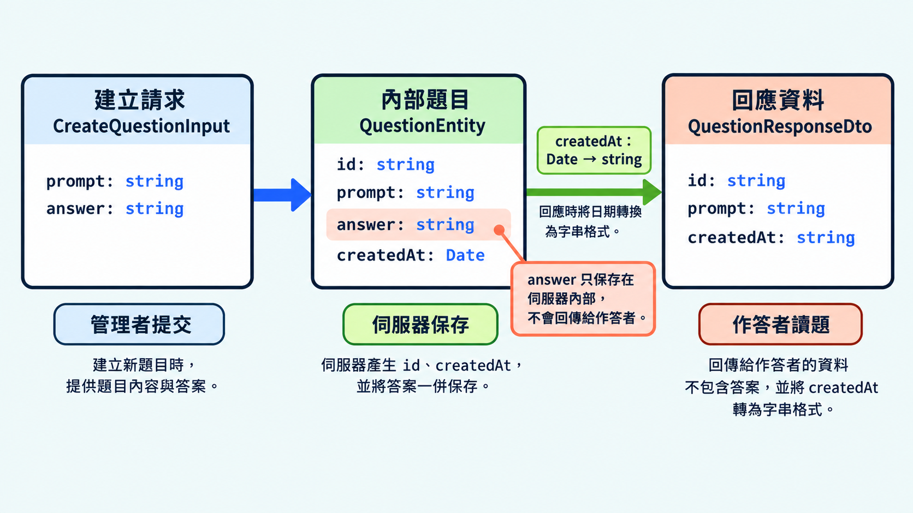

前一篇介紹如何檢查收到的資料。接下來要想的是：建立資料時需要填什麼，保存時需要記錄什麼，回傳給使用者時又應該提供什麼？這些用途需要的欄位可能不同，型別也可以分開定義。

## 一份型別為什麼不夠？

資料在建立、儲存與回傳時，可能有不同的必填欄位與公開範圍。分開定義型別，可以讓每種用途各自表達完整的要求。若為了共用型別，把所有欄位都改成選填，原本必要的欄位也會變成可以省略。

```ts
// 改進前：為了共用，將所有欄位設成選填
interface SharedQuestion {
  id?: string;
  prompt?: string;
  answer?: string;
  createdAt?: Date;
}

// 所有欄位都有 ?，因此空物件也能通過型別檢查
const incomplete: SharedQuestion = {};
```

## 區分新增資料與保存資料

建立請求（create input）定義新增資料時要提供哪些欄位。編號、建立時間等由系統自動產生的資料，就不需要一起傳入。

```ts
// 建立題目時提交的資料；id 與 createdAt 由伺服器產生
interface CreateQuestionInput {
  prompt: string;
  answer: string;
}

// 前面的 SharedQuestion 全部選填，允許傳入空物件
// 這裡的 prompt 與 answer 都是必填，少了任一欄位就會報錯
// const missing: CreateQuestionInput = {};
```

實體（entity）描述系統內保存的完整資料，包含建立時提供的內容與系統產生的資訊。

```ts
interface QuestionEntity {
  id: string; // 伺服器產生的編號
  prompt: string;
  answer: string; // 答案只留在伺服器內
  createdAt: Date; // 伺服器記錄建立時間
}
```

```ts
// 建立請求：必須提供題目文字與答案
const input: CreateQuestionInput = {
  prompt: "哪個關鍵字宣告變數？",
  answer: "const",
};

// 保存資料：補上系統產生的欄位，符合 QuestionEntity
const saved: QuestionEntity = {
  ...input,
  id: "q24",
  createdAt: new Date(),
};
```

共同欄位的要求相同時，也可以用 `Pick` 共用定義：

```ts
// 若要共用欄位定義，可用這個型別取代前面的 CreateQuestionInput
// 從 QuestionEntity 取出 prompt 與 answer，保留它們的型別與必填要求
// 不包含系統產生的 id 與 createdAt
type CreateQuestionInputFromEntity = Pick<QuestionEntity, "prompt" | "answer">;
```

## 更新請求只開放可修改的欄位

更新請求（update input）描述這次操作可以修改的欄位。欄位是否選填，取決於操作允許哪些修改。

```ts
// 更新題目文字時，必須傳入新的 prompt
interface UpdateQuestionInput {
  prompt: string;
}
```

`Partial` 會把所有欄位改成選填，但可修改哪些欄位，需要另外決定。直接套用完整的實體型別，就會連系統產生的欄位也一起開放。

```ts
// 這個型別連 id 都允許傳入，超出只修改題目文字的需求
// type UpdateQuestionInput = Partial<QuestionEntity>;
// const update: UpdateQuestionInput = { id: "another-id" };
```

可以先用 `Pick` 選出允許修改的欄位，並保留必填要求：

```ts
// 前面的 UpdateQuestionInput 也可以改用這種寫法，只包含必填的 prompt
// type UpdateQuestionInput = Pick<QuestionEntity, "prompt">;

const update: UpdateQuestionInput = { prompt: "新的題目文字" };
// const invalidUpdate: UpdateQuestionInput = { id: "another-id" }; // 錯誤：沒有 id 欄位
```

## 回應 DTO 描述對外傳送的資料

資料傳輸物件（Data Transfer Object，DTO）描述程式之間傳送的資料格式。回應 DTO 定義 API 要回傳哪些欄位，以及各欄位的型別。

回傳資料前，可以用函式挑出要公開的欄位，並將值轉成回應需要的格式。標上回傳型別後，TypeScript 就會檢查函式產生的資料是否符合要求。

```ts
// 給作答者的回應不包含答案，日期使用字串
interface QuestionResponseDto {
  id: string;
  prompt: string;
  createdAt: string;
}

function toQuestionResponseDto(question: QuestionEntity): QuestionResponseDto {
  return {
    id: question.id,
    prompt: question.prompt,
    // 日期轉成回應使用的字串
    createdAt: question.createdAt.toISOString(),
  };
}
```

用 `Omit` 排除欄位後，實際物件裡的資料仍會保留。下面比較直接指派與呼叫轉換函式的結果：

```ts
type PublicQuestion = Omit<QuestionEntity, "answer">;

// 型別中省略 answer，但只是將 saved 指派給另一個變數
// 兩個變數指向同一個物件，物件裡仍然有 answer
const publicQuestion: PublicQuestion = saved;
// Object.keys() 列出物件實際包含的欄位名稱
console.log(Object.keys(publicQuestion));
// ["prompt", "answer", "id", "createdAt"]

// 前面的轉換函式建立新物件，只放入要回傳的欄位
const response = toQuestionResponseDto(saved);
console.log(Object.keys(response));
// ["id", "prompt", "createdAt"]
```

收到 API 回應後，有時會先整理資料再顯示，例如將日期轉成方便閱讀的文字。這些給畫面使用的資料，也可以另外定義型別。

> [!TIP] 畫面模型 / View Model
> 畫面模型定義畫面要使用的資料。例如 API 回傳 `createdAt` 日期字串，畫面模型可以另外提供 `createdAtText`，用來顯示「2026 年 10 月 7 日」。回應資料已經符合畫面需求時，就可以直接使用。



## 今日練習

[day24 | 型旅 TypeTrail](https://typetrail.johnsonchen.dev/#/day/24)

## 結論

建立與更新請求描述可以提交什麼，實體描述系統內保存什麼，回應 DTO 描述對外傳送什麼。先區分用途，再決定欄位，就能讓型別清楚表達每一處的要求。

除了回應內容，呼叫端也需要知道操作成功或失敗。下一篇會介紹如何用型別描述這些結果。
