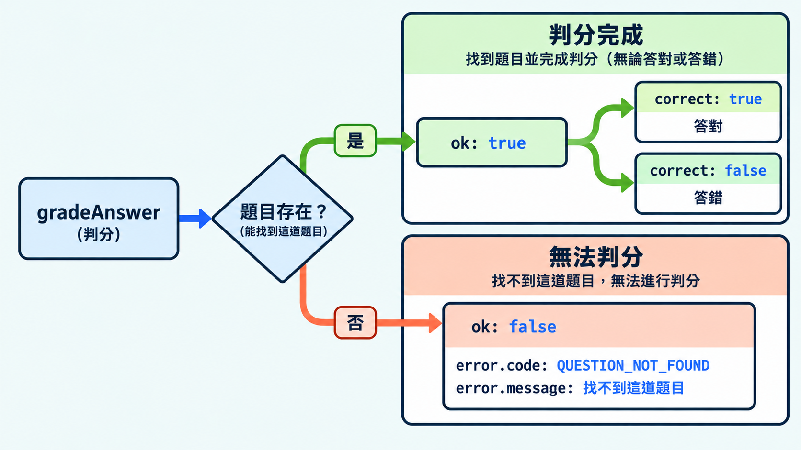

函式除了回傳成功的資料，也可能遇到無法完成操作的情況。如果所有失敗都回傳 `null`，呼叫端就無法從結果知道原因。把失敗也寫進型別，可以讓使用端知道有哪些情況需要處理。

## 分開表示處理結果與失敗原因

結果模式（Result pattern）用不同的回傳分支表示成功與失敗。成功分支放處理結果，失敗分支放原因，呼叫端再依分支決定下一步。

```ts
type GradeResult =
  // 答對與答錯都表示判分已完成，分別使用 correct: true 與 false
  | { ok: true; correct: boolean }
  // 找不到題目時無法判分，因此回傳失敗原因
  | {
      ok: false;
      error: {
        code: "QUESTION_NOT_FOUND"; // 程式用來辨識「找不到題目」
        message: string; // 顯示給使用者的錯誤說明
      };
    };
```

這裡使用前面介紹過的可辨識聯集。判斷 `ok` 後，TypeScript 就能知道可以讀取成功結果，還是錯誤資訊。

> [!TIP] 錯誤代碼 / Error code
> 錯誤代碼是用來區分失敗原因的固定值。程式可以比較代碼來選擇處理方式，顯示的錯誤文字則可以另外修改。

## 將可預期的失敗寫進回傳型別

可預期的失敗，是設計功能時已經考慮到、並安排好處理方式的失敗情況。可以將這些情況寫進回傳型別，交給呼叫端處理。

```ts
// 伺服器保存的題目資料，這裡只保留編號與正確答案
interface QuestionEntity {
  id: string;
  answer: string;
}

// 使用者送出的作答資料：題目編號與填寫的答案
interface AnswerInput {
  questionId: string;
  answer: string;
}

function gradeAnswer(
  input: AnswerInput,
  questions: QuestionEntity[],
): GradeResult {
  // 用作答資料中的 questionId，找出要判分的題目
  const question = questions.find((item) => item.id === input.questionId);

  // 題目可能已被刪除，但使用者仍從舊頁面送出答案
  if (!question) {
    // 無法比對答案，回傳 GradeResult 的失敗分支
    return {
      ok: false,
      error: { code: "QUESTION_NOT_FOUND", message: "找不到這道題目" },
    };
  }

  // 找到題目後，比對使用者答案與正確答案
  // ok: true 表示判分完成，correct 才表示答案是否正確
  return { ok: true, correct: input.answer === question.answer };
}
```

接著準備一筆題目資料，測試不同的作答。判分完成與無法判分時，會分別回傳成功與失敗兩種型別的物件：

```ts
// q25 的正確答案是 "const"
const questions: QuestionEntity[] = [{ id: "q25", answer: "const" }];

// 題目存在，而且答案相同
console.log(gradeAnswer({ questionId: "q25", answer: "const" }, questions));
// { ok: true, correct: true }

// 題目存在，但答案不同：判分仍然完成，所以 ok 是 true
console.log(gradeAnswer({ questionId: "q25", answer: "let" }, questions));
// { ok: true, correct: false }

// 題目陣列裡沒有 missing，無法取得正確答案來判分
console.log(gradeAnswer({ questionId: "missing", answer: "const" }, questions));
// { ok: false, error: { code: "QUESTION_NOT_FOUND", message: "找不到這道題目" } }
```

## 用條件判斷縮小型別

`GradeResult` 是成功與失敗兩種型別的聯集。判斷 `ok` 後，TypeScript 會將 `result` 縮小成對應型別，讓程式讀取該分支的欄位。

```ts
const result = gradeAnswer({ questionId: "missing", answer: "const" }, questions);

if (result.ok) {
  // result 是成功型別，有 correct
  console.log(result.correct);
  // result.error; // 型別錯誤：成功型別沒有 error
} else {
  // result 是失敗型別，有 error
  console.log(result.error.code); // QUESTION_NOT_FOUND
  console.log(result.error.message); // 找不到這道題目
  // result.correct; // 型別錯誤：失敗型別沒有 correct
}
```

如果之後需要區分更多失敗原因，可以擴充錯誤代碼，再加入對應的處理方式。



## 什麼時候用 `throw`？

回傳失敗結果後，呼叫端會取得結果，繼續執行後面的程式。`throw` 則會中斷目前流程，把錯誤往外傳；有對應的 `catch` 時，就跳到那裡處理。

同樣是找不到題目，也可以選擇拋出錯誤：

```ts
function gradeOrThrow(input: AnswerInput, questions: QuestionEntity[]): boolean {
  const question = questions.find((item) => item.id === input.questionId);
  if (!question) {
    throw new Error("找不到這道題目");
  }
  return input.answer === question.answer;
}

try {
  const correct = gradeOrThrow({ questionId: "missing", answer: "const" }, questions);
  console.log(correct); // 發生錯誤時，這行不會執行
} catch (error) {
  if (error instanceof Error) {
    console.log(error.message); // 找不到這道題目
  } else {
    console.log("發生未知錯誤");
  }
}
```

兩種方式都能處理失敗，可以依呼叫端需要的處理方式選擇：

| 方式 | 呼叫端如何處理 | 適合的情況 |
|---|---|---|
| 結果模式 | 讀取回傳值，用條件判斷區分分支 | 需要依失敗原因提供提示或修正方式 |
| `throw` | 用 `try/catch` 捕捉錯誤 | 需要交給外層統一記錄與處理 |

TypeScript 的回傳型別只描述正常回傳的值，拋出的錯誤不會自動列在其中。因此 `gradeOrThrow` 宣告回傳 `boolean`，也可能因 `throw` 而中斷。

> [!TIP] 捕捉錯誤的型別 / Catch variable
> JavaScript 可以拋出字串、物件等不同的值。在 `strict` 設定下，`catch` 參數預設是 `unknown`，所以範例先用 `instanceof Error` 判斷，再讀取 `message`。[官方錯誤捕捉文件](https://www.typescriptlang.org/docs/handbook/release-notes/typescript-4-4.html#defaulting-to-the-unknown-type-in-catch-variables---useunknownincatchvariables)說明這項型別檢查。

## 今日練習

[day25 | 型旅 TypeTrail](https://typetrail.johnsonchen.dev/#/day/25)

## 結論

設計回傳型別時，也要想好操作失敗後，使用端需要知道什麼。用不同分支描述成功與失敗，再用錯誤代碼區分原因，就能讓處理方式更明確。

這些函式也可以放進框架的服務中使用。接下來會看看框架如何組織這些程式，以及類別在其中扮演的角色。
