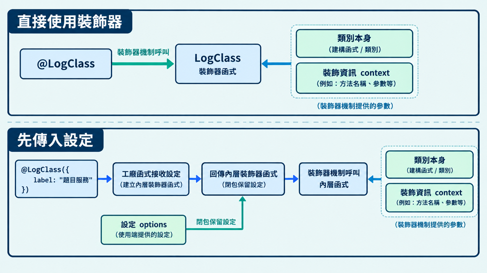

部分框架會在類別或方法上方使用 `@xxx`，例如 Angular 的 `@Component`、NestJS 的 `@Controller`。這種寫法能把共用的處理或設定，直接標在要套用的地方。

這些函式稱為裝飾器，可以重複套用到不同宣告。今天會先從自訂裝飾器開始，再來看 Angular 如何用它提供設定。

## 裝飾器是什麼？

裝飾器（decorator）是套用在類別或成員宣告上的函式，使用 `@名稱` 指定。TypeScript 會把這項語法編譯成 JavaScript 呼叫，執行時將被裝飾的對象與相關資訊交給函式。

裝飾器的用途由函式內容決定。它可以記錄資訊，也可以回傳替代的類別或方法來改變行為；框架則可以利用它取得設定。

## 寫一個自訂裝飾器

`@` 後面的名稱會依作用域找到對應的函式，可以使用自行宣告或從套件匯入的函式。

標準的類別裝飾器會收到兩個參數：第一個是類別本身，第二個是描述這次裝飾的資訊物件。TypeScript 提供 `ClassDecoratorContext` 型別，描述第二個參數有哪些欄位，例如類別名稱 `name`。

```ts
// decorator-demo.ts
function LogClass(_target: Function, context: ClassDecoratorContext): void {
  // _target 收到 QuestionService 類別本身，Function 表示函式型別
  // 這裡只使用 context；_target 前的底線用來標示未使用的參數
  console.log(`2. 裝飾器執行：${context.name}`);
}

console.log("1. 類別宣告前");

// @LogClass 找到上方的 LogClass 函式
@LogClass
class QuestionService {
  getPrompt(): string {
    return "哪個關鍵字宣告變數？";
  }
}

console.log("3. 類別宣告完成");

// new 建立實例時，不會再次呼叫 LogClass
const first = new QuestionService();
const second = new QuestionService();
console.log(`4. 建立實例後：${first.getPrompt()}`);
```

執行後，主控台會依序顯示：

```text
1. 類別宣告前
2. 裝飾器執行：QuestionService
3. 類別宣告完成
4. 建立實例後：哪個關鍵字宣告變數？
```

## 讓裝飾器接受設定

直接使用 `@名稱` 時，裝飾器的參數由系統提供。若希望使用端另外傳入設定，可以先用一個函式接收設定，再由它回傳裝飾器。這種函式稱為裝飾器工廠（decorator factory）。

`@名稱({...})` 會先呼叫工廠函式，取得它回傳的裝飾器函式。類別定義時，再呼叫這個裝飾器，傳入類別本身與裝飾資訊。

```ts
// decorator-demo-v2.ts
function LogClass(options: { label: string }) {
  // 外層接收使用端傳入的設定
  return function (_target: Function, context: ClassDecoratorContext): void {
    // 內層才是裝飾器，收到類別本身與裝飾資訊
    // 透過閉包使用外層的 options
    console.log(`${options.label}：${context.name}`);
  };
}

// 先呼叫 LogClass，把回傳的函式當作裝飾器
@LogClass({ label: "題目服務" })
class QuestionService {
  getPrompt(): string {
    return "哪個關鍵字宣告變數？";
  }
}

// 類別定義時印出「題目服務：QuestionService」
const service = new QuestionService();
console.log(service.getPrompt()); // 哪個關鍵字宣告變數？
```

> [!TIP] 線上試用 / TypeScript Playground
> 想試試前面的自訂裝飾器，可以將程式碼貼到 [TypeScript Playground](https://www.typescriptlang.org/play/)，按「Run」查看輸出。



## 看懂 Angular 的裝飾器

框架會定義自己的裝飾器與設定格式。Angular 的 `@Component` 與 `@Injectable` 就是透過這種方式，告訴框架如何使用類別。

不過，Angular 專案預設使用的裝飾器規則，與前面的自訂範例不同。這邊先了解 `experimentalDecorators` 這個設定的由來。

### 為什麼設定名稱還有「實驗性」？

早期 JavaScript 的裝飾器提案還在討論，TypeScript 先提供了一套實作，需要設定 `experimentalDecorators: true` 才能使用。「實驗性」這個名稱，來自當時提案尚未定案的狀態。

後來提案的設計改變，TypeScript 5.0 加入標準裝飾器，也保留舊式規則。因此從 TypeScript 5.0 起，開啟 `experimentalDecorators` 會使用舊式規則，關閉或省略則使用標準裝飾器。前面的自訂範例使用標準裝飾器。

Angular 有些既有寫法還需要舊式規則，所以 Angular 22 建立專案時，預設會開啟這個設定。

> [!TIP] 裝飾器版本差異 / Decorator versions
>
> - [TypeScript 官方版本差異說明](https://www.typescriptlang.org/docs/handbook/release-notes/typescript-5-0.html#differences-with-experimental-legacy-decorators)：介紹兩套裝飾器規則的差異。
> - [Angular 22 官方設定範本](https://github.com/angular/angular-cli/blob/22.2.x/packages/schematics/angular/workspace/files/tsconfig.json.template)：查看專案的預設設定。
> - [Angular 團隊的討論](https://github.com/angular/angular/issues/48096#issuecomment-1319398602)：了解保留舊式規則的原因。

### 用裝飾器提供設定

`@Component` 設定負責畫面的元件（component），例如 HTML 標籤與畫面內容。共用資料或邏輯可以放進服務（service），透過 `@Injectable` 設定如何提供給其他類別使用。

這兩種寫法都是先呼叫裝飾器工廠、傳入設定，再將回傳的裝飾器套用到類別。

```ts
// question.service.ts：將取得題目文字的邏輯放在服務中
import { Injectable } from "@angular/core";

// 傳入 providedIn: "root"，告訴 Angular 在整個應用程式中提供這個服務
@Injectable({ providedIn: "root" })
export class QuestionService {
  getPrompt(): string {
    return "哪個關鍵字宣告變數？";
  }
}
```

接著用 `@Component` 設定畫面，並透過 `inject()` 使用服務。可以把它想成類似 JavaScript 用 `import` 引入功能；這裡取得的是 Angular 提供的服務實例。

```ts
// question.component.ts：Angular 專案中的元件
import { Component, inject } from "@angular/core";
import { QuestionService } from "./question.service";

@Component({
  selector: "app-question", // 使用元件的 HTML 標籤：<app-question>
  template: "<p>{{ prompt }}</p>", // 顯示題目文字
})
export class QuestionComponent {
  // 取得 Angular 提供的 QuestionService
  readonly service = inject(QuestionService);

  // 呼叫服務的方法，取得題目文字
  readonly prompt = this.service.getPrompt();
}
```

## 今日練習

[day26 | 型旅 TypeTrail](https://typetrail.johnsonchen.dev/#/day/26)

## 結論

今天介紹了裝飾器的基本寫法，以及如何透過工廠函式傳入設定。框架也會利用裝飾器取得類別的設定，例如 Angular 用 `@Component` 設定畫面、用 `@Injectable` 設定服務的提供方式。

理解這些寫法後，閱讀框架程式碼時，就能知道 `@` 後面的函式在做什麼，以及傳入的設定如何影響類別的使用方式。
