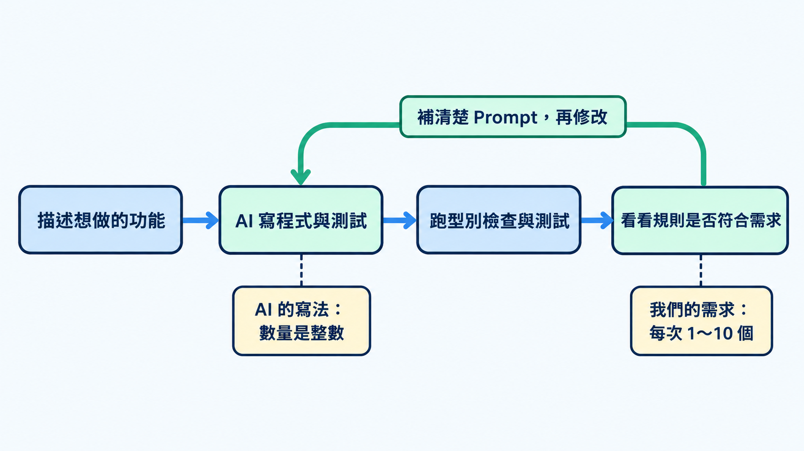

前面學了不少 TypeScript，也用過 Zod 檢查資料。這次把它們一起用上，請 AI 幫忙做一個小功能，再看看它寫出來的程式是否符合我們想要的結果。

## 請 AI 幫忙寫，該怎麼說？

請 AI 幫忙做功能，可以先描述使用者會怎麼操作，再指定想用的技術。拿到結果後，就用學過的 TypeScript 與 Zod，看看它寫了哪些檢查。

這幾個工具各自幫我們檢查不同的事情：

| 工具 | 負責的事情 |
|---|---|
| Prompt | 告訴 AI 想做什麼、有什麼要求 |
| TypeScript | 檢查型別與函式用法 |
| Zod | 執行時驗證收到的資料 |
| Vitest | 跑測試，看看結果是否跟預期一樣 |

先用 Pizza 購物車試試看。如果只告訴 AI 下面這些需求，有些沒說到的地方，它可能會自己決定：

```text
請用 Astro 與 TypeScript 做 Pizza 購物車。
使用者可以選餐點、輸入數量與備註。
用 Zod 驗證資料，並用 Vitest 寫測試。
```

這份 Prompt 留了不少細節讓 AI 決定。下面是一種可能的寫法，先看它怎麼檢查輸入。

## 測試通過了，還要看什麼？

Zod 會照我們寫下的 Schema 檢查資料，測試也會照寫好的預期結果來比對。所以拿到程式時，要看一下 AI 把哪些資料當成有效輸入。那些規則，跟我們想的一樣嗎？

```ts
// cart-schema.ts
import * as z from "zod";

export const CartSchema = z.object({
  pizzaId: z.string(),
  quantity: z.number().int(),
  note: z.string(),
});
```

`quantity` 只用了 `.int()`，意思是數量必須是整數。用這份 Schema 檢查 11，結果會是：

```ts
const result = CartSchema.safeParse({
  pizzaId: "margherita", quantity: 11, note: "",
});
console.log(result.success); // true
```

如果 AI 寫的測試也把 11 當成有效數量，測試就會通過。這時候要看的是：我們想讓使用者一次買幾個？Prompt 只寫「驗證資料」，AI 可能只檢查是不是整數；想限制在 1～10 個，就要把範圍說出來。

拿到程式後，可以先找到 `safeParse` 使用的 Schema，再看驗證成功與失敗時各回傳什麼。

Demo 的 `validateCart(raw: unknown)` 接收待驗證的資料，先用 `safeParse` 檢查，再整理文字與確認數量範圍。它把 Zod 的 `success` 結果轉成下面的 `ValidationResult`，讓畫面透過 `ok` 取得資料或錯誤提示：

```ts
type CartDraft = z.infer<typeof CartSchema>;
type ValidationResult =
  | { ok: true; cart: CartDraft }
  | { ok: false; errors: string[] };
```



## 把沒說清楚的地方補上

這時候可以補一段 Prompt，說清楚哪些數量可以、哪些不行，請 AI 一起修改程式和測試：

```text
購物車每次只能選 1～10 個 Pizza，數量必須是整數。
0、11 與小數都要拒絕；1 與 10 要接受。
請把這個限制加進 Zod 或驗證函式，測試也一起修改。
其他已完成的功能要保留，改完後再跑型別檢查與測試。
如果還有不清楚的地方，先問我。
```

把補充的 Prompt 交給 AI 後，它可能會把數量檢查改成下面這樣：

```ts
// AI 可能把範圍限制加在 Schema；Demo 則放在驗證函式裡檢查
export const CartSchema = z.object({
  pizzaId: z.string(),
  // 必須是整數，範圍為 1～10
  quantity: z.number().int().min(1).max(10),
  note: z.string(),
});
```

收到修改後，先看它有沒有補上剛才提出的要求，也看看其他功能是否被一起改動。可以請 AI 說明改了哪些地方，再對照程式確認，並實際操作一次。

如果程式和測試都交給 AI 寫，也要看看它選了哪些情況來測。除了正常輸入，超出限制、資料格式錯誤時的處理，也應該符合需求。

## 也看看程式怎麼處理資料

需求補清楚後，還可以沿著資料的去向看程式：

- 輸入有沒有真的交給 Schema 驗證？如果用 `any` 或 `as` 直接當成有效資料，就要確認驗證在哪裡完成。
- 驗證失敗或查無資料時，程式會怎麼處理？看到 `!`，可以看看前面是否已經檢查過缺值。
- 呼叫的函式有沒有提供這個方法？先跑型別檢查；套件的用法有疑問時，再查目前安裝版本的官方文件。

發現問題時，把需要修改的地方和預期結果一起告訴 AI，再回頭確認它的修改。例如，看到程式直接用 `as CartDraft` 接收輸入，可以這樣補充：

```text
這裡直接把輸入當成 CartDraft，請改成先用 Zod 的 Schema 驗證輸入。
原本的數量限制與文字整理要保留。
驗證成功後，才把 cart 交給畫面使用。
驗證失敗時，顯示 errors 裡的提示，讓使用者修改輸入。
請保留原本的回傳格式，並確認畫面能處理成功與失敗兩種結果。
```

> [!TIP] 測試工具 / Vitest
> Vitest 是執行自動化測試的工具，可以檢查程式的結果是否符合預期。這次請 AI 一起準備測試，完整範例放在 Demo 專案；想了解用法，可以看 [Vitest 起步文件](https://vitest.dev/guide/)。

## 在範例專案中操作

今天也準備了一份 Pizza 購物車範例，接下來 Day27～30 都會用同一個專案，逐步加入 AI 整理資料、查詢餐點與確認購物車的功能。專案用 Astro 做操作頁面，主要程式用 TypeScript 撰寫，每一天的進度放在不同分支。今天先從輸入驗證開始，可以在畫面上輸入不同數量，看看驗證結果。

> [!TIP] 可操作範例 / Demo project
> 可以從 [Pizza 範例專案的 day-27 分支](https://github.com/johnsonchen3669/type-demo-2026/tree/day-27)開始，安裝、操作與測試方式請看該分支的 README。

## 今日練習

[day27 | 型旅 TypeTrail](https://typetrail.johnsonchen.dev/#/day/27)

## 結論

請 AI 幫忙寫程式，拿到結果後可以看看它用了哪些規則。遇到跟自己想法不同的地方，就把需求補清楚，請它連同測試一起修改。這樣也更容易知道，自己到底希望這個功能怎麼運作。

目前我們自己填購物車資料；換成讓 AI 整理使用者的文字時，也能用同樣的驗證方式檢查它整理出的結果。
