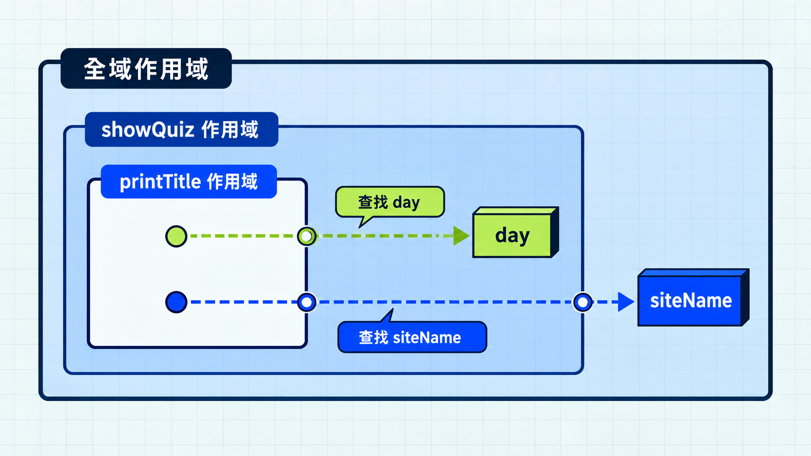

進入今日主題前，先看一段累計分數的程式。

```js
let score = 0;

function addScore(points) {
  score += points;
}

addScore(2);
addScore(5);

console.log(score); // 7
```

JavaScript 怎麼知道這裡的 `score` 指的是哪個變數？如果把變數移到函式裡，外面還能使用嗎？變數可以在哪裡使用，就和作用域（scope）有關。

## 作用域決定名稱在哪裡可以使用

作用域描述變數、參數與函式名稱可以在哪些範圍內被存取。

```js
function showQuestion() {
  const questionText = "變數可以在哪裡使用？";
  console.log(questionText);
}

showQuestion();
console.log(questionText); // ReferenceError：函式外找不到這個名稱
```

由函式建立的範圍稱為函式作用域（function scope）。

函式參數也只能在該函式內使用。不同函式即使宣告同名變數，也各自擁有自己的變數，不會互相覆蓋。

## 區塊作用域：大括號也可能建立範圍

`let` 與 `const` 具有區塊作用域（block scope）。條件判斷、迴圈或單獨一組大括號形成的區塊，都會限制它們的可見範圍。

```js
const isCorrect = true;

if (isCorrect) {
  const message = "答對了";
  let bonus = 1;

  console.log(message); // 答對了
  console.log(bonus);   // 1
}


console.log(message); // ReferenceError：區塊外找不到這個名稱
```


`var` 的規則不同。它有函式作用域，沒有一般的區塊作用域：

```js
function checkAnswer() {
  if (true) {
    var result = "correct";
  }

  console.log(result); // correct
}

checkAnswer();
```

通常優先使用 `const`，需要重新指定變數時才用 `let`，並把變數宣告在實際使用它的區塊內。

## 詞法作用域：看程式寫在哪裡，不看從哪裡呼叫

JavaScript 會先找目前的作用域；找不到時，再往包住它的外層作用域尋找。這條查找方向形成作用域鏈（scope chain），找到名稱就停止。

```js
const siteName = "TypeTrail";

function showQuiz() {
  const day = 3;

  function printTitle() {
    console.log(`${siteName} Day ${day}`);
  }

  printTitle();
}

showQuiz(); // TypeTrail Day 3
```

> [!NOTE]
> 詞法作用域（lexical scope）：名稱的可見範圍由宣告位置與巢狀結構決定，不會隨函式的呼叫位置改變。



接著看這個例子：printLabel 在 run 裡被呼叫，會讀到哪個 label？

```js
const label = "全域題目";

function printLabel() {
  console.log(label);
}

function run() {
  const label = "函式內題目";
  printLabel();
}

run(); // 全域題目
```

在 `run` 裡直接讀取 `label`，會得到 `"函式內題目"`。但呼叫 `printLabel()` 時，它仍會讀取自己外層的 `label`，因此印出 `"全域題目"`。

## 回呼函式：把函式交給另一個函式呼叫

JavaScript 的函式可以像其他值一樣，被存進變數或傳給另一個函式。被傳入、由接收者呼叫的函式，常稱為回呼函式（callback）。

```js
function checkAnswer(answer, onResult) {
  const isCorrect = answer === "A";
  onResult(isCorrect);
}

checkAnswer("A", function printResult(isCorrect) {
  console.log(isCorrect ? "答對了" : "再試一次");
});
```

`onResult(isCorrect)` 呼叫收到的函式並傳入判斷結果。這裡的回呼直接在 `checkAnswer` 執行期間執行，回呼本身不等於非同步。

## 用閉包記錄同一道題的作答次數

同一道題可能作答多次。建立紀錄函式時先傳入題號，之後每次只要傳入答案，就能累加作答次數。

> [!TIP] 工廠函式 / Factory function
> 用來建立物件或函式的函式，常稱為工廠函式。`createAnswerRecorder` 每次執行都會建立一個新的作答紀錄函式。

```js
function createAnswerRecorder(questionId) {
  let attempts = 0;

  return function recordAnswer(answer) {
    attempts += 1;

    return {
      questionId,
      answer,
      attempts,
    };
  };
}

const recordDay3Question1 = createAnswerRecorder("day-03-01");
const recordDay3Question2 = createAnswerRecorder("day-03-02");

console.log(recordDay3Question1("B"));
// { questionId: "day-03-01", answer: "B", attempts: 1 }

console.log(recordDay3Question1("A"));
// { questionId: "day-03-01", answer: "A", attempts: 2 }

console.log(recordDay3Question2("C"));
// { questionId: "day-03-02", answer: "C", attempts: 1 }
```

`createAnswerRecorder` 執行完畢後，回傳的 `recordAnswer` 仍能使用那次呼叫的 `questionId` 與 `attempts`。函式連同它能存取的外部環境，合稱為閉包（closure）。

每次呼叫 `recordAnswer`，都會把作答次數加一，再回傳題號、這次的答案與累積次數。兩次呼叫 `createAnswerRecorder` 會建立兩個獨立的 `attempts`，所以兩道題的次數不會互相影響。外部程式也不必重複傳入題號，或直接存取內部的 `attempts`。

閉包不一定要回傳函式才存在。前面的 `printTitle` 在外層函式執行期間就被呼叫，同樣能透過閉包存取外層變數。

## 今日練習

[day3 | 型旅 TypeTrail](https://typetrail.johnsonchen.dev/#/day/3)

## 結論

- 函式作用域限制函式內宣告的名稱；`let` 與 `const` 另外具有區塊作用域。
- 詞法作用域由函式定義的位置決定。名稱查找會從目前作用域沿著作用域鏈往外走，不會因呼叫位置而改變。
- 回呼函式是交給其他程式呼叫的函式，本身不等於非同步。
- 閉包讓函式在外層函式結束後，仍能存取外層變數，用來累計作答次數，或記住題號等固定資料。

下一篇會看 Prototype、Class 與 `this`，理解物件方法如何取得資料。
