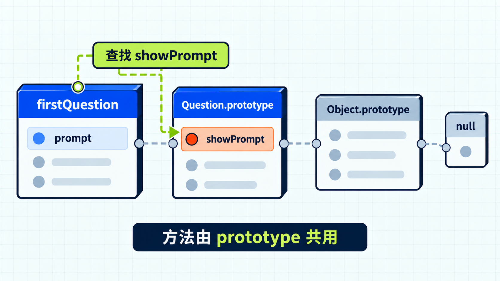

上一篇從作用域與閉包看到，函式可以讀取並保留外部狀態。當 TypeTrail 開始有多道題目時，還需要把每道題目的資料和操作整理在一起：題目文字各自不同，顯示題目的方式卻可以共用。

如果每次都重新建立相同結構，程式很快就會出現重複。`class` 是整理這類物件的一種方式，Angular 的元件與服務也會使用它。

不過，把資料和方法放進 class 之後，還有兩件事需要弄清楚：JavaScript 從哪裡找到方法，以及方法裡的 `this` 指向誰。這篇會從建立 `Question` 物件開始，再看方法變成回呼函式時，為什麼可能失去原本的 `this`。

## Class 把建構與共用方法寫在一起

先把題目需要的資料與方法寫成 `Question` class，再透過 `new` 建立個別物件。透過 `new` 建立的物件稱為實體（instance）。

```js
class Question {
  constructor(prompt) {
    this.prompt = prompt;
  }

  showPrompt() {
    console.log(this.prompt);
  }
}

const firstQuestion = new Question("Prototype 是什麼？");
firstQuestion.showPrompt(); // Prototype 是什麼？
```

`Question` 是 class，`firstQuestion` 是它建立的實體。執行 `new Question(...)` 時，`constructor` 會收到題目文字，並把它存進實體的 `prompt`。`showPrompt` 則是所有 `Question` 實體都能使用的方法。

這裡先把 `this.prompt` 理解成「這個實體的 `prompt`」。判斷 `this` 實際指向誰時，還要一起看函式的呼叫方式。

## 物件找不到屬性時，會沿著原型鏈往上找

`firstQuestion` 可以呼叫 `showPrompt`，但這個方法不是複製到每個實體裡。先用一般物件把查找過程拆開來看：

```js
const questionActions = {
  showPrompt() {
    console.log(this.prompt);
  },
};

const question = Object.create(questionActions);
question.prompt = "this 是在哪個時機決定的？";

question.showPrompt();
// this 是在哪個時機決定的？
```

`question` 自己有 `prompt`，但沒有 `showPrompt`。讀取 `question.showPrompt` 時，JavaScript 會先檢查 `question`，找不到後再到它的 prototype，也就是 `questionActions`。如果一路都找不到，查找會繼續到 `Object.prototype`，最後抵達 `null`。這條路徑稱為原型鏈（prototype chain）。

回到前面的 class 範例，也能看到相同關係：

```js
console.log(Object.getPrototypeOf(firstQuestion) === Question.prototype);
// true
console.log(firstQuestion.showPrompt === Question.prototype.showPrompt);
// true
```

Class body 裡的一般方法會放在 `Question.prototype`，所以不同實體可以沿著原型鏈找到同一個 `showPrompt`。Class 沒有讓 prototype 消失，只是把建立實體與共用方法的寫法集中在一起。

> [!NOTE]
> 修改 `Object.prototype` 等內建原型會影響其他物件的屬性查找，除非有非常明確的理由，否則應避免這樣做。



## 一般函式的 `this` 由呼叫方式決定

Prototype chain 決定方法在哪裡找到，`this` 則由呼叫方式決定。先看同一個函式被兩個物件使用時的結果：

```js
const quiz = {
  title: "Day 4",
  showTitle() {
    console.log(this.title);
  },
};

const review = {
  title: "複習題",
  showTitle: quiz.showTitle,
};

quiz.showTitle();   // Day 4
review.showTitle(); // 複習題
```

兩個物件使用的是同一個 `showTitle` 函式，但 `quiz.showTitle()` 的接收者（receiver）是 `quiz`，`review.showTitle()` 的接收者則是 `review`。呼叫時點號左邊的物件會成為 `this`。

## 方法變成回呼函式時，接收者可能遺失

把方法交給其他函式時，原本點號左邊的物件可能消失。回到開頭的 `firstQuestion`：

```js
function runAction(action) { action(); }

runAction(firstQuestion.showPrompt);
// TypeError：this 是 undefined
```

`runAction` 最後以 `action()` 呼叫收到的函式，前面沒有 `firstQuestion.`。Class 方法會在嚴格模式（strict mode）下執行，因此這時的 `this` 是 `undefined`，讀取 `this.prompt` 便發生 TypeError。

可以使用 `bind` 建立固定 `this` 的新函式：

```js
const boundShowPrompt = firstQuestion.showPrompt.bind(firstQuestion);

runAction(boundShowPrompt); // Prototype 是什麼？
```

`bind` 不會立即執行原方法，而是回傳一個新函式。呼叫新函式時，`this` 會固定為指定的 `firstQuestion`。

## 箭頭函式沒有自己的 `this`

箭頭函式（arrow function）不會建立自己的 `this`，而是使用定義位置外層的 `this`。把它寫成 class 欄位時，欄位初始化會發生在實體上：

```js
class ArrowQuestion {
  constructor(prompt) { this.prompt = prompt; }
  showPrompt = () => console.log(this.prompt);
}

const arrowQuestion = new ArrowQuestion("箭頭函式會保留 this 嗎？");
const arrowCallback = arrowQuestion.showPrompt;
arrowCallback(); // 箭頭函式會保留 this 嗎？
```

`showPrompt` 是 class 欄位，每個實體各有一個箭頭函式；它沿用建立時的 `this`，所以取出後仍能使用。

代價是函式不再共用 prototype。方法經常當作回呼函式時，可以考慮箭頭函式欄位；其他方法傳遞時再使用 `bind`。

## TypeTrail 中適合使用 Class 的地方

TypeTrail 每場測驗可以建立 `QuizSession`，讓實體保存分數並透過 prototype 共用方法。複習場次再建立另一個實體，兩者維持相同結構。

## 延伸到 Angular：這個概念在框架中如何出現？

Angular 的元件（Component）與服務（Service）都以 TypeScript class 為基礎。元件保存畫面狀態與操作，服務則集中可重用的資料或規則。

```ts
export class ScoreComponent {
  score = 0;
  addPoint() { this.score += 1; }
}

export class ScoreService {
  passingScore = 3;
  isPassing(score: number) { return score >= this.passingScore; }
}
```

`ScoreComponent` 用欄位保存分數，`ScoreService` 集中及格分數與判斷規則，供不同元件使用。

## 今日練習

[day4 | 型旅 TypeTrail](https://typetrail.johnsonchen.dev/#/day/4)

## 結論

- 物件本身找不到屬性時，JavaScript 會沿著原型鏈繼續尋找。
- Class 的一般方法放在 prototype 上，由各實體共用。
- 一般函式的 `this` 由呼叫方式決定。方法變成回呼函式時，可以使用 `bind` 或箭頭函式欄位保留 `this`。

方法能作為回呼函式傳遞之後，接下來就能進一步理解 Promise 與計時器如何安排非同步工作的執行順序。
