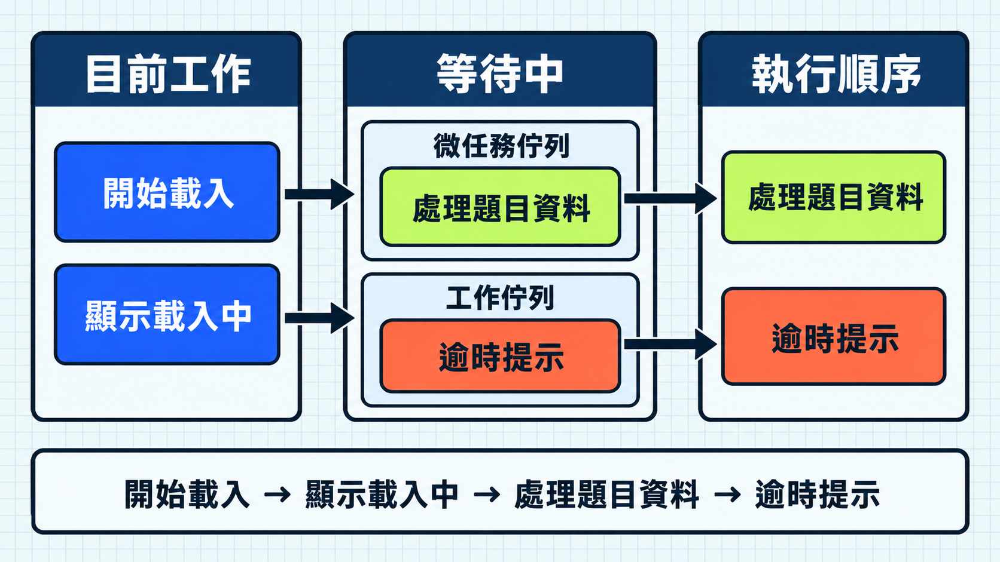

載入題目時，程式要等待資料，也要繼續回應畫面。程式碼雖然由上往下寫，實際執行順序卻不一定相同。要判斷資料何時可用、錯誤何時發生，就要理解 Promise、`async`／`await` 與事件迴圈（Event Loop）如何安排工作。

先看一段簡化程式，這裡只要觀察輸出順序：

```js
console.log("開始載入");

setTimeout(() => {
  console.log("逾時提示");
}, 0);

Promise.resolve().then(() => {
  console.log("處理題目資料");
});

console.log("顯示載入中");
```

輸出順序是：

```text
開始載入
顯示載入中
處理題目資料
逾時提示
```

`setTimeout` 寫成 `0`，仍然不會插進目前正在執行的程式。Promise 的處理函式和計時器的回呼函式也有不同的排程時機。

## Promise 表示尚未完成的結果

網路請求與計時器不會立刻完成。JavaScript 執行環境（Runtime）可以先啟動工作並繼續執行程式，等結果出現後再處理。Promise 是表示這個未來結果的物件。

一個 Promise 會處於以下狀態之一：

- `pending`：尚未完成。
- `fulfilled`：已成功完成並帶有結果。
- `rejected`：已失敗並帶有原因。

Promise 完成後不會再改變結果。先用計時器模擬載入一道題目：

```js
function loadQuestion() {
  return new Promise((resolve) => {
    setTimeout(() => {
      resolve({ id: "day-05-01", prompt: "Promise 有哪些狀態？" });
    }, 500);
  });
}

const questionPromise = loadQuestion();
console.log(questionPromise); // 此時仍是 pending
```

`loadQuestion()` 立即回傳 Promise，不會直接交回題目。此時計時器的回呼函式還沒執行，所以 Promise 仍處於未完成狀態。

使用 `.then()` 可以登記成功完成後要做的事。它也會回傳新的 Promise，因此後續步驟可以接續處理；若其中一步拋出錯誤，後面的 `.catch()` 可以處理失敗。

```js
loadQuestion()
  .then((question) => console.log(question.prompt))
  .catch((error) => console.error("載入失敗", error));
```

`new Promise(...)` 裡的函式會在建立 Promise 的當下執行，通常用來啟動計時器或網路請求。等 Promise 成功或失敗後，`.then()`、`.catch()` 與 `.finally()` 裡的處理函式才會排入等待，稍後執行。

## 事件迴圈如何安排工作與微任務？

先把 JavaScript 執行程式的位置想成一個櫃台。這個櫃台一次只能處理一件事；目前這件事做完，才能換下一件。

> [!NOTE] 一個櫃台與兩個等待區
> 交給櫃台處理的一件事叫工作（task），還不能處理的內容先放進佇列（queue）等待。微任務（microtask）放在優先等待區：目前工作做完後，櫃台要先處理完微任務，才能拿下一項工作。事件迴圈就是不斷檢查「目前工作是否完成，以及下一個該處理誰」的安排機制。

對回開頭的程式：

```text
目前工作：整段同步程式
微任務佇列：Promise 的處理函式
工作佇列：計時器的回呼函式
```

整段同步程式先輸出「開始載入」與「顯示載入中」。這項工作結束後，事件迴圈先從微任務佇列取出 Promise 的處理函式，輸出「處理題目資料」；微任務處理完，才從工作佇列取出計時器的回呼函式，輸出「逾時提示」。

因此，事件迴圈是安排者、工作是要執行的內容、佇列是等待區。微任務不是比較小的工作，而是會在下一項工作之前先執行的內容。




這是用來判斷常見輸出順序的瀏覽器模型。Node.js 等執行環境有不同細節，仍要查看各環境規則。

[WHATWG HTML Standard：Event loops](https://html.spec.whatwg.org/multipage/webappapis.html#event-loops)

## `async`／`await` 沒有把非同步變成同步

`async`／`await` 讓 Promise 流程比較接近日常閱讀順序：

```js
async function showQuestion() {
  try {
    const question = await loadQuestion();
    console.log(question.prompt);
  } catch (error) {
    console.error("載入失敗", error);
  }
}

showQuestion();
```

`async function` 一定回傳 Promise。執行到 `await` 時，只有目前這次函式的後續流程會暫停；JavaScript 執行環境仍能繼續執行其他同步程式與已排程工作。Promise 成功後，`await` 取得結果並繼續；如果 Promise 失敗，`await` 會在該位置拋出錯誤，交給 `try...catch`。

如果 async function 沒有在內部處理錯誤，呼叫端就要 `await` 它回傳的 Promise，或接上 `.catch()`。外層同步 `try...catch` 不會自動接住稍後發生的 rejection。

## HTTP 回應與業務成功要分開判斷

在瀏覽器使用 `fetch` 時，網路層無法完成請求可能讓 Promise 失敗；但伺服器回覆 `404`、`500` 等 HTTP 狀態時，`fetch` 通常仍會成功。程式必須自行檢查 `response.ok` 或 `response.status`。

```js
async function loadQuestions() {
  const response = await fetch("/api/questions");

  if (!response.ok) {
    throw new Error(`載入題目失敗：HTTP ${response.status}`);
  }

  return response.json();
}
```

取得 HTTP 回應、確認成功狀態與取得可信資料是不同判斷。`response.json()` 只解析 JSON，不會驗證資料結構。

[MDN：Using the Fetch API](https://developer.mozilla.org/en-US/docs/Web/API/Fetch_API/Using_Fetch)

## 先判斷資料依賴，再決定循序或共同等待

型旅頁面同時需要題目和使用者進度。若兩份資料互不依賴，連續 `await` 會等第一個完成後才啟動第二個：

```js
const questions = await loadQuestions();
const progress = await loadProgress();
```

可以先啟動兩個工作，再用 `Promise.all` 一起等待：

```js
const questionsPromise = loadQuestions();
const progressPromise = loadProgress();

const [questions, progress] = await Promise.all([
  questionsPromise,
  progressPromise,
]);
```

兩個函式被呼叫時便啟動工作，`Promise.all` 負責組合結果；任一項失敗，組合結果也會失敗。這裡的「一起」只表示等待時間重疊，JavaScript 沒有因此把程式分派到多顆 CPU 同時計算。

如果載入題目必須先取得 session ID，就應保留循序執行，不能只為了看起來更快而改用 `Promise.all`。

## AI API：一次拿完，或分段接收

一般 HTTP 呼叫常用一個 Promise 表示完整結果。AI 回覆可能較長，API 也可能把結果分成多段送回。應用程式收到一段就能先處理，不必等全部內容完成：

```js
const events = await requestEvents();

for await (const event of events) {
  console.log(event);
}
```

`requestEvents` 是用來說明控制流程的示意名稱，沒有對應特定 SDK。分段接收讓程式在完整結果產生前就開始處理，等待依然存在。實作時仍要依 API 文件確認每段資料的格式、完成訊號、錯誤與取消方式。

## 今日練習

[day5 | 型旅 TypeTrail](https://typetrail.johnsonchen.dev/#/day/5)

## 結論

- 同步程式結束後，瀏覽器會先處理微任務，再執行下一個工作；`setTimeout(..., 0)` 仍需等待下一個工作。
- `async function` 回傳 Promise，`await` 只暫停目前函式的後續流程；非同步錯誤仍要沿著 Promise 處理。
- 互不依賴的工作可以先啟動後共同等待，有資料依賴的工作則維持循序執行。

這套執行模型說明了非同步工作何時繼續、如何失敗。當程式開始分散到多個檔案，下一個需要釐清的問題就是模組如何公開內容，以及執行環境如何找到彼此的依賴。
