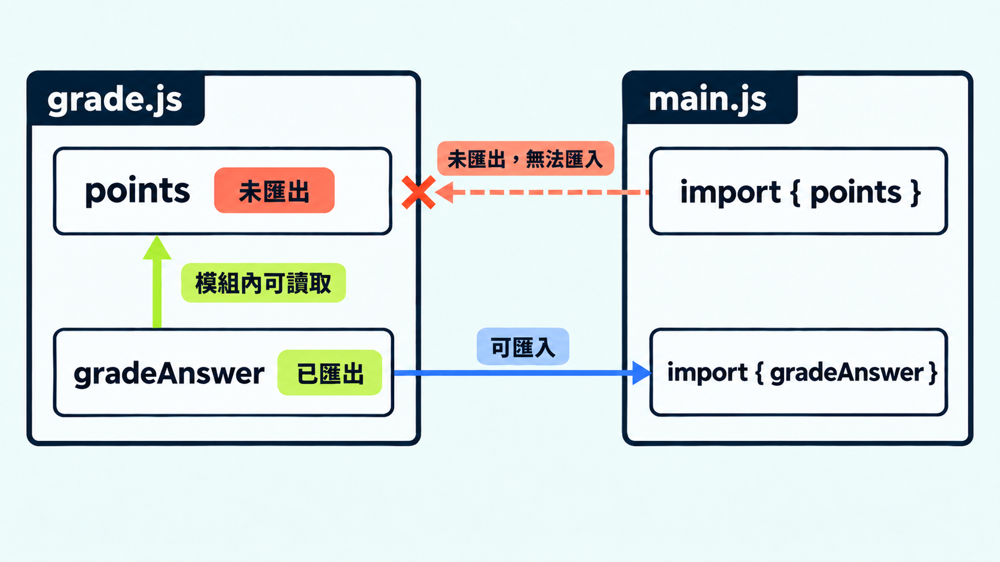

當單一檔案開始變長，通常會把題目與判分邏輯拆成不同檔案。先看看以下的範例：

```js
// question.js
const question = { prompt: "哪個關鍵字用來匯出？" };

// main.js
console.log(question.prompt);
```

如果兩個檔案各自以 ES 模組載入，`main.js` 會因為找不到 `question` 而拋出 `ReferenceError`。把檔案放在同一個資料夾，不會讓它們自動共享變數。

Day 3 談過作用域：變數能在哪裡使用，有明確的範圍。今天把這個觀念延伸到檔案之間，用 `export` 定義模組提供哪些內容，再用 `import` 說明自己要使用哪個模組的內容。

## 用 `export` 與 `import` 接起兩個檔案

ES 模組是 JavaScript 標準的模組系統，文件中也常簡稱 ESM。模組可以選擇要對外提供哪些名稱，使用端也要明確指出它需要什麼：

```js
// question.js
export const question = {
  prompt: "哪個關鍵字用來匯出？",
};

// main.js
import { question } from "./question.js";

console.log(question.prompt);
```

`./question.js` 是相對於 `main.js` 的檔案位置。`{ question }` 是具名匯入語法，名稱要對上來源的具名匯出；它看起來像物件解構，但不是先取得一般物件再拆開。

若要在 Node.js 執行這組 `.js`，可以在同一個專案範圍加入：

```json
{
  "type": "module"
}
```

`"type": "module"` 明確指定這個套件範圍內的 `.js` 使用 ESM；`.mjs` 則是不依賴 `package.json` 的另一種標示方式。Node.js 原生 ESM 的相對檔案匯入需要寫出副檔名，因此範例保留 `.js`。規則可參考 [Node.js ESM 文件](https://nodejs.org/api/esm.html#enabling)與[相對路徑規則](https://nodejs.org/api/esm.html#mandatory-file-extensions)。

## 模組作用域保留內部實作

模組作用域（module scope）是模組最上層名稱的可見範圍。這些名稱不會自動變成其他模組可直接使用的全域變數；只有明確匯出的名稱，才能由其他模組匯入。

```js
// grade.js
const points = 10;

export function gradeAnswer(input, expected) {
  return input === expected ? points : 0;
}

// main.js
import { gradeAnswer } from "./grade.js";

console.log(gradeAnswer("export", "export")); // 10
```

`points` 留在 `grade.js`，定義於同一個模組的 `gradeAnswer` 仍能依詞法作用域讀取它。使用端若寫成 `import { points } from "./grade.js"`，載入就會失敗，因為來源沒有提供這個具名匯出。

這個邊界方便我們保留實作細節，卻不是保密機制。送到瀏覽器的答案或密鑰仍可能被讀到。



## 具名匯出與預設匯出要對上

具名匯出的名稱由來源決定。預設匯出則是一個模組最多一個，匯入時不加大括號，使用端可以自行命名，不必對應來源的變數名稱。

| 來源 | 對應的匯入 |
|---|---|
| `export function gradeAnswer() {}` | `import { gradeAnswer } from "./grade.js"` |
| `export default "型旅 TypeTrail"` | `import siteTitle from "./title.js"` |

如果 `grade.js` 只有具名匯出的 `gradeAnswer`，寫成 `import gradeAnswer from "./grade.js"` 就是在要求不存在的預設匯出。兩種方式都合法，重點是兩端必須對上。

## 匯入連接的是來源綁定

ES 模組的具名匯入會持續反映來源綁定目前的值，通常稱為即時綁定（live binding）：

```js
// counter.js
export let count = 0;

export function increment() {
  count += 1;
}

// main.js
import { count, increment } from "./counter.js";

console.log(count); // 0
increment();
console.log(count); // 1
```

匯入時不是把數字複製一份；來源更新 `count` 後，使用端會讀到新值。不過，使用端不能用 `count = 99` 重新指定來源綁定。匯入也不會自動凍結物件。

## CommonJS 是另一套模組格式

Node.js 舊程式與部分套件仍常見 CommonJS。它使用 `require()` 載入，並以 `module.exports` 匯出：

```js
// grade.cjs
const gradeAnswer = (input, expected) => input === expected ? 10 : 0;
module.exports = { gradeAnswer };

// main.cjs
const { gradeAnswer } = require("./grade.cjs");
```

這裡的 `{ gradeAnswer }` 才是從 `require()` 回傳的物件取出屬性。程式執行到 `require()` 時才載入模組，因此呼叫可以放在條件判斷內。

ES 模組的靜態 `import` 必須寫在模組頂層；需要依條件載入時，另有動態 `import()`。兩套格式雖能互通，卻不能只替換語法就假設行為相同。細節可查 [Node.js 的 CommonJS 互通說明](https://nodejs.org/api/esm.html#interoperability-with-commonjs)。

## 套件組織多個模組

模組處理檔案之間的依賴；套件（package）則用 `package.json` 描述一組模組的範圍、資訊與依賴。自己的專案也可以是一個套件，不必發布到 npm。`type` 讓 Node.js 判斷 `.js` 的模組格式，`exports` 則能定義公開入口。完整規則可參考 [Node.js Packages 文件](https://nodejs.org/api/packages.html)。

`./grade.js` 指向相對檔案；`some-package` 這類名稱則由執行環境或建置工具解析。`import` 本身不會下載缺少的套件。

審查 `import` 時，要確認路徑是否存在、匯出形式是否匹配，以及執行環境使用哪套模組格式。即使 `import` 的寫法符合語法，這些設定不匹配時，模組載入仍可能失敗。

## 今日練習

[day6 | 型旅 TypeTrail](https://typetrail.johnsonchen.dev/#/day/6)

## 結論

前六天建立了理解 JavaScript 如何在執行時期運作的基礎。接下來進入 TypeScript 時，判斷重點會從「程式實際怎麼執行」延伸到「哪些規則能在執行前由編譯器檢查」，同時保留兩者之間的界線。
