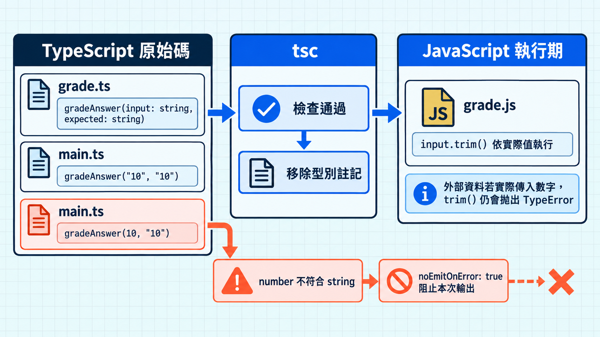

寫 JavaScript 時，函式收到不合預期的值，常要等程式執行才發現。以下函式就有這個風險：它會用 `trim()` 去掉答案前後的空白，呼叫端卻可能傳入數字。TypeScript 可以在呼叫處檢查參數型別，提早指出這種錯誤。

## JavaScript 執行到哪裡才發現錯誤

```js
function gradeAnswer(input, expected) {
  return input.trim() === expected.trim() ? 10 : 0;
}

gradeAnswer(10, "10");
```

上面的呼叫符合 JavaScript 語法；實際執行時，數字沒有 `trim()` 方法，因此拋出 `TypeError`。

## 試寫 TypeScript 的兩種方式

想先看 TypeScript 怎麼檢查程式，可以打開 [官方 Playground](https://www.typescriptlang.org/play/)，貼上這段：

```ts
function gradeAnswer(input: string, expected: string) {
  return input.trim() === expected.trim() ? 10 : 0;
}

gradeAnswer(10, "10");
```

Playground 會指出 `number` 不能傳給 `string` 參數。函式參數旁的 `: string` 是型別註記，用來告訴 TypeScript 預期收到字串；切到 JavaScript 輸出，就會看到這段註記消失。

> [!TIP] 型別註記 / Type annotation
> 型別註記也能寫在變數旁，例如 `const score: number = 10` 中的 `: number`。它提供編譯期的檢查資訊，執行時不會替變數轉換資料。

這個練習只需要瀏覽器。若想自己建立檔案、用編譯器跑完整流程，下面再用 Node.js 示範一個本機專案。

### 在本機建立練習專案

這個本機範例需要 Node.js 和 npm。若電腦還沒有，先照 [Node.js 官方下載頁](https://nodejs.org/en/download)安裝。接著在終端輸入以下命令，確認安裝成功：

```sh
node --version
npm --version
```

接著建立練習資料夾，在裡面安裝 TypeScript 7.0：

```sh
mkdir ts-day-07
cd ts-day-07
npm init -y
npm install --save-dev typescript@7.0
npm pkg set type=module
mkdir src
npx tsc --version
```

`npm pkg set type=module` 會在 `package.json` 加上 `"type": "module"`，讓 Node.js 把之後輸出的 `.js` 當成 ES 模組執行。

上面是把 TypeScript 裝在專案裡，`npx tsc --version` 會顯示該專案的版本。若想用全域版，建立資料夾等步驟不變，只把安裝和查版本的命令換成：

```sh
npm install -g typescript@7.0
tsc --version
```

等下面的 `tsconfig.json` 建好後，全域安裝者在專案目錄執行 `tsc --noEmit` 可以只做檢查，執行 `tsc` 則會輸出 JavaScript。全域版本不會跟著專案走；換台電腦可能用到不同版本。因此下面的練習使用 `npx tsc`，固定執行專案安裝的版本。

>[TypeScript 官方安裝說明](https://www.typescriptlang.org/download/)。

## 把判分函式改寫成 TypeScript

編譯器準備好後，把判分函式放進 `src/grade.ts`，用 `string` 標示兩個參數：

```ts
// src/grade.ts
export function gradeAnswer(input: string, expected: string) {
  return input.trim() === expected.trim() ? 10 : 0;
}
```

在 `src/main.ts` 匯入它。相對路徑保留 `.js` 副檔名，因為稍後輸出的檔案會是 `grade.js`：

```ts
// src/main.ts
import { gradeAnswer } from "./grade.js";

console.log(gradeAnswer("10", "10")); // 10
// console.log(gradeAnswer(10, "10")); // 取消註解後會有型別錯誤
```

`gradeAnswer` 需要字串；第二次呼叫若取消註解，編譯器會在呼叫處指出 `number` 不能傳給 `string` 參數。這是靜態檢查（static checking）：它根據原始碼中已知的型別關係提出錯誤。

在專案資料夾新增 `tsconfig.json`。從這裡執行不帶檔名的 `npx tsc` 或 `tsc`，編譯器會讀取這份設定檔。本篇選用 Node.js 執行輸出的程式，所以模組設定也配合 Node.js：

```jsonc
{
  "compilerOptions": {
    "target": "es2022",
    "module": "nodenext",
    "strict": true,
    "rootDir": "./src",
    "outDir": "./dist",
    "noEmitOnError": true
  },
  "include": ["src/**/*.ts"]
}
```

這份設定裡的選項各有用途：

- `include`：選出 `src` 裡的 `.ts` 檔參與編譯。
- `strict`：開啟較嚴格的型別檢查。
- `noEmitOnError`：遇到編譯錯誤時停止輸出檔案。
- `rootDir`：指定來源檔從 `src` 這層目錄開始算。
- `outDir`：把輸出放進 `dist`，所以 `src/grade.ts` 會對應到 `dist/grade.js`。
- `target`：指定輸出的 JavaScript 語法版本，這裡是 ES2022。
- `module: "nodenext"`：依 Node.js 的規則處理模組，並參考 `package.json` 裡的 `"type": "module"`，把這裡的 `.ts` 輸出成 ES 模組。兩處設定要對上，Node.js 才能載入輸出的檔案。瀏覽器專案要依自己的建置方式選擇模組設定，無須照搬這一項。完整規則可參考以下文件。

>[TypeScript 的設定檔說明](https://www.typescriptlang.org/docs/handbook/tsconfig-json)
>[模組文件](https://www.typescriptlang.org/docs/handbook/modules/reference.html#node16-nodenext)。

## 跑檢查，再執行輸出的 JavaScript

兩個來源檔和設定檔備齊後，在專案目錄執行：

```sh
npx tsc --noEmit
npx tsc
node dist/main.js
```

把數字呼叫取消註解後，`npx tsc --noEmit` 會回報型別錯誤；這個命令本來就不會輸出檔案。改跑 `npx tsc` 時，`noEmitOnError: true` 才會阻止這次建置輸出。先前已在 `dist` 的檔案仍會留著，直接執行 `node dist/main.js` 跑到的是舊版本。`noEmitOnError` 預設是 `false`，想讓型別錯誤阻止輸出，就要明確設定。

>[官方設定說明](https://www.typescriptlang.org/tsconfig/noEmitOnError)

TypeScript 會先用型別註記檢查程式，輸出 JavaScript 時再把註記拿掉。這個步驟叫型別抹除（type erasure）。`dist/grade.js` 的函式會接近這樣：

```js
export function gradeAnswer(input, expected) {
  return input.trim() === expected.trim() ? 10 : 0;
}
```

> [!TIP] 型別抹除 / Type erasure
> 在 Playground 的 JavaScript 輸出或 `dist/grade.js` 中，可以對照 `input: string` 變成 `input`，但 `trim()` 仍在。若其他 JavaScript 語法也改變了，可能是 `target` 或 `module` 設定在轉換語法。

編譯後的 JavaScript 若從 API 收到數字，並把它交給判分函式，執行到 `trim()` 仍會拋錯。型別註記不會替 API 回應做執行期驗證；接收資料時還是要檢查實際值。



## TypeScript 7.0 需要留意的設定

TypeScript 7.0 把編譯器改用 Go 實作，`string` 這類基本型別的寫法照舊。它也沿用 6.0 調整過的預設值：`strict` 預設開啟，`rootDir` 預設指向專案根目錄。前面的設定明確指定 `rootDir: "./src"`；如果省略，輸出會保留 `src` 這層目錄，`node dist/main.js` 就找不到檔案。列出了這些變化。

> 既有專案從 6.0 升到 7.0 時，先處理 6.0 已標記棄用的設定；7.0 會對其中部分選項報錯。
> [TypeScript 7.0 官方公告](https://devblogs.microsoft.com/typescript/announcing-typescript-7-0/)

## 今日練習

[day7 | 型旅 TypeTrail](https://typetrail.johnsonchen.dev/#/day/7)

## 結論

當呼叫端傳錯值時，TypeScript 能依參數型別在執行前指出問題；輸出的 JavaScript 仍依實際值執行。在 Playground 就能觀察這個差別；本機範例則用 `tsc`、`tsconfig.json` 和 Node.js 走過完整流程。接下來看型別推論時，就能進一步判斷哪些型別需要手寫，哪些資訊已經能從程式碼推導出來。
