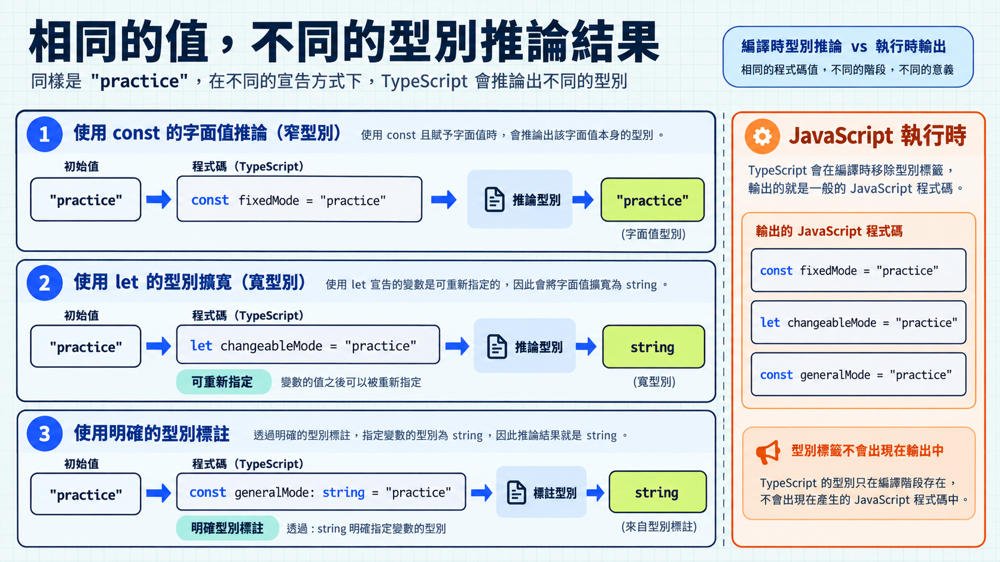

Day 7 看過 TypeScript 如何在執行前檢查型別。若每個變數都手動標上型別，很快就會出現重複資訊。TypeScript 能從已寫出的值推導多少？哪些地方還需要我們明確標註？

先看一段範例：

```ts
const pointsPerQuestion = 10;
let currentAnswer = "export";

currentAnswer = "import"; // 可以
currentAnswer = 42;       // 編譯期錯誤
```

編譯器會從初始值推導出 `pointsPerQuestion` 是數字、`currentAnswer` 是字串，因此會擋下 `42` 的指定。這項檢查發生在編譯期。

接下來看看，哪些型別註記可以省略。

## 型別推論是在編譯期產生的結論

型別推論（type inference）是 TypeScript 根據初始值、使用情境與型別註記，在編譯期替名稱推導型別。推論結果只用於編譯期檢查；輸出的 JavaScript 沒有對應的驗證器。

> [!TIP] 基本型別 / Primitive types
> TypeScript 用小寫的 `string`、`number`、`boolean` 分別表示文字、數字和布林值。這些是常見的基本型別名稱；Day 2 用過的大寫 `String()`、`Number()`、`Boolean()` 則是 JavaScript 的轉換函式。可對照 [TypeScript Handbook 的基本型別說明](https://www.typescriptlang.org/docs/handbook/2/everyday-types.html#the-primitives-string-number-and-boolean)。

## 哪些地方需要型別註記

下面兩種寫法都能通過型別檢查：

```ts
let pointsPerQuestion = 10;
let pointsPerQuestionWithAnnotation: number = 10;
```

兩個變數都能改成其他數字，也都不能接收字串。第一行由初始值推導成 `number`；第二行則由我們寫出 `: number`。在這裡，型別註記重複了編譯器已經知道的資訊。

函式參數沒有預設值時，通常要自己標上型別，讓 TypeScript 知道可以傳入什麼：

```ts
function gradeAnswer(input: string, expected: string) {
  return input === expected ? 10 : 0;
}
```

回傳值可以從函式內容推導，這個簡單範例省略 `: number` 就夠了。

沒有初始值時，型別註記也能先表達之後要使用的型別：

```ts
let selectedAnswer: string;

selectedAnswer = "export";
// selectedAnswer = 42; // 編譯期錯誤
```

把 `42` 指定給這個變數會出現編譯期錯誤，值本身不會被轉換。使用變數以前也要先完成指定；在 `strict` 設定下，編譯器會指出尚未賦值的問題。

## 為什麼 `const` 與 `let` 推導不同

先看 JavaScript 原本的差別：`const` 宣告後不能重新指定，`let` 可以。TypeScript 會參考這個差別來推論型別。

```ts
const fixedMode = "practice";
let changeableMode = "practice";

// fixedMode = "review";     // const 不能重新指定
changeableMode = "review";  // let 可以重新指定
changeableMode = 42;        // TypeScript 編譯期錯誤
```

一般的 `string` 型別允許任何字串。字面值型別（literal type）只允許一個指定值，例如 `"practice"` 只接受這個字串。TypeScript 對前兩個名稱的推論結果是：

```text
fixedMode: "practice"
changeableMode: string
```

`fixedMode` 無法換成別的值，因此 TypeScript 保留了 `"practice"` 這個精確型別。`changeableMode` 可以換成 `"review"`，所以推論成一般的 `string`；數字 `42` 仍然不能放進去。初始值若是數字，例如 `let score = 10`，就會推論成 `number`。

像 `changeableMode` 這樣，編譯器把 `"practice"` 推論成範圍更廣的 `string`，稱為字面值拓寬（literal widening）。

手動標註也能讓型別變寬：

```ts
const generalMode: string = "practice";
```

`generalMode` 依照 `: string` 被視為一般字串型別，但 `const` 仍然不能重新指定。



## 周圍的情境也會提供型別

前面的例子是從「值」往外推導。另一種常見來源是使用情境：某個函式或 API 已經知道回呼函式會收到什麼型別，裡面的參數就能從這個情境得到型別。

```ts
const answerOptions = ["export", "import"];

const normalizedOptions = answerOptions.map((option) => {
  return option.toUpperCase();
});
```

`answerOptions` 是字串陣列，因此 `map` 會把每個字串元素交給回呼函式。`option` 從這個使用情境得到字串型別，可以直接使用 `toUpperCase()`；`normalizedOptions` 也會被推導成字串陣列。

這種從使用位置取得型別的方式稱為情境式型別推論（contextual typing）。編譯器會利用回呼函式所在的周圍情境；把參數標成不相容的型別，就會產生錯誤：

```ts
const answerOptions = ["export", "import"];

const normalizedOptions = answerOptions.map((option: number) => {
  return option * 2;
});
```

`map` 會把字串元素傳給回呼函式；這裡的 `: number` 和資料來源衝突，因此編譯器報錯。

拿掉 `: number`，編譯器就能從 `map` 推導 `option` 的型別。再加 `: string` 只會重複已有的資訊；遇到型別衝突時，先檢查資料從哪裡來。

## 過度標註會增加維護成本

以下程式的每個區域變數，都重複標上編譯器已從初始值知道的型別：

```ts
const prompt: string = "哪個關鍵字用來匯出？";
const options: string[] = ["export", "import"];
const points: number = 10;
const isCorrect: boolean = true;
```

在這個情境中，保留推論通常比較清楚：

```ts
const prompt = "哪個關鍵字用來匯出？";
const options = ["export", "import"];
const points = 10;
const isCorrect = true;
```

初始值已經清楚時，重複標註會讓日後修改多一處要檢查。像前面的判分函式參數、宣告時還沒有值的變數，則需要自己寫出型別。

TypeScript 會根據程式碼推論型別。從 API、表單或檔案收到的資料，執行時仍要另外驗證。

## 今日練習

[day8 | 型旅 TypeTrail](https://typetrail.johnsonchen.dev/#/day/8)

## 結論

型別推論是 TypeScript 根據初始值和使用情境，在編譯期判斷型別。資訊足夠時可以省下註記；需要明確指定型別時，再自己寫出來。資料由多個欄位組成時，也可以用物件型別描述每個欄位。
